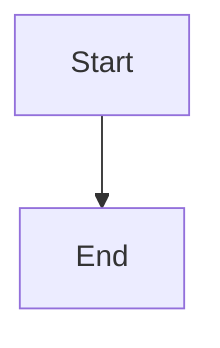

# mukulkadel.github.io

Personal blog and tools site for [mukulkadel.com](https://mukulkadel.com), built with Jekyll and hosted on GitHub Pages.

## Stack

- **Jekyll 4** — static site generator
- **GitHub Actions** — build and deploy on push to `main`
- **highlight.js** — client-side syntax highlighting
- **mermaid.js** — diagram rendering
- **jekyll-seo-tag** — SEO meta tags
- **jekyll-sitemap** + **jekyll-feed** — sitemap and RSS

## Local development

```bash
bundle install
bundle exec jekyll serve
```

Open [http://localhost:4000](http://localhost:4000).

## Adding a blog post

Create a file in `_posts/` named `YYYY-MM-DD-slug.md`:

```markdown
---
layout: post
title: "Your Post Title"
date: 2026-05-23 00:00:00 +0530
categories: [Category]
tags: [tag1, tag2]
description: "SEO meta description (shown in search results)"
---

Your content here. Markdown, code blocks, and mermaid diagrams are all supported.

```bash
echo "syntax highlighted code"
```


```

## Adding a React app

1. Build your app: `npm run build`
2. Copy the build output to `apps/<your-app-name>/`
3. Add a card for it in `_pages/apps.md`
4. Commit and push — the deploy workflow handles the rest

## Configuration

Edit `_config.yml` to update site settings:

| Key | Description |
|-----|-------------|
| `google_analytics` | GA4 Measurement ID (e.g. `G-XXXXXXXXXX`) |
| `google_adsense_client` | AdSense publisher ID (e.g. `ca-pub-XXXXXXXXXX`) |
| `title` | Site title |
| `description` | Site meta description |
| `social.*` | Social profile URLs |

## Deploying

Push to `main`. GitHub Actions builds the site with Jekyll and deploys it to GitHub Pages automatically.

**First-time setup:** go to repo **Settings → Pages** and set the source to **GitHub Actions**.

## Project structure

```
_posts/          # Blog posts (markdown)
_pages/          # Static pages (categories, apps)
_layouts/        # Page templates
_includes/       # Reusable partials (head, header, footer)
assets/
  css/main.css   # Stylesheet (dark mode via prefers-color-scheme)
  js/main.js     # highlight.js + mermaid.js init, copy buttons
  images/        # Downloaded media
tools/           # Browser-based tools (no backend required)
wordpress-dump/  # Original WordPress export (reference only)
convert-wp.py    # One-time WordPress → Jekyll converter
```
