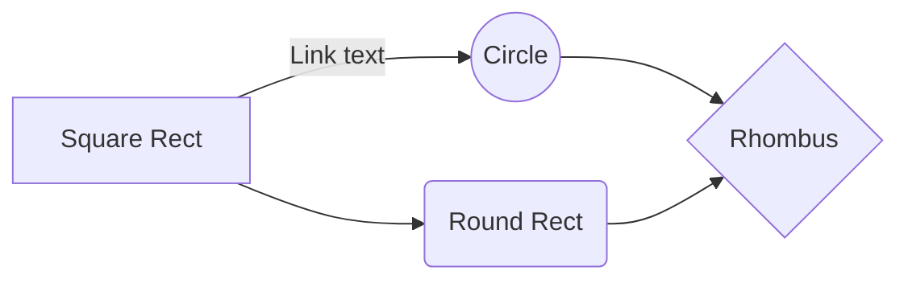
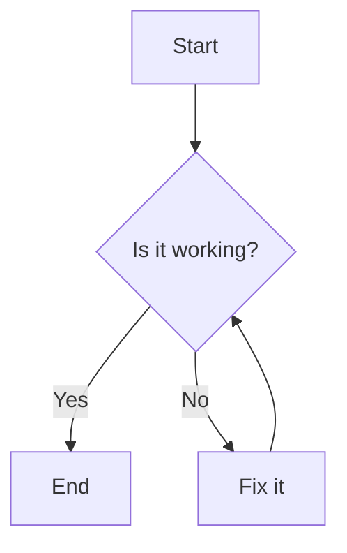
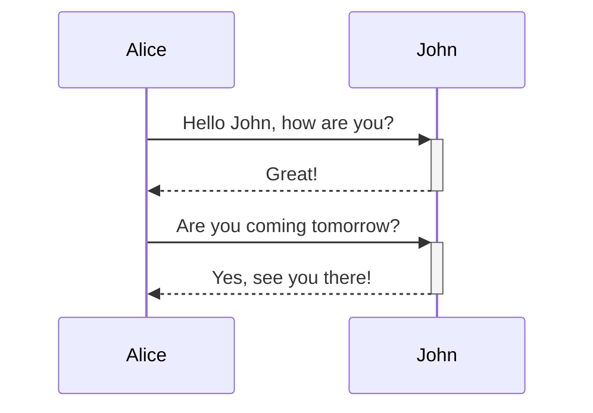
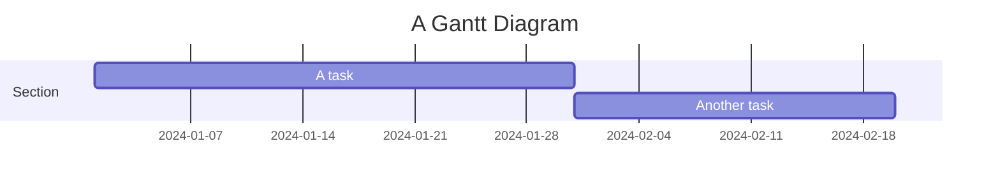
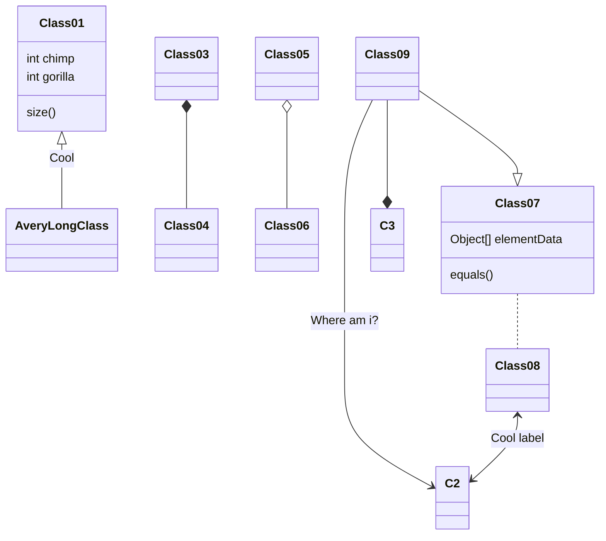

Markdown is a lightweight markup language with plain text formatting syntax. It’s designed so that it can be converted to HTML and many other formats. Mermaid, on the other hand, is a tool that generates diagrams and flowcharts from text in a similar syntax to Markdown, making it ideal for documentation purposes.

### Why Use Markdown and Mermaid Together?

- **Simplicity**: Both are easy to write and understand, making your documentation or blog posts more accessible to readers.
- **Versatility**: You can document complex workflows, data models, or architectures directly within your Markdown files.
- **Maintainability**: Changes to diagrams require only textual edits, rather than re-drawing in a graphical tool.

## Getting Started with Markdown

Here are some basic examples of Markdown syntax:

```markdown
# This is an H1
## This is an H2
### And here's an H3

- Bullet list item 1
- Bullet list item 2

1. Numbered list item 1
2. Numbered list item 2

**Bold text** and *italic text* are also easy to add.

[This is a link](http://example.com)


```

## Incorporating Mermaid Diagrams

To include Mermaid diagrams in your Markdown, you’ll typically need a platform that supports Mermaid rendering, such as GitHub or GitLab, or a Markdown editor that supports it. Here’s how you can include a Mermaid diagram:

````markdown

````

### Mermaid Diagram Examples

1. **Flowchart Example**

````markdown

````

**Sequence Diagram**

````markdown

````

**Gantt Chart**

````markdown

````

**Class Diagram**

````markdown

````

## Tips for Effective Use

- **Context**: Always provide context around your diagrams. Don’t let the visuals stand alone; describe what they represent and why they’re important.
- **Version Control**: Markdown and Mermaid make it easy to track changes in diagrams over time using version control systems like Git.
- **Collaboration**: Since both are text-based, they’re collaboration-friendly. Team members can suggest changes through pull requests or shared editing sessions.

## Conclusion

Integrating Mermaid diagrams into Markdown documents is a powerful method to enhance technical documentation, blog posts, and more. It combines the simplicity of Markdown with the visual representation capabilities of Mermaid, making complex information easier to understand and maintain. With practice, you can leverage these tools to create clear, informative, and visually appealing content.
