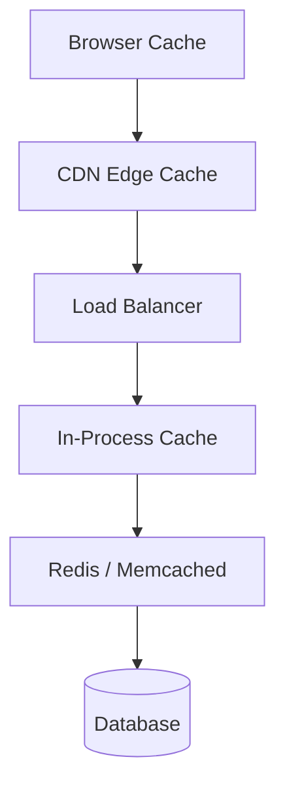

Caching is the single most impactful performance optimization you can add to a backend system. A query that takes 50ms against a database takes under 1ms from Redis. A page that loads in 800ms from your origin loads in 20ms from a CDN edge node. But caching wrong — stale data, cache stampedes, unbounded memory growth — creates subtle bugs that are harder to debug than the slowness you were trying to fix.

## The Cache Hierarchy

Before choosing a strategy, understand where caches live:



Each layer has different characteristics:

| Layer | Latency | Scope | Cost |
|-------|---------|-------|------|
| In-process (dict, LRU) | ~microseconds | Single process | Memory |
| Redis | ~1ms | All servers | Infrastructure |
| CDN | ~20ms from edge | All clients globally | Egress fees |
| Browser | 0ms | Single user | Free |

## Cache-Aside (Lazy Loading)

The most common pattern. The application checks the cache first; on a miss, it loads from the database and populates the cache.

```python
import redis
import json

cache = redis.Redis(host="localhost", decode_responses=True)

def get_user(user_id: str) -> dict:
    key = f"user:{user_id}"
    cached = cache.get(key)

    if cached:
        return json.loads(cached)

    user = db.query("SELECT * FROM users WHERE id = %s", user_id)
    if user:
        cache.setex(key, 3600, json.dumps(user))  # TTL: 1 hour

    return user
```

**Pros:** simple, only caches what's actually requested, resilient to cache failures (app falls back to DB).

**Cons:** first request after a miss is slow; cache can hold stale data until TTL expires.

### The Cache Stampede Problem

Under high traffic, when a popular key expires, many requests hit the database simultaneously before anyone repopulates the cache:

```
T=0: key expires
T=0.001: 1000 concurrent requests miss the cache
T=0.001: 1000 requests fire against the database
T=0.050: database falls over
```

The fix is **mutex locking**: only one request repopulates the cache, others wait.

```python
import time

def get_user_safe(user_id: str) -> dict:
    key = f"user:{user_id}"
    lock_key = f"lock:user:{user_id}"

    cached = cache.get(key)
    if cached:
        return json.loads(cached)

    # Try to acquire the lock (NX = only set if not exists)
    acquired = cache.set(lock_key, "1", nx=True, ex=5)

    if acquired:
        user = db.query("SELECT * FROM users WHERE id = %s", user_id)
        cache.setex(key, 3600, json.dumps(user))
        cache.delete(lock_key)
        return user
    else:
        # Another process is repopulating — wait briefly and retry
        time.sleep(0.05)
        return get_user_safe(user_id)
```

Alternatively, use **probabilistic early expiration**: refresh the cache slightly before the TTL expires based on a random check, so the stampede never happens.

## Write-Through

Write to the cache and database simultaneously. Every write keeps the cache up to date.

```python
def update_user(user_id: str, data: dict):
    key = f"user:{user_id}"

    db.execute("UPDATE users SET name=%s WHERE id=%s", data["name"], user_id)
    cache.setex(key, 3600, json.dumps(data))
```

**Pros:** cache is always fresh; reads after writes are fast.

**Cons:** every write pays the cost of updating both DB and cache, even for data that might never be read again.

## Write-Behind (Write-Back)

Write to the cache immediately, then asynchronously flush to the database. The write is fast; the DB is eventually consistent.

```python
def update_user(user_id: str, data: dict):
    key = f"user:{user_id}"
    dirty_key = f"dirty:user:{user_id}"

    cache.setex(key, 3600, json.dumps(data))
    cache.sadd("dirty_users", user_id)  # mark for async flush

# Background job flushes dirty keys to DB
def flush_dirty_users():
    user_ids = cache.smembers("dirty_users")
    for uid in user_ids:
        data = json.loads(cache.get(f"user:{uid}"))
        db.execute("UPDATE users SET name=%s WHERE id=%s", data["name"], uid)
    cache.delete("dirty_users")
```

**Risk:** if the cache crashes before the async flush, you lose the writes. Only appropriate for data you can afford to lose (analytics counts, view counters).

## TTL and Expiration Strategies

Every cache entry should have a TTL — never cache forever.

```bash
# Check TTL on a Redis key
$ redis-cli TTL user:12345
3201  # seconds remaining

# Set a key with TTL
$ redis-cli SET user:12345 '{"name":"Alice"}' EX 3600
OK

# Check memory usage
$ redis-cli INFO memory | grep used_memory_human
used_memory_human:2.14G
```

**TTL guidelines:**
- User profile: 1–24 hours (changes infrequently)
- Product catalog: 5–30 minutes (changes occasionally)
- Search results: 60–300 seconds (freshness matters)
- Auth tokens: match the token lifetime exactly
- Computed aggregates (report totals): match the refresh schedule

## Cache Invalidation

"There are only two hard things in computer science: cache invalidation and naming things." — Phil Karlton

When source data changes, you need to update or remove the cached version. The three main approaches:

**TTL-based (passive expiry):** just let it expire. Simple but allows stale reads for up to TTL seconds.

**Event-based invalidation:** when a write happens, explicitly delete the cache key.

```python
def delete_user(user_id: str):
    db.execute("DELETE FROM users WHERE id = %s", user_id)
    cache.delete(f"user:{user_id}")
    # also delete any aggregates that referenced this user
    cache.delete(f"user_count")
```

**Cache versioning:** instead of invalidating, change the cache key. Old key becomes unreachable and expires naturally.

```python
def get_product_list(category: str, schema_version: int = 3) -> list:
    key = f"products:{category}:v{schema_version}"
    # bump schema_version whenever product schema changes
    ...
```

## In-Process Caching

For very hot data that rarely changes, an in-process dict is faster than Redis:

```python
from functools import lru_cache
import time

# Python's lru_cache: great for pure functions with hashable args
@lru_cache(maxsize=512)
def get_feature_flags() -> dict:
    return db.query("SELECT * FROM feature_flags")

# Manual TTL-aware in-process cache
_cache: dict[str, tuple[any, float]] = {}

def get_with_ttl(key: str, ttl: int):
    if key in _cache:
        value, expiry = _cache[key]
        if time.time() < expiry:
            return value
    return None

def set_with_ttl(key: str, value: any, ttl: int):
    _cache[key] = (value, time.time() + ttl)
```

**Caveat:** in-process caches are not shared across server instances. If you have 10 app servers, each one has its own copy. This is fine for read-only config data; bad for user-specific data that can change.

## CDN Caching

CDNs cache static and semi-static content at edge nodes close to your users. The browser sends a request to the nearest edge; if it's cached, the edge responds without ever hitting your origin.

Control CDN caching with HTTP headers:

```nginx
# Cache static assets aggressively
location /assets/ {
    expires 1y;
    add_header Cache-Control "public, immutable";
}

# Cache API responses for 60 seconds, allow stale while revalidating
location /api/products {
    add_header Cache-Control "public, max-age=60, stale-while-revalidate=30";
}

# Never cache user-specific or authenticated content
location /api/account {
    add_header Cache-Control "private, no-store";
}
```

`stale-while-revalidate=30` is particularly useful: the CDN serves the stale cached response immediately while refreshing it in the background. The user never waits.

## Choosing the Right Layer

| What you're caching | Layer |
|---------------------|-------|
| Static assets (JS, CSS, images) | CDN |
| API responses (public, read-heavy) | CDN + Redis |
| User-specific data (session, profile) | Redis |
| Expensive computed results (per server) | In-process LRU |
| Feature flags, config | In-process (with periodic refresh from Redis) |

## Conclusion

Good caching is layered: CDN for public content, Redis for shared application data, in-process LRU for the hottest read-only lookups. The strategy you pick — cache-aside, write-through, or write-behind — depends on whether you can tolerate stale reads and lost writes. The most common mistake is forgetting cache invalidation: always design what happens on write before you design the cache for reads.
