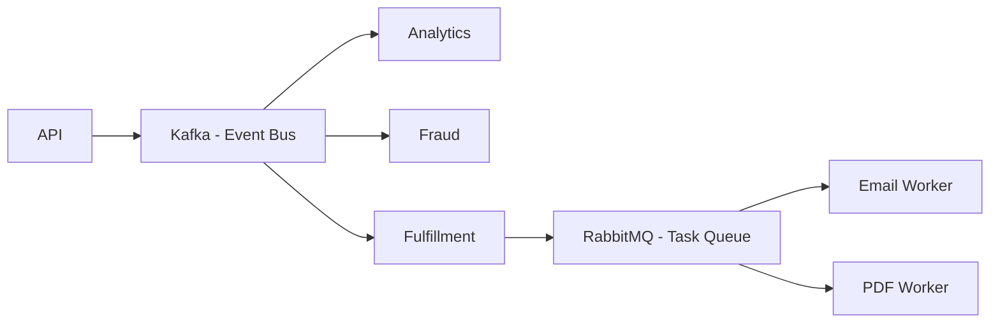

Message queues are the connective tissue of distributed systems — they decouple services, absorb traffic spikes, and make async workflows possible. Kafka and RabbitMQ both solve this problem, but they do it with fundamentally different architectures and trade-offs. Picking the wrong one can haunt a system for years.

## What a Message Queue Does

Before comparing, let's be clear on the problem. When Service A needs to trigger work in Service B, it has two options:

1. **Direct call** (HTTP/gRPC): A waits for B to respond. If B is slow or down, A blocks or fails.
2. **Queue**: A drops a message in a queue and moves on. B picks it up when ready. They're decoupled in time.

Queues also enable fan-out (one message → many consumers), load leveling (burst of messages processed at a steady rate), and replay (reprocess events from history).

## RabbitMQ: The Traditional Message Broker

RabbitMQ is a **message broker** — it routes messages from producers to consumers and then deletes them once acknowledged. Think of it like a post office: once a letter is delivered, it's gone.

### Core Concepts

- **Exchange**: producers publish to exchanges, not queues directly
- **Queue**: where messages land after routing
- **Binding**: rule that connects an exchange to a queue
- **Routing key**: a label on the message used for routing decisions

```
Producer → Exchange → [routing logic] → Queue → Consumer
```

### Exchange Types

| Type | Behavior |
|------|----------|
| `direct` | Route to queue whose binding key matches exactly |
| `topic` | Route based on wildcard patterns (`orders.#`, `*.error`) |
| `fanout` | Broadcast to all bound queues |
| `headers` | Route based on message headers instead of key |

### Publishing a Message

```python
import pika

connection = pika.BlockingConnection(
    pika.ConnectionParameters(host="localhost")
)
channel = connection.channel()

channel.exchange_declare(exchange="orders", exchange_type="topic")

channel.basic_publish(
    exchange="orders",
    routing_key="orders.created",
    body=b'{"order_id": "ord_123", "amount": 4999}',
    properties=pika.BasicProperties(
        delivery_mode=2  # persistent — survives broker restart
    )
)

print("Message published")
connection.close()
```

### Consuming Messages

```python
def callback(ch, method, properties, body):
    print(f"Received: {body}")
    ch.basic_ack(delivery_tag=method.delivery_tag)  # ack = "I processed this"

channel.queue_declare(queue="order_fulfillment", durable=True)
channel.queue_bind(
    exchange="orders",
    queue="order_fulfillment",
    routing_key="orders.created"
)

channel.basic_qos(prefetch_count=1)  # don't overwhelm this consumer
channel.basic_consume(queue="order_fulfillment", on_message_callback=callback)
channel.start_consuming()
```

```
$ python consumer.py
Received: b'{"order_id": "ord_123", "amount": 4999}'
```

The critical thing about RabbitMQ: if the consumer doesn't `ack` a message (e.g., it crashes), the broker redelivers it to another consumer. This is **at-least-once delivery**.

## Kafka: The Distributed Log

Kafka is fundamentally different. It's not a message broker — it's a **distributed commit log**. Producers append events to a log; consumers read from the log at their own offset. Messages are not deleted after consumption — they're retained for a configurable period (days, weeks, or forever).

### Core Concepts

- **Topic**: a named log, partitioned for parallelism
- **Partition**: an ordered, immutable sequence of records
- **Offset**: the position of a consumer in a partition
- **Consumer group**: a group of consumers that share partitions (each partition → one consumer in the group at a time)

```
Topic: orders
  Partition 0: [msg1, msg3, msg5, msg7...]
  Partition 1: [msg2, msg4, msg6, msg8...]

Consumer Group A (fulfillment):
  Consumer A1 → Partition 0
  Consumer A2 → Partition 1

Consumer Group B (analytics):
  Consumer B1 → Partition 0
  Consumer B2 → Partition 1
```

Both groups read the same events independently. This is why Kafka is ideal for event streaming.

### Producing to Kafka

```python
from kafka import KafkaProducer
import json

producer = KafkaProducer(
    bootstrap_servers=["localhost:9092"],
    value_serializer=lambda v: json.dumps(v).encode()
)

producer.send(
    topic="orders",
    key=b"ord_123",  # same key → same partition (ordering guaranteed per key)
    value={"order_id": "ord_123", "amount": 4999}
)

producer.flush()
print("Event published")
```

### Consuming from Kafka

```python
from kafka import KafkaConsumer
import json

consumer = KafkaConsumer(
    "orders",
    bootstrap_servers=["localhost:9092"],
    group_id="fulfillment-service",
    value_deserializer=lambda v: json.loads(v.decode()),
    auto_offset_reset="earliest"  # start from beginning if no committed offset
)

for message in consumer:
    print(f"Partition {message.partition}, Offset {message.offset}: {message.value}")
    # no explicit ack — offset is committed periodically or manually
```

```
Partition 0, Offset 42: {'order_id': 'ord_123', 'amount': 4999}
Partition 1, Offset 17: {'order_id': 'ord_124', 'amount': 12000}
```

## Key Differences

| Feature | RabbitMQ | Kafka |
|---------|----------|-------|
| **Model** | Push-based broker | Pull-based log |
| **Message retention** | Deleted after ack | Retained by time/size |
| **Ordering** | Per-queue FIFO | Per-partition ordered |
| **Consumer groups** | Competing consumers (load balance) | Each group gets all messages |
| **Replay** | Not possible | Yes — seek to any offset |
| **Throughput** | ~50K–100K msg/s | Millions of msg/s |
| **Best for** | Task queues, RPC, complex routing | Event streaming, audit log, fan-out |

## When to Use RabbitMQ

- **Task queues**: background jobs where each task should be processed exactly once by one worker (email sending, image resizing, report generation)
- **Complex routing**: you need fine-grained routing rules with topic exchanges and wildcard bindings
- **Low-latency push delivery**: RabbitMQ pushes messages to consumers immediately; Kafka consumers poll
- **Small teams, simpler ops**: RabbitMQ is easier to set up and reason about for straightforward use cases

## When to Use Kafka

- **Event streaming**: you need multiple independent services to react to the same events (orders go to fulfillment, analytics, fraud detection simultaneously)
- **Audit logs**: you need a permanent, replayable history of what happened
- **High throughput**: you're moving millions of events per second
- **Event sourcing**: rebuilding state from a log of events
- **Stream processing**: integrating with Flink, Spark Streaming, or ksqlDB

## A Common Pattern: Both Together

Large systems often use both. RabbitMQ handles task distribution (worker queues for background jobs), while Kafka handles event streaming (the event bus between services). They're complements, not competitors.



## Conclusion

RabbitMQ is a battle-tested message broker optimized for task distribution and complex routing — when you need a job done exactly once by one worker, it's the right tool. Kafka is a distributed log optimized for high-throughput event streaming — when you need many consumers to independently process the same stream of events, or when you need replay, Kafka wins. The choice comes down to: are you routing tasks (RabbitMQ) or streaming events (Kafka)?
