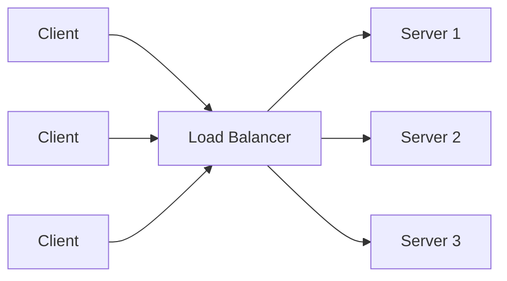

When your application outgrows a single server, you put a load balancer in front. But a load balancer is only as good as its routing algorithm. The same infrastructure can behave very differently depending on which strategy you choose — and the wrong choice leads to hot spots, cache thrashing, or uneven resource usage.

## What a Load Balancer Does

A load balancer sits between clients and your backend servers. Every incoming request hits the load balancer first, which then picks a backend and forwards the request. The backend sends its response, usually back through the load balancer, sometimes directly to the client.



The interesting part is how the load balancer picks which server to send each request to. That's the algorithm.

## Round Robin

The simplest algorithm: cycle through servers in order. Request 1 → Server 1, Request 2 → Server 2, Request 3 → Server 3, Request 4 → Server 1, and so on.

**Nginx config:**

```nginx
upstream backend {
    server 10.0.0.1:8080;
    server 10.0.0.2:8080;
    server 10.0.0.3:8080;
    # round robin is the default — no directive needed
}

server {
    location / {
        proxy_pass http://backend;
    }
}
```

**Weighted round robin** lets you send more traffic to beefier servers:

```nginx
upstream backend {
    server 10.0.0.1:8080 weight=3;  # gets 3x the traffic
    server 10.0.0.2:8080 weight=1;
}
```

**When it works well:** homogeneous requests (similar cost per request) on identical servers.

**Where it breaks down:** if some requests are expensive (a heavy database query vs. a health check), round robin ignores that. A server can get stuck processing a slow request while others are idle.

## Least Connections

Instead of cycling blindly, send the request to whichever server has the fewest active connections right now.

```nginx
upstream backend {
    least_conn;
    server 10.0.0.1:8080;
    server 10.0.0.2:8080;
    server 10.0.0.3:8080;
}
```

In HAProxy:

```
backend web_servers
    balance leastconn
    server web1 10.0.0.1:8080 check
    server web2 10.0.0.2:8080 check
    server web3 10.0.0.3:8080 check
```

**When it works well:** mixed-cost workloads where some requests take much longer than others — WebSocket connections, file uploads, long-polling endpoints. Least connections naturally avoids overwhelming a server that's already busy.

**Limitation:** connection count isn't always a perfect proxy for server load. A server could have few connections but be CPU-bound on those connections.

## IP Hash (Sticky Sessions)

Route requests from the same client IP to the same server, every time.

```nginx
upstream backend {
    ip_hash;
    server 10.0.0.1:8080;
    server 10.0.0.2:8080;
    server 10.0.0.3:8080;
}
```

**When it works well:** applications that store session state locally on the server (in-memory session caches, local file uploads). The client always lands on the server that holds their session.

**Why it's usually the wrong answer:** it couples your load balancer to application state. The real fix is to externalize session state to Redis or a shared database, then any algorithm works. IP hash also distributes poorly if clients are behind a corporate NAT (thousands of users share one IP).

## Consistent Hashing

This is the most sophisticated strategy, and the one you need when you have a caching tier or stateful backends.

The idea: map both servers and request keys (usually user ID or cache key) onto a virtual ring. Each request is assigned to the first server clockwise on the ring from the request's hash point.

```
Ring:
  0° ........... Server A (hash 45°)
                   .
                   .
  Server B         .
  (hash 140°)  ..........
                           .
                           .
                  Server C (hash 280°)
```

A request hashing to 90° lands on Server A (next clockwise). A request hashing to 200° lands on Server C.

The magic: **when a server is added or removed, only the keys on that server's arc need to remapped** — not the entire key space. With simple hash-mod approaches, adding a server reshuffles everything.

**Example in Python:**

```python
import hashlib
import bisect

class ConsistentHashRing:
    def __init__(self, servers: list[str], replicas: int = 150):
        self.replicas = replicas
        self.ring: dict[int, str] = {}
        self.sorted_keys: list[int] = []

        for server in servers:
            self.add_server(server)

    def _hash(self, key: str) -> int:
        return int(hashlib.md5(key.encode()).hexdigest(), 16)

    def add_server(self, server: str):
        for i in range(self.replicas):
            h = self._hash(f"{server}:{i}")
            self.ring[h] = server
            bisect.insort(self.sorted_keys, h)

    def get_server(self, key: str) -> str:
        h = self._hash(key)
        idx = bisect.bisect_right(self.sorted_keys, h) % len(self.sorted_keys)
        return self.ring[self.sorted_keys[idx]]

ring = ConsistentHashRing(["server1", "server2", "server3"])
print(ring.get_server("user_123"))   # → server2
print(ring.get_server("user_456"))   # → server1
print(ring.get_server("user_789"))   # → server3
```

```
$ python ring.py
server2
server1
server3
```

**When it works well:** distributed caches, session affinity without IP hash's fragility, microservice routing where specific services own specific data ranges.

## Random

Exactly what it sounds like — pick a random backend. Surprisingly effective in practice because random selection approximates uniform distribution over time, without maintaining connection count state. Some load balancers use this as a fast fallback.

```python
import random

def pick_server(servers: list[str]) -> str:
    return random.choice(servers)
```

**Power of two choices:** a refinement of random — pick two random servers, then route to whichever has fewer connections. This performs nearly as well as least connections with much lower overhead (no global state needed).

## Health Checks

Every algorithm assumes the servers are healthy. A good load balancer continuously probes backends and removes unhealthy ones automatically:

```nginx
upstream backend {
    least_conn;
    server 10.0.0.1:8080 max_fails=3 fail_timeout=30s;
    server 10.0.0.2:8080 max_fails=3 fail_timeout=30s;
}
```

In HAProxy, active health checks run on a configurable interval:

```
backend web_servers
    option httpchk GET /healthz
    http-check expect status 200
    server web1 10.0.0.1:8080 check inter 5s fall 3 rise 2
    server web2 10.0.0.2:8080 check inter 5s fall 3 rise 2
```

`fall 3` means 3 consecutive failures before marking down; `rise 2` means 2 successes to bring back up.

## Choosing an Algorithm

| Situation | Algorithm |
|-----------|-----------|
| Stateless API, homogeneous requests | Round robin |
| Mixed-cost requests (some slow, some fast) | Least connections |
| Local server-side session state (legacy apps) | IP hash |
| Distributed cache, data partitioning | Consistent hashing |
| Simplicity, surprising effectiveness | Random / power of two choices |

## Conclusion

Round robin is the right default for stateless services with similar request costs. Least connections is better when request duration varies significantly. Consistent hashing solves the cache invalidation problem when scaling out stateful backends. For most modern apps — where session state lives in Redis and services are stateless — round robin with health checks gets you 90% of the way there without the operational complexity of the others.
