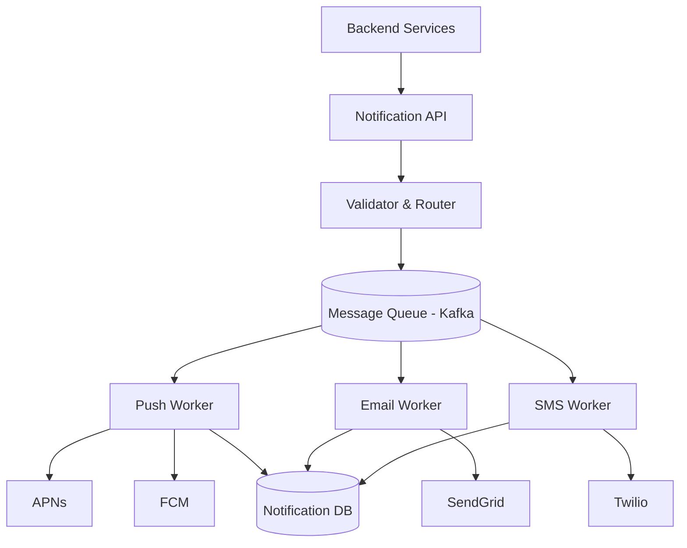

Every app eventually needs to notify its users — a new message arrived, your order shipped, someone liked your post. What looks like a simple feature from the outside is a deceptively complex distributed system problem: you need to reach users across multiple channels, handle delivery failures gracefully, and do it at millions of events per hour without dropping a single notification.

## What We're Building

A notification service sits between your application backends and the delivery providers (APNs for iOS, FCM for Android, SendGrid for email, Twilio for SMS). Its job is to:

1. Accept notification requests from internal services
2. Route them to the right channel(s) per user
3. Deliver reliably, with retries on failure
4. Track delivery status

**Scale targets for this design:** 10M notifications/day across push, email, and SMS.

## High-Level Architecture



The queue is the most important architectural decision here. Without it, a spike in notification requests (say, a marketing blast to 2M users) would overwhelm the delivery workers or the third-party APIs. The queue absorbs the spike and lets workers drain it at a controlled rate.

## The Notification API

Internal services POST to the notification API with a simple payload:

```json
{
  "user_id": "u_1234",
  "type": "order_shipped",
  "data": {
    "order_id": "ord_9876",
    "tracking_url": "https://track.example.com/ord_9876"
  },
  "channels": ["push", "email"],
  "priority": "normal"
}
```

The API looks up user preferences and device tokens, then publishes a message to the appropriate Kafka topic per channel.

```python
@app.post("/notifications")
async def send_notification(req: NotificationRequest):
    user_prefs = await prefs_service.get(req.user_id)
    channels = resolve_channels(req.channels, user_prefs)

    for channel in channels:
        payload = build_payload(req, channel, user_prefs)
        await kafka.produce(topic=f"notifications.{channel}", value=payload)

    return {"status": "queued", "notification_id": payload["id"]}
```

Notice the API returns immediately after enqueuing. It does not wait for delivery — that's the worker's job.

## User Preferences and Device Registry

The service needs to know how each user wants to be reached and what their device tokens are:

```sql
CREATE TABLE user_notification_prefs (
    user_id     VARCHAR(64) PRIMARY KEY,
    email       VARCHAR(255),
    phone       VARCHAR(20),
    push_enabled  BOOLEAN DEFAULT TRUE,
    email_enabled BOOLEAN DEFAULT TRUE,
    sms_enabled   BOOLEAN DEFAULT FALSE,
    quiet_hours_start TIME,
    quiet_hours_end   TIME,
    timezone    VARCHAR(64) DEFAULT 'UTC'
);

CREATE TABLE device_tokens (
    id          BIGSERIAL PRIMARY KEY,
    user_id     VARCHAR(64) NOT NULL,
    platform    VARCHAR(10) NOT NULL,  -- 'ios' or 'android'
    token       TEXT NOT NULL,
    created_at  TIMESTAMPTZ DEFAULT NOW(),
    last_seen   TIMESTAMPTZ
);

CREATE INDEX idx_device_tokens_user ON device_tokens (user_id);
```

## The Delivery Workers

Each channel has a dedicated worker pool that reads from its Kafka topic. Here's a simplified push worker:

```python
class PushWorker:
    def __init__(self):
        self.apns = APNsClient(cert_path="/certs/apns.p12")
        self.fcm = FCMClient(api_key=os.environ["FCM_KEY"])

    async def process(self, message: dict):
        tokens = await db.fetch_device_tokens(message["user_id"])

        for token in tokens:
            try:
                if token.platform == "ios":
                    await self.apns.send(token.token, message["payload"])
                else:
                    await self.fcm.send(token.token, message["payload"])

                await db.record_delivery(message["id"], token.id, "delivered")

            except InvalidTokenError:
                await db.deactivate_token(token.id)
            except RateLimitError:
                await kafka.republish_with_delay(message, delay_seconds=60)
            except Exception as e:
                await db.record_delivery(message["id"], token.id, "failed", str(e))
```

Three failure modes need distinct handling:
- **Invalid token**: the user uninstalled the app — deactivate the token, don't retry
- **Rate limit**: back off and republish to the queue with a delay
- **Transient error**: retry with exponential backoff (Kafka consumer offset not committed until success)

## Retry and Dead Letter Queue

For transient failures, don't just retry immediately — use exponential backoff with a dead letter queue (DLQ) for messages that exceed the retry limit:

```
Attempt 1: immediate
Attempt 2: 30 seconds later
Attempt 3: 2 minutes later
Attempt 4: 10 minutes later
→ Move to DLQ after 4 failures
```

The DLQ holds failed notifications for manual inspection. An alert fires when the DLQ depth exceeds a threshold.

```python
MAX_RETRIES = 4

async def handle_failure(message: dict, error: Exception):
    retries = message.get("retry_count", 0)

    if retries >= MAX_RETRIES:
        await kafka.produce("notifications.dlq", message)
        return

    delay = 30 * (4 ** retries)  # 30s, 120s, 480s, 1920s
    message["retry_count"] = retries + 1
    await kafka.produce_with_delay(
        topic=f"notifications.{message['channel']}",
        value=message,
        delay_seconds=delay
    )
```

## Quiet Hours and Batching

Nobody wants a push notification at 2 AM. The router checks user quiet hours before enqueuing:

```python
def should_delay_for_quiet_hours(user_prefs, priority: str) -> int:
    if priority == "urgent":
        return 0  # urgent notifications always go through

    now = datetime.now(tz=user_prefs.timezone)
    if user_prefs.quiet_hours_start <= now.time() <= user_prefs.quiet_hours_end:
        # calculate seconds until quiet hours end
        return seconds_until(user_prefs.quiet_hours_end, now)

    return 0
```

For marketing-style batch sends (e.g., a newsletter to 5M users), add a rate limiter in the worker to avoid hitting provider rate limits:

```python
# Using a token bucket to cap at 5,000 FCM requests/second
rate_limiter = TokenBucket(rate=5000, capacity=5000)

async def send_with_rate_limit(token, payload):
    await rate_limiter.acquire()
    return await fcm.send(token, payload)
```

## Tracking Delivery Status

Store a record for every notification attempt so you can debug failures and measure delivery rates:

```sql
CREATE TABLE notification_log (
    id              BIGSERIAL PRIMARY KEY,
    notification_id VARCHAR(64) NOT NULL,
    user_id         VARCHAR(64) NOT NULL,
    channel         VARCHAR(20) NOT NULL,
    status          VARCHAR(20) NOT NULL,  -- queued, delivered, failed, bounced
    provider        VARCHAR(40),
    error_message   TEXT,
    sent_at         TIMESTAMPTZ,
    delivered_at    TIMESTAMPTZ
);
```

For email, delivery confirmation comes via webhooks from SendGrid. For push, delivery receipts come back through APNs/FCM callbacks. Wire those up to update `notification_log.status`.

## Conclusion

A notification service is a queue-centric system where the key design decisions are: absorbing spikes with Kafka, routing per channel per user preference, and handling the three classes of delivery failure (invalid token, rate limit, transient error) differently. The hardest part in practice isn't the happy path — it's the edge cases: expired tokens, quiet hours, provider outages, and ensuring that a marketing blast to millions of users doesn't take down your delivery workers.
