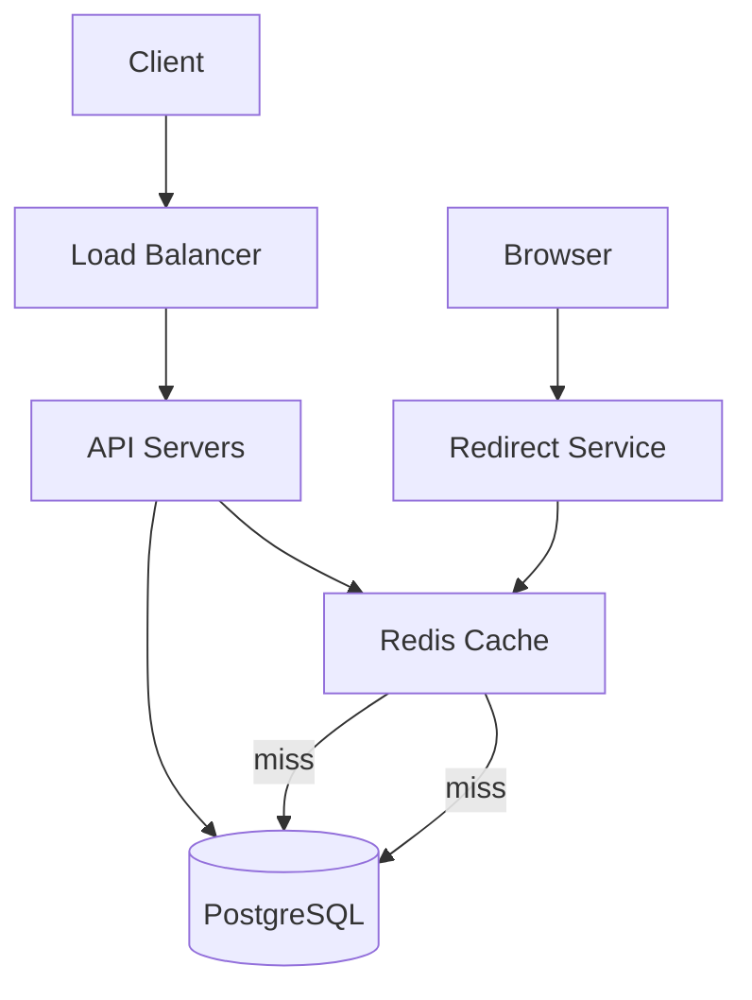

URL shorteners look simple from the outside: paste a long URL, get a short one back. But building one that handles millions of requests per day while staying reliable and fast is a genuinely interesting design challenge. It covers hashing, database layout, caching, and redirect performance — which is why it's one of the most common system design interview questions.

## Requirements

Before designing anything, let's be explicit about what we're building:

**Functional requirements:**
- Given a long URL, generate a short alias (e.g., `https://short.ly/xK3mP`)
- Visiting the short URL redirects to the original long URL
- Optional: custom aliases, expiry dates, click analytics

**Non-functional requirements:**
- Reads (redirects) heavily outweigh writes (link creation) — expect a 100:1 ratio or more
- Redirects must be fast — under 10ms overhead
- Short codes must be unique and non-guessable
- System should handle 100M URLs and 10B redirects per day at scale

## High-Level Architecture



The write path (creating short URLs) and the read path (resolving redirects) can be separated into independent services since they have very different load profiles.

## Generating Short Codes

The core problem is mapping a long URL to a short, unique code. There are two main approaches.

### Option 1: Hash-based

Take a hash of the URL, then base62-encode the first N characters of the result:

```python
import hashlib
import base64

def generate_short_code(long_url: str) -> str:
    digest = hashlib.md5(long_url.encode()).digest()
    encoded = base64.urlsafe_b64encode(digest).decode()
    return encoded[:7]  # 7 chars of base64 = ~3.5 billion combinations
```

The problem: two different URLs can produce the same 7-character prefix (collision). You need to detect this and retry with a slightly modified input or fall back to a counter.

### Option 2: Counter-based with Base62

Maintain a global auto-incrementing counter. Convert the counter value to base62 (0-9, a-z, A-Z = 62 characters).

```python
BASE62 = "0123456789abcdefghijklmnopqrstuvwxyzABCDEFGHIJKLMNOPQRSTUVWXYZ"

def to_base62(num: int) -> str:
    result = []
    while num > 0:
        result.append(BASE62[num % 62])
        num //= 62
    return ''.join(reversed(result))

# Counter value 1000000 → "4c92"
print(to_base62(1_000_000))
```

```
$ python3 encode.py
4c92
```

A 7-character base62 string gives you 62^7 ≈ 3.5 trillion unique codes, which is more than enough. The downside: a global counter is a write bottleneck under high load. The fix is to use distributed counter ranges — each API server pre-claims a batch of 1000 IDs from a central service and uses them locally.

## Database Schema

```sql
CREATE TABLE short_urls (
    id          BIGSERIAL PRIMARY KEY,
    code        VARCHAR(10) UNIQUE NOT NULL,
    long_url    TEXT NOT NULL,
    user_id     BIGINT,
    created_at  TIMESTAMPTZ DEFAULT NOW(),
    expires_at  TIMESTAMPTZ,
    click_count BIGINT DEFAULT 0
);

CREATE INDEX idx_short_urls_code ON short_urls (code);
```

The `code` column is the hot lookup path — every redirect hits it. The index keeps that lookup at O(log n).

For click analytics at scale, don't increment `click_count` inline on every redirect. Instead, emit click events to a queue (Kafka, SQS) and aggregate them asynchronously.

## The Redirect Flow

When a user visits `https://short.ly/xK3mP`, the redirect service needs to:

1. Extract the code (`xK3mP`) from the path
2. Look up the long URL
3. Respond with a `301` (permanent) or `302` (temporary) redirect

```python
from fastapi import FastAPI, HTTPException
from fastapi.responses import RedirectResponse
import redis

app = FastAPI()
cache = redis.Redis(host="localhost", decode_responses=True)

@app.get("/{code}")
async def redirect(code: str):
    long_url = cache.get(f"url:{code}")

    if not long_url:
        long_url = db.query("SELECT long_url FROM short_urls WHERE code = $1", code)
        if not long_url:
            raise HTTPException(status_code=404)
        cache.setex(f"url:{code}", 86400, long_url)  # cache for 24h

    return RedirectResponse(url=long_url, status_code=302)
```

**301 vs 302:** A `301` tells browsers to cache the redirect permanently — future clicks bypass your server entirely, which is great for throughput but means you lose click tracking. Use `302` if you need analytics; use `301` for maximum speed.

## Caching Layer

Since reads vastly outnumber writes, Redis is your best friend here. The access pattern for URLs follows a power law — the top 20% of URLs account for 80% of traffic. A Redis cache with an LRU eviction policy handles this naturally.

```bash
# Check cache hit rate
$ redis-cli info stats | grep keyspace_hits
keyspace_hits:9821043
keyspace_misses:183921
# Hit rate: ~98% — healthy
```

A reasonable cache TTL is 24 hours. Popular URLs will constantly be refreshed before they expire; stale entries for dead links will age out naturally.

## Handling Collisions and Duplicates

If the same long URL is shortened twice, you have a choice:

- **Return the same short code** (deduplicate): requires an index on `long_url`, which is expensive for a TEXT column. Use a hash of the URL as an indexed column instead.
- **Return a new short code**: simpler to implement, wastes storage.

Most production systems do the simpler thing and create a new code each time, since storage is cheap and deduplication adds index complexity.

## Scaling Beyond a Single Server

At 10B redirects/day (~115K RPS), a single database can't keep up. The read-heavy nature of the system makes horizontal scaling straightforward:

- **Read replicas**: add PostgreSQL read replicas; the redirect service only needs to read
- **Redis cluster**: shard the cache by code prefix
- **CDN for redirects**: at extreme scale, you can push redirect rules to CDN edge nodes so resolution happens without hitting your origin at all

For writes (link creation), a distributed counter service (like ZooKeeper or a dedicated sequence service) prevents counter collisions across API servers.

## Conclusion

A URL shortener is a classic read-heavy system that benefits from aggressive caching, a well-indexed database, and a counter-based or hash-based code generation strategy. The key design decisions are: counter vs hash for code generation, `301` vs `302` for redirect semantics, and how to keep the Redis hit rate high. Once you nail those, scaling is mostly a matter of adding read replicas and cache nodes.
