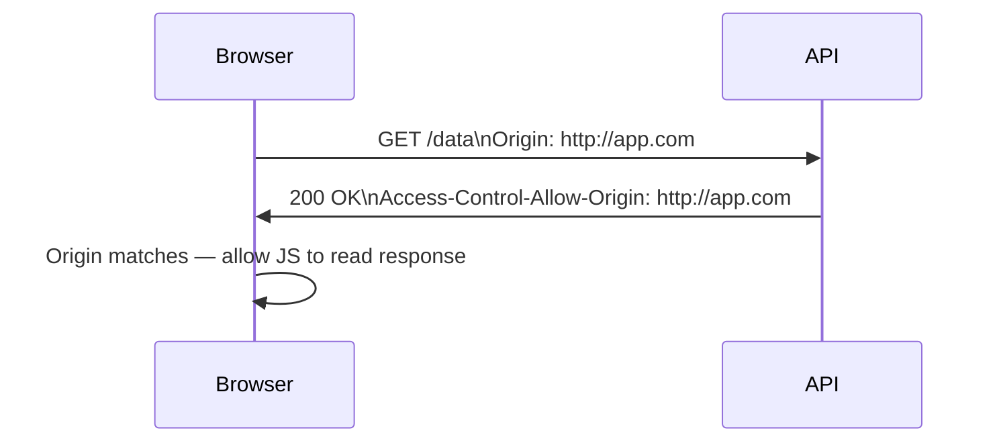
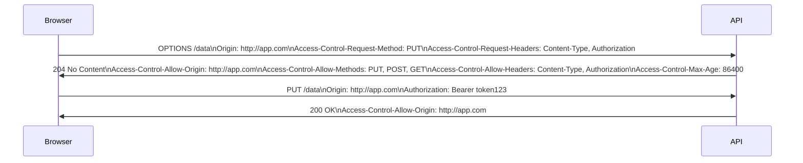

You're testing your new React app against a local API. You open the browser console and see: `Access to fetch at 'http://localhost:8080/api/data' from origin 'http://localhost:3000' has been blocked by CORS policy`. The server is running, the URL is right, the API works in Postman — but the browser refuses. This is CORS, and it's one of the most consistently confusing things in web development.

## What CORS Is (and Isn't)

CORS — Cross-Origin Resource Sharing — is a **browser security policy**, not a server security feature. It has nothing to do with Postman, curl, or any non-browser client. Those tools make requests directly; browsers impose CORS as a protection for their users.

The **Same-Origin Policy** (SOP) is the underlying rule: a web page can only make requests to the same origin it was loaded from. Origin = scheme + hostname + port. So `http://app.com:3000` and `http://api.com:8080` are different origins.

CORS is the mechanism by which a server can say "I'm okay with requests from that other origin." Without CORS headers, the browser's SOP blocks the response (the request is made, but the browser refuses to expose the response to JavaScript).

## Why This Exists

Imagine you're logged into your bank at `bank.com`. A malicious page at `evil.com` wants to make a request to `bank.com/transfer?to=hacker&amount=10000`. Without SOP, that request would include your bank session cookie and succeed.

With SOP, `evil.com` can't read the response from `bank.com` in your browser — even if the request goes through. CORS relaxes this restriction only when the server explicitly opts in.

## The Browser's CORS Flow

When your frontend at `http://app.com` makes a fetch to `http://api.com`:

1. Browser adds an `Origin: http://app.com` header to the request
2. Server responds with (or without) `Access-Control-Allow-Origin` headers
3. Browser checks: does the response allow this origin?
4. If yes: JavaScript gets the response. If no: browser blocks it with a CORS error.



## Simple vs Preflighted Requests

Not all requests are equal. Browsers treat "simple" requests differently from more complex ones.

**Simple requests** (no preflight) are: GET/POST/HEAD with only standard headers and content types (`text/plain`, `application/x-www-form-urlencoded`, `multipart/form-data`).

**Preflighted requests** require an OPTIONS request first — this happens for: `PUT`, `DELETE`, `PATCH`, `Content-Type: application/json`, or custom headers like `Authorization`.



The preflight is the browser asking: "Is this kind of request allowed?" The `Access-Control-Max-Age` header caches the preflight result so the browser doesn't repeat it for every request.

## The CORS Headers

| Header | Direction | Purpose |
|--------|-----------|---------|
| `Origin` | Request | Sent by browser, identifies the requesting origin |
| `Access-Control-Allow-Origin` | Response | Which origins are allowed |
| `Access-Control-Allow-Methods` | Response | Which HTTP methods are allowed |
| `Access-Control-Allow-Headers` | Response | Which request headers are allowed |
| `Access-Control-Allow-Credentials` | Response | Whether cookies/auth headers are allowed |
| `Access-Control-Max-Age` | Response | Seconds to cache preflight response |
| `Access-Control-Expose-Headers` | Response | Which response headers JS can read |

## Configuring CORS in Practice

### Nginx

```nginx
server {
    # Handle preflight
    location /api/ {
        if ($request_method = OPTIONS) {
            add_header Access-Control-Allow-Origin "https://app.example.com";
            add_header Access-Control-Allow-Methods "GET, POST, PUT, DELETE, OPTIONS";
            add_header Access-Control-Allow-Headers "Authorization, Content-Type";
            add_header Access-Control-Max-Age "86400";
            return 204;
        }

        add_header Access-Control-Allow-Origin "https://app.example.com";
        proxy_pass http://backend;
    }
}
```

### Express (Node.js)

```javascript
const cors = require('cors');

// Allow specific origin
app.use(cors({
  origin: 'https://app.example.com',
  methods: ['GET', 'POST', 'PUT', 'DELETE'],
  allowedHeaders: ['Content-Type', 'Authorization'],
  credentials: true,         // allow cookies
  maxAge: 86400              // cache preflight 24h
}));

// Dynamic origin allowlist
const allowedOrigins = ['https://app.example.com', 'https://admin.example.com'];

app.use(cors({
  origin: (origin, callback) => {
    if (!origin || allowedOrigins.includes(origin)) {
      callback(null, true);
    } else {
      callback(new Error('Not allowed by CORS'));
    }
  }
}));
```

### FastAPI (Python)

```python
from fastapi import FastAPI
from fastapi.middleware.cors import CORSMiddleware

app = FastAPI()

app.add_middleware(
    CORSMiddleware,
    allow_origins=["https://app.example.com"],
    allow_credentials=True,
    allow_methods=["GET", "POST", "PUT", "DELETE"],
    allow_headers=["Authorization", "Content-Type"],
    max_age=86400,
)
```

## Credentials and Cookies

If your API uses cookies or the `Authorization` header, you need `credentials: true` on both sides:

**Frontend:**

```javascript
fetch("https://api.example.com/profile", {
  credentials: "include"  // sends cookies cross-origin
})
```

**Backend:**

```
Access-Control-Allow-Credentials: true
Access-Control-Allow-Origin: https://app.example.com  # must be specific, not *
```

`Access-Control-Allow-Origin: *` cannot be combined with credentials. You must specify the exact origin.

## The Wildcard Trap

`Access-Control-Allow-Origin: *` allows any origin to read responses. This is fine for truly public APIs (public CDN assets, open data APIs). It's a problem when:

- The API is authenticated via cookies (credentials + wildcard = not allowed anyway)
- The API serves data that should only be consumed by your own apps
- You want to prevent scrapers from trivially using your API from the browser

Don't reflexively add `*` to fix CORS errors in development — use a proper allowlist for production.

## Testing CORS Without a Browser

Curl doesn't enforce CORS, but you can simulate the browser's behavior:

```bash
# Simulate a preflight
$ curl -X OPTIONS https://api.example.com/data \
  -H "Origin: https://app.example.com" \
  -H "Access-Control-Request-Method: PUT" \
  -H "Access-Control-Request-Headers: Content-Type" \
  -v 2>&1 | grep -i "access-control"

< Access-Control-Allow-Origin: https://app.example.com
< Access-Control-Allow-Methods: GET, POST, PUT, DELETE
< Access-Control-Allow-Headers: Content-Type, Authorization
< Access-Control-Max-Age: 86400
```

## Common Mistakes

**Setting CORS in the wrong place:** if you have Nginx proxying to your app, only one layer should set CORS headers. If both Nginx and your app set them, you get duplicate headers and the browser rejects them.

**Caching a failed CORS preflight:** `Access-Control-Max-Age` caches preflight results. If you deploy a new origin to the allowlist, users may have the old "blocked" response cached for up to `Max-Age` seconds. Set `Max-Age` to 0 during development.

**Confusing CORS with authentication:** CORS is not an authentication or authorization mechanism. It only controls which origins can read responses in the browser. If you need to restrict API access, you still need auth tokens or API keys.

## Conclusion

CORS errors are browser-side enforcement of the Same-Origin Policy. The server opts into cross-origin access by returning the right headers; without them, the browser blocks the response from JavaScript even though the request reached the server. Fix it by configuring `Access-Control-Allow-Origin` to your frontend's origin, adding `Access-Control-Allow-Credentials` if you need cookies, and handling OPTIONS preflight for non-simple requests. Never use `*` with credentials, and set CORS headers in exactly one place in your stack.
