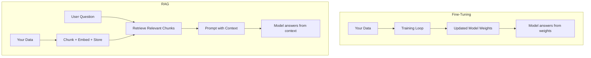

When you need an LLM to work with your domain — your company's products, a proprietary codebase, a specialized knowledge base — you have two main options: fine-tune the model on your data, or build a RAG pipeline that retrieves the right context at query time. Both approaches are widely used, and they're not mutually exclusive. But they're solving fundamentally different problems, and picking the wrong one wastes significant time and money. Here's how to think through the decision.

## What Each Approach Does

**Fine-tuning** means taking a pre-trained model and continuing its training on your own dataset. You're updating the model's weights — baking knowledge, behavior, or style directly into the model itself. After fine-tuning, the model "knows" things without being told in the prompt.

**RAG (Retrieval-Augmented Generation)** leaves the model's weights untouched. Instead, you build a retrieval system that fetches relevant chunks of your data at query time and includes them in the prompt as context. The model answers based on what's in the prompt, not what's in its weights.



## What Fine-Tuning Is Good At

Fine-tuning changes *how* the model behaves, not just *what it knows*. It's the right tool when you need to:

- **Change the model's output format or tone.** If you need every response to follow a specific JSON schema, or to match a particular brand voice, fine-tuning instills that behavior reliably. RAG alone won't consistently change how the model structures its output.
- **Teach the model a specialized task.** Training a model to extract specific entity types from medical notes, or to classify support tickets into internal categories, is a task-shaping problem — fine-tuning solves it.
- **Improve performance on a narrow domain.** If 80% of queries are about a specific topic, fine-tuning on domain data improves both accuracy and confidence in that area.
- **Reduce latency and cost.** A fine-tuned smaller model can outperform a larger base model on your task, at lower cost per query.

### The downsides

Fine-tuning is expensive to start: you need a curated, labeled dataset (typically hundreds to thousands of examples), GPU compute for training, and a re-training pipeline for when your data changes. Most importantly, it doesn't handle *facts that change* well — the knowledge is frozen in the weights.

## What RAG Is Good At

RAG is the right tool when the core problem is *access to information*, not behavior change:

- **Your data changes frequently.** Legal documents, product catalogs, internal wikis, support articles — these are updated regularly. With RAG you update the index; with fine-tuning you retrain.
- **You need source citations.** RAG knows which chunks it retrieved, so it can say "according to policy document v3.2, section 4..." Fine-tuned models hallucinate sources.
- **You need to answer questions about large corpora.** The context window is the limit for RAG, but the retrieval step scales to millions of documents. Fine-tuning can't "know" 10 million documents.
- **You want auditability.** You can inspect what the model was shown. This matters in regulated industries.

### The downsides

RAG adds latency (embedding the query, searching the index, stuffing the context). It also fails when the answer requires synthesizing across many documents rather than retrieving a specific passage. And retrieval quality is a moving target — garbage in, garbage out.

## The Decision Framework

Answer these questions in order:

1. **Does the answer depend on frequently updated data?**
   - Yes → RAG (or RAG + fine-tuning)
   - No → continue

2. **Is the problem about output format, style, or task behavior?**
   - Yes → Fine-tuning
   - No → continue

3. **Can the answer fit in a context window?**
   - Yes → RAG
   - No → Consider multi-step retrieval or summarization pipelines

4. **Do you have labeled training data (hundreds of examples)?**
   - Yes → Fine-tuning is viable
   - No → RAG is lower-barrier to start

## Using Both Together

The approaches compose well. A common pattern:

1. **Fine-tune for behavior** — train the model to respond in your format, use your taxonomy, or follow your conventions.
2. **Use RAG for facts** — retrieve the actual current data at query time.

A customer support assistant might be fine-tuned to always respond with empathy and route to the right department, while using RAG to pull the latest product documentation or account-specific data.

```
Base Model
    └── Fine-tuned on support conversations → consistent tone, format, routing
            └── RAG retrieves current pricing, policies, account data → factual accuracy
```

## Practical Cost Comparison

| | Fine-tuning | RAG |
|---|---|---|
| Upfront work | High (data curation, training) | Medium (chunking, embedding, index) |
| Cost per query | Low (smaller model) | Medium (retrieval + generation) |
| Data refresh | Retrain (days to weeks) | Re-index (minutes to hours) |
| Requires labeled data | Yes | No |
| Good for behavior changes | Yes | No |
| Good for factual recall | Limited | Yes |

## Conclusion

Fine-tuning and RAG solve adjacent but different problems. If you need the model to behave differently — follow a format, master a task, adopt a persona — fine-tune. If you need the model to know things that change — your docs, your products, your policies — use RAG. When in doubt, start with RAG: it's faster to build, easier to update, and the failure modes are more visible. Layer in fine-tuning later once you've validated that the core retrieval and generation pipeline is working.
