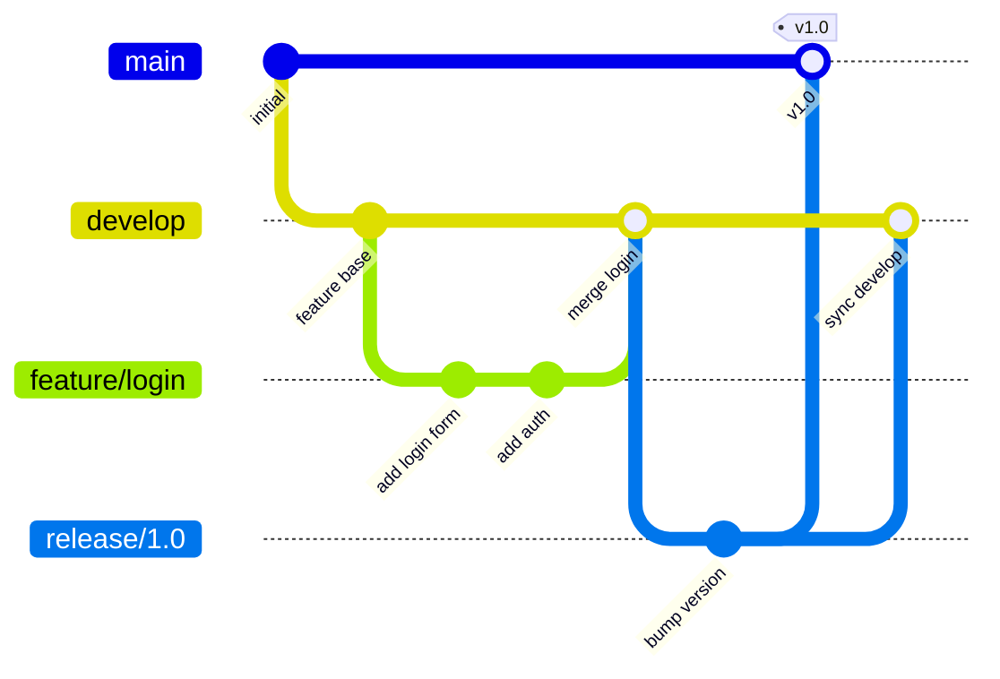
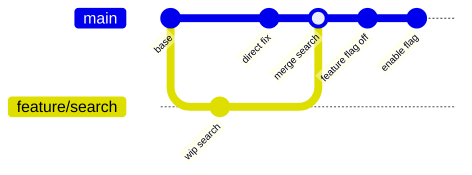

How you branch in git shapes how your team releases software. Get it wrong and you end up with merge conflicts that take days to resolve, a release branch that's always "almost ready," and a team afraid to touch anything that's in flight. There are two dominant schools of thought — Git Flow, which uses long-lived branches for features and releases, and trunk-based development, which keeps everyone on one branch and uses feature flags for isolation. Understanding the trade-offs helps you pick the right model for your team's size and release cadence.

## Git Flow

Git Flow was formalized by Vincent Driessen in 2010 and became the de-facto standard for teams shipping versioned software releases. It defines five branch types with explicit rules about how they interact.



### The five branch types

**`main`** (or `master`) — always reflects production. Only ever receives merges from `release` or `hotfix` branches. Never commit directly to `main`.

**`develop`** — integration branch. All completed features merge here. This is what gets deployed to staging.

**`feature/*`** — branched from `develop`, merged back to `develop`. One branch per feature. Lives as long as the feature is in development.

**`release/*`** — branched from `develop` when a release is ready. Only bug fixes go here — no new features. Merges into both `main` (tagged) and `develop` when done.

**`hotfix/*`** — branched from `main` to fix critical production bugs. Merges into both `main` and `develop`.

### Git Flow in practice

```bash
# Start a feature
$ git checkout develop
$ git checkout -b feature/user-profile
# ... work, commit ...
$ git checkout develop
$ git merge --no-ff feature/user-profile
$ git branch -d feature/user-profile

# Prepare a release
$ git checkout develop
$ git checkout -b release/2.0
# bump version numbers, fix last-minute bugs
$ git checkout main
$ git merge --no-ff release/2.0
$ git tag -a v2.0 -m "Version 2.0"
$ git checkout develop
$ git merge --no-ff release/2.0
$ git branch -d release/2.0

# Emergency hotfix
$ git checkout main
$ git checkout -b hotfix/payment-crash
# fix the bug
$ git checkout main
$ git merge --no-ff hotfix/payment-crash
$ git tag -a v2.0.1 -m "Hotfix 2.0.1"
$ git checkout develop
$ git merge --no-ff hotfix/payment-crash
```

The `--no-ff` flag creates a merge commit even when a fast-forward would work. This preserves the visual history of when a feature branch was merged.

### When Git Flow fits

- **Versioned software** — mobile apps, desktop apps, libraries. You ship discrete versions and must support multiple versions simultaneously.
- **Compliance environments** — release branches give you an auditable window between "code complete" and "deployed," useful for regulated industries.
- **Slower release cadence** — weekly or monthly releases, not continuous deployment.
- **Larger teams** — clear boundaries between branches reduce coordination overhead when many people work on different features simultaneously.

### The downsides

Long-lived feature branches drift far from `develop`. Merging a two-week-old branch back into a busy `develop` branch is often painful. Git Flow also adds ceremony: every release requires touching four branches (feature → develop → release → main + back to develop).

## Trunk-Based Development

Trunk-based development (TBD) is the model used by Google, Facebook, and most teams doing continuous deployment. The rule is simple: everyone commits to `main` (the "trunk") at least once a day. Feature branches exist but are short-lived — hours to a day or two, never weeks.



### The mechanics

```bash
# Create a short-lived branch
$ git checkout -b feature/add-search
# ... implement, test ...
# Branch lives for hours, not weeks
$ git push origin feature/add-search
# Open a PR, get review, merge to main
$ git checkout main && git pull
```

The key enabler is **feature flags** (also called feature toggles). New code lands in `main` behind a flag that's off by default. You deploy continuously, but the feature isn't visible to users until you flip the flag.

```python
if feature_flags.is_enabled("new_search_ui", user=current_user):
    return render_new_search()
return render_legacy_search()
```

This decouples deployment from release — you can ship code daily and decide independently when to turn features on.

### CI requirements

TBD only works with a fast, reliable CI pipeline. Every commit to `main` must pass automated tests before it's considered shippable. Without this, you can't guarantee that `main` is always deployable.

- Tests must run in under 10 minutes (ideally under 5) — slow tests break the feedback loop.
- Any failing test must be fixed or reverted immediately; a broken `main` blocks the whole team.

### When trunk-based development fits

- **Continuous deployment** — web apps where you deploy multiple times a day.
- **Small to medium teams** — less branch coordination overhead when everyone's in the same place.
- **Microservices** — each service has its own trunk; branching complexity doesn't compound across a monorepo.
- **Teams with strong test coverage** — the discipline of TBD forces you to maintain test quality.

### The downsides

Feature flags add code complexity — you end up with branching logic throughout the codebase that needs to be cleaned up once features are fully rolled out. TBD also requires a culture of small commits and high test coverage; if your team hasn't built these habits yet, the model breaks down.

## Side-by-Side Comparison

| | Git Flow | Trunk-Based |
|---|---|---|
| Main branches | `main`, `develop`, `feature/*`, `release/*`, `hotfix/*` | `main` (+ short-lived `feature/*`) |
| Feature isolation | Long-lived branches | Feature flags |
| Release cadence | Versioned (weekly/monthly) | Continuous |
| Merge complexity | High (multiple branch types) | Low (short-lived branches) |
| Test requirements | Moderate | High (must gate `main`) |
| Best for | Versioned software, compliance | Web apps, continuous delivery |
| Parallel version support | Yes | Harder |

## A Middle Ground: GitHub Flow

Many teams land somewhere between the two. GitHub Flow is a simplified model: `main` is always deployable, feature branches are short-lived, and everything goes through a PR before merging. No `develop` branch, no release branches — just feature → PR → `main` → deploy.

```bash
$ git checkout -b feature/rate-limiting
# ... work ...
$ git push origin feature/rate-limiting
# Open PR, review, CI passes
$ git merge feature/rate-limiting main
$ git push origin main
# Deploy immediately
```

This works well for teams doing weekly or biweekly releases who find Git Flow too heavy but aren't yet doing continuous deployment.

## Conclusion

Git Flow gives you structure and explicit release control at the cost of branching complexity. Trunk-based development gives you speed and simplicity at the cost of discipline — you need feature flags, fast CI, and a culture of small commits. If you're shipping versioned software or working in a compliance-heavy environment, Git Flow's structure is worth the overhead. If you're running a web app and want to deploy continuously, trunk-based development with short-lived branches is the faster path. Most teams starting fresh do well with GitHub Flow and graduate to trunk-based as their CI and testing maturity grows.
