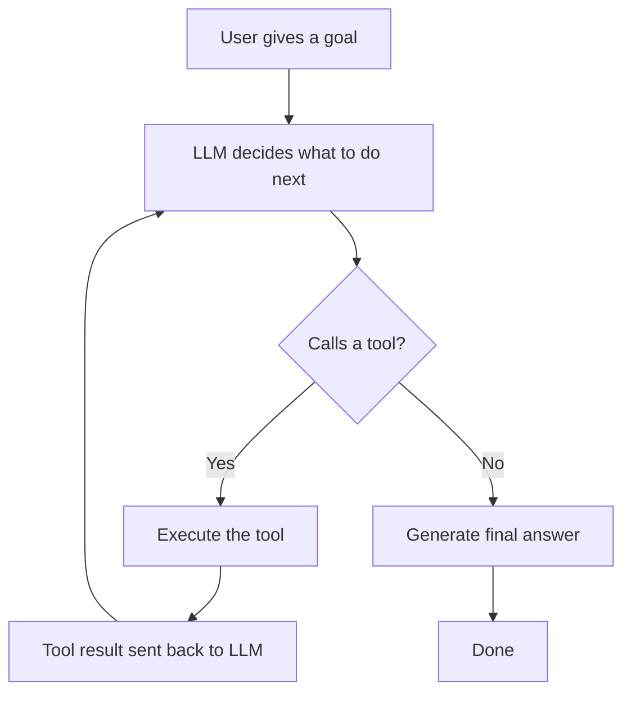

"AI agent" is one of those terms that gets thrown around so much it starts to feel meaningless. But there's a concrete technical definition: an agent is an LLM that can take actions — call tools, read files, search the web — and loop until a task is complete, rather than generating a single response and stopping. That loop is what makes an agent different from a chatbot. Let's look at the architecture, then build a minimal working example.

## The Agent Loop

A chatbot takes input and produces output. An agent takes a *goal* and runs a loop:



In each loop iteration, the LLM either calls a tool (getting a result it can use in the next step) or produces a final answer. This continues until the task is complete or a step limit is hit.

The key insight: the LLM acts as the *reasoning engine* while the tools do the actual work. The model itself doesn't browse the web or run Python — it calls a tool that does, then uses the result.

## Tool Use (Function Calling)

Modern LLM APIs support tool use natively. You define tools as JSON schemas, pass them to the model, and the model returns structured calls to them when it needs to.

Here's a simple weather tool definition for the Anthropic API:

```python
import anthropic
import json

client = anthropic.Anthropic()

tools = [
    {
        "name": "get_weather",
        "description": "Get the current weather for a city.",
        "input_schema": {
            "type": "object",
            "properties": {
                "city": {
                    "type": "string",
                    "description": "City name, e.g. 'Mumbai'",
                },
            },
            "required": ["city"],
        },
    },
    {
        "name": "get_time",
        "description": "Get the current local time for a city.",
        "input_schema": {
            "type": "object",
            "properties": {
                "city": {"type": "string"},
            },
            "required": ["city"],
        },
    },
]
```

## Implementing the Tool Functions

```python
def get_weather(city: str) -> str:
    weather_data = {
        "Mumbai": "32°C, humid, partly cloudy",
        "London": "14°C, overcast",
        "Tokyo": "22°C, sunny",
    }
    return weather_data.get(city, f"Weather data unavailable for {city}")

def get_time(city: str) -> str:
    time_data = {
        "Mumbai": "3:30 PM IST",
        "London": "10:00 AM GMT",
        "Tokyo": "7:00 PM JST",
    }
    return time_data.get(city, f"Time data unavailable for {city}")

def dispatch_tool(name: str, inputs: dict) -> str:
    if name == "get_weather":
        return get_weather(**inputs)
    elif name == "get_time":
        return get_time(**inputs)
    return f"Unknown tool: {name}"
```

## The Agent Loop

Now the actual agent loop — this is the core pattern:

```python
def run_agent(user_message: str) -> str:
    messages = [{"role": "user", "content": user_message}]

    while True:
        response = client.messages.create(
            model="claude-sonnet-4-6",
            max_tokens=1024,
            tools=tools,
            messages=messages,
        )

        messages.append({"role": "assistant", "content": response.content})

        if response.stop_reason == "end_turn":
            for block in response.content:
                if hasattr(block, "text"):
                    return block.text

        tool_results = []
        for block in response.content:
            if block.type == "tool_use":
                result = dispatch_tool(block.name, block.input)
                print(f"[tool] {block.name}({block.input}) → {result}")
                tool_results.append({
                    "type": "tool_result",
                    "tool_use_id": block.id,
                    "content": result,
                })

        messages.append({"role": "user", "content": tool_results})
```

Running it:

```python
answer = run_agent("What's the weather and current time in Mumbai and Tokyo?")
print(answer)
```

```
[tool] get_weather({'city': 'Mumbai'}) → 32°C, humid, partly cloudy
[tool] get_time({'city': 'Mumbai'}) → 3:30 PM IST
[tool] get_weather({'city': 'Tokyo'}) → 22°C, sunny
[tool] get_time({'city': 'Tokyo'}) → 7:00 PM JST

In Mumbai it's currently 3:30 PM IST with partly cloudy skies and 32°C —
quite humid. In Tokyo it's 7:00 PM JST, 22°C and sunny. Tokyo is much more
comfortable right now if you're looking to travel.
```

The model called four tools across two loop iterations (it can call multiple tools in parallel when they're independent), then synthesized the results into a coherent response.

## Adding a Code Execution Tool

The same pattern extends to more powerful tools. Here's a Python execution tool:

```python
import subprocess

def run_python(code: str) -> str:
    result = subprocess.run(
        ["python3", "-c", code],
        capture_output=True,
        text=True,
        timeout=10,
    )
    if result.returncode != 0:
        return f"Error: {result.stderr.strip()}"
    return result.stdout.strip()
```

With this tool, the agent can answer math questions, transform data, or validate logic by actually running code rather than predicting the output from memory.

```python
answer = run_agent("What is the sum of all prime numbers below 100?")
```

```
[tool] run_python({'code': '...'}) → 1060

The sum of all prime numbers below 100 is 1060.
```

## Guardrails and Safety

A few things to consider before giving an agent real tools:

- **Sandboxing** — code execution should run in a Docker container or subprocess with resource limits, never with access to production systems.
- **Step limits** — add a `max_iterations` counter to the loop to prevent infinite loops.
- **Human-in-the-loop** — for irreversible actions (sending emails, deleting records), require human confirmation before the tool runs.
- **Scoped permissions** — tools should only access what they need. A web search tool doesn't need filesystem access.

```python
def run_agent(user_message: str, max_iterations: int = 10) -> str:
    messages = [{"role": "user", "content": user_message}]
    iterations = 0

    while iterations < max_iterations:
        iterations += 1
        # ... loop body ...
    
    return "Agent hit iteration limit without completing the task."
```

## Conclusion

An AI agent is just an LLM + tools + a loop. The model decides which tool to call, the tool runs and returns a result, and the model decides what to do next. This simple pattern enables surprisingly capable behavior — the model can plan multi-step tasks, recover from tool errors, and synthesize results across many tool calls. Start with one or two well-defined tools, get the loop working correctly, then add tools incrementally as you understand the failure modes.
