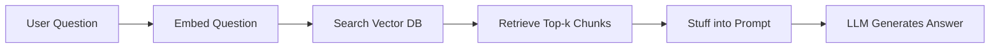

Large language models are impressive out of the box, but they have a hard limit: they only know what was in their training data. Retrieval-Augmented Generation (RAG) is the technique that breaks this ceiling — it lets you feed your own documents, databases, or live content into a model at query time, so it answers from *your* knowledge rather than its training cutoff. If you've ever built a "chat with your PDF" app, that's RAG. Let's dig into how it actually works, and build a working pipeline.

## How RAG Works

The core idea is simple: before sending a question to the LLM, look up the most relevant chunks of your data and include them in the prompt as context.



There are two phases:

1. **Indexing** — happens once (or periodically). You chunk your documents, embed each chunk, and store the embeddings in a vector database.
2. **Querying** — happens at runtime. You embed the user's question, do a nearest-neighbor search, retrieve the top-k chunks, and pass them to the LLM.

## Step 1: Chunking Your Documents

Chunking is underrated. Split too coarsely and your context window fills up with noise. Split too finely and individual chunks lose meaning.

A reasonable starting point: 512 tokens per chunk, 50-token overlap between adjacent chunks. The overlap prevents a sentence from being cut off at a chunk boundary.

```python
from langchain.text_splitter import RecursiveCharacterTextSplitter

splitter = RecursiveCharacterTextSplitter(
    chunk_size=512,
    chunk_overlap=50,
    separators=["\n\n", "\n", ".", " "],
)

with open("docs/handbook.txt") as f:
    raw_text = f.read()

chunks = splitter.split_text(raw_text)
print(f"Split into {len(chunks)} chunks")
```

```
Split into 143 chunks
```

## Step 2: Embedding Chunks

Embeddings are numerical representations of text where semantically similar sentences end up close together in vector space. We'll use OpenAI's `text-embedding-3-small` — it's cheap and accurate enough for most use cases.

```python
from openai import OpenAI

client = OpenAI()

def embed(texts: list[str]) -> list[list[float]]:
    response = client.embeddings.create(
        model="text-embedding-3-small",
        input=texts,
    )
    return [item.embedding for item in response.data]

embeddings = embed(chunks)
print(f"Each embedding has {len(embeddings[0])} dimensions")
```

```
Each embedding has 1536 dimensions
```

## Step 3: Storing in a Vector Database

We'll use [Chroma](https://www.trychroma.com/) — it runs in-process with zero setup, perfect for development. For production you'd swap this out for Pinecone, pgvector, or Weaviate.

```python
import chromadb

chroma = chromadb.Client()
collection = chroma.create_collection("handbook")

collection.add(
    documents=chunks,
    embeddings=embeddings,
    ids=[f"chunk_{i}" for i in range(len(chunks))],
)

print(f"Stored {collection.count()} documents")
```

```
Stored 143 documents
```

## Step 4: Querying — Retrieve Then Generate

At query time, embed the question and find the closest chunks. Then build a prompt that includes those chunks as context.

```python
def answer(question: str, top_k: int = 4) -> str:
    q_embedding = embed([question])[0]

    results = collection.query(
        query_embeddings=[q_embedding],
        n_results=top_k,
    )
    context_chunks = results["documents"][0]
    context = "\n\n".join(context_chunks)

    prompt = f"""Answer the question using only the context below.
If the answer isn't in the context, say "I don't know."

Context:
{context}

Question: {question}
Answer:"""

    response = client.chat.completions.create(
        model="gpt-4o-mini",
        messages=[{"role": "user", "content": prompt}],
    )
    return response.choices[0].message.content
```

```python
print(answer("What is the vacation policy for new employees?"))
```

```
New employees receive 15 days of paid vacation per year, accrued monthly
starting from their first day. Unused days can be carried over up to a
maximum of 5 days per year.
```

## Improving Retrieval Quality

The naive approach works, but there are a few common improvements worth knowing.

### Hybrid Search

Pure vector search can miss exact keyword matches (e.g., a specific error code or product SKU). Hybrid search combines BM25 (keyword-based) with vector search and merges results using Reciprocal Rank Fusion.

### Re-ranking

After retrieval, run a cross-encoder re-ranker (like `cross-encoder/ms-marco-MiniLM-L-6-v2`) to re-score the top-k chunks before sending to the LLM. This adds latency but noticeably improves precision.

### Metadata Filtering

Store metadata alongside each chunk (document name, date, category) and filter before the vector search. This prevents the retriever from returning chunks from an outdated policy document when the user asks about the current one.

```python
results = collection.query(
    query_embeddings=[q_embedding],
    n_results=top_k,
    where={"source": "employee-handbook-2024.pdf"},
)
```

## Evaluating a RAG Pipeline

The hardest part of RAG isn't building it — it's knowing when it's working. Common metrics:

| Metric | What it measures |
|---|---|
| **Faithfulness** | Does the answer stick to the retrieved context? |
| **Answer relevance** | Does the answer actually address the question? |
| **Context recall** | Did we retrieve the chunks that contain the answer? |

Tools like [RAGAS](https://github.com/explodinggradients/ragas) automate these evals against a reference question set.

## Conclusion

RAG is the practical path to grounding LLMs in private or up-to-date knowledge without the cost and complexity of fine-tuning. The pipeline has three moving parts — chunking, embedding, and retrieval — and each one has a meaningful impact on answer quality. Start with a basic Chroma setup, measure against a real question set, and iterate. The retrieval step is almost always where improvements have the most leverage.
