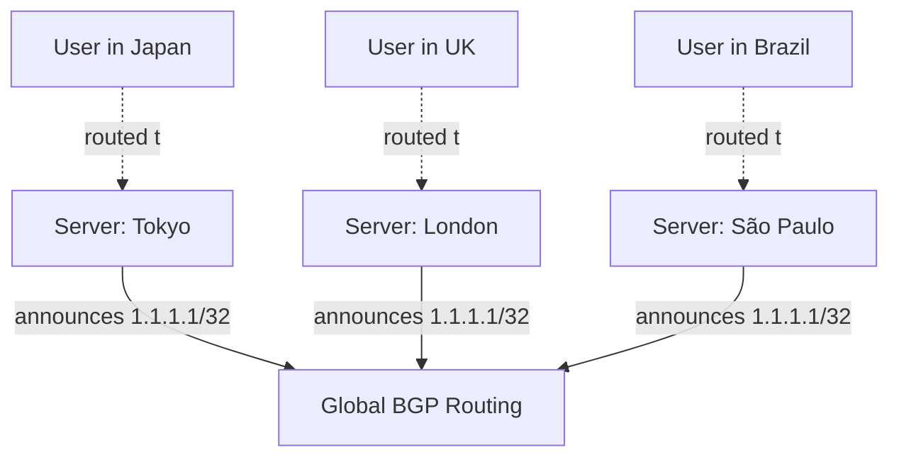

When you query `1.1.1.1` (Cloudflare's public DNS resolver) from Tokyo, you're talking to a server in or near Tokyo. Query the exact same IP address from São Paulo, and you're talking to a completely different physical machine, near São Paulo. This isn't DNS trickery or a load balancer redirecting you — it's **anycast**, a routing technique where the same IP address is announced from many physically distant locations simultaneously, and the network itself, not any application logic, decides which one you actually reach. This post covers how anycast actually works at the routing level, and why it's become the backbone technique behind modern CDNs and DDoS-resistant infrastructure.

## The Core Idea: One Address, Many Locations

In normal (**unicast**) routing, one IP address corresponds to exactly one physical destination — traffic sent to it converges on a single machine or network, no matter where the sender is located.

Anycast breaks that one-to-one mapping deliberately: the **same** IP address is advertised via BGP from multiple, geographically distributed locations at once.



Every one of these locations is telling the internet's routers the exact same thing: "I can reach `1.1.1.1`." BGP's standard path-selection process (shorter AS path, and — in practice, since so many paths tie on AS-path length for a well-peered anycast network — the underlying network topology's actual routing cost) then determines, independently for every network location on the internet, which of these announcements represents the "closest" or cheapest path from that vantage point. A user in Tokyo has their traffic naturally converge on the Tokyo announcement not because of any explicit geographic logic, but because that's simply the path BGP's ordinary route selection concludes is shortest from their network's perspective.

## Why This Is Different From a Load Balancer or GeoDNS

It's worth being precise about what anycast is *not*, since it's easy to conflate with more familiar techniques:

- **GeoDNS** resolves the *same hostname* to *different IP addresses* depending on the resolver's apparent location — the routing decision happens once, at DNS resolution time, based on the DNS server's own geolocation logic.
- **A load balancer** sits in front of multiple backend servers, all reachable via one address (or a small set), and it makes the routing decision itself, actively, based on health checks or load metrics.
- **Anycast** makes no explicit "which is closer" decision anywhere in application logic at all — the routing decision emerges entirely from BGP's ordinary path-selection process, running on routers that have no awareness they're doing anything special. From BGP's perspective, an anycast address is routed exactly like any other address; the "magic" is purely a consequence of the same address being announced from multiple places.

```bash
$ dig +short 1.1.1.1.ptr  # not a real lookup pattern, illustrative only
$ traceroute 1.1.1.1
 1  gateway (192.168.1.1)  1.2 ms
 2  isp-router (10.20.0.1)  4.1 ms
 3  regional-exchange (203.0.113.1)  8.9 ms
 4  1.1.1.1 (1.1.1.1)  9.2 ms
```

Running this same `traceroute` from a different country produces a completely different hop sequence and a different final latency, despite targeting the literal same IP address — the destination string never changed, but the physical machine that string routed to did.

## Why This Matters: Latency and Resilience

**Latency.** A request naturally terminates at the nearest (in BGP-path terms, which usually but not always correlates with physical distance) announcing location, without any client-side logic needing to know anything about server locations. This is precisely why anycast is the default architecture behind CDN edge networks and public DNS resolvers — the client just queries one fixed address, and the network transparently routes it somewhere close.

**DDoS resilience.** This is arguably anycast's most operationally important property for large-scale infrastructure: an attack's traffic doesn't converge on one physical target — it gets naturally distributed across every location announcing that address, since each attacking source's traffic is routed to whichever announcement is closest *to that source*, exactly like legitimate traffic is. A volumetric attack that would overwhelm a single unicast server gets divided across dozens or hundreds of anycast locations instead, each absorbing only a fraction of the total attack traffic — turning a concentrated attack into a distributed-and-diluted one, purely as a side effect of how the routing works, with zero attack-specific logic required.

```
Unicast target:  all attack traffic converges on one server -> overwhelmed
Anycast target:  attack traffic naturally spreads across N locations -> each absorbs 1/N
```

**Automatic failover.** If one anycast location goes down entirely, it simply stops announcing the address via BGP, and traffic that was routing there automatically reroutes to the next-closest surviving location — no health-check-and-redirect logic required, no DNS TTL to wait out, because the rerouting is a natural consequence of that location's BGP announcement disappearing from the routing tables the same way any other route withdrawal is handled.

## The Practical Constraint: Anycast Wants Stateless (or Near-Stateless) Services

Anycast's routing decision can, in principle, change over time — a BGP path that was shortest an hour ago might not be shortest now, as network conditions and route announcements shift elsewhere on the internet. This means a client's traffic could, in theory, be routed to a *different* anycast location mid-session, which is a serious problem for any service that depends on **session state living on a specific server**.

This is exactly why anycast is the natural fit for genuinely stateless or near-stateless services:

- **DNS resolution** — each individual query is independent; there's no session to lose if two consecutive queries from the same client happen to land on different anycast locations.
- **CDN static asset delivery** — each request for a cached file is independent; a mid-session location change just means the next request is served by a different (still correct) cache.
- **DDoS scrubbing / packet filtering** — inspecting and filtering individual packets doesn't require session continuity across a single location.

It's a poor fit, without extra engineering, for services that need **long-lived, stateful connections tied to one specific backend** — a long-running WebSocket connection, a database connection, an in-progress file upload — since a mid-connection reroute to a different physical anycast location would sever that connection entirely, with no shared state for the new location to pick up from. Services with these needs either avoid anycast for the stateful parts of their architecture, or build an explicit mechanism to reconnect and resume state after a reroute — anycast itself provides no such mechanism.

## Anycast in Practice: BGP Announcement Configuration

Setting this up is, at the routing level, unremarkable — it's the same BGP announcement mechanism as any other route, just deliberately duplicated across multiple physical locations with identical configuration:

```
# Location: Tokyo edge node
router bgp 64500
  network 1.1.1.0/24

# Location: London edge node
router bgp 64500
  network 1.1.1.0/24

# Location: São Paulo edge node
router bgp 64500
  network 1.1.1.0/24
```

Each location runs its own BGP session with its upstream providers, announcing the identical prefix, entirely unaware that other locations elsewhere on the internet are announcing the same thing — there's no coordination protocol between the anycast locations themselves, no shared state, and no central authority deciding which location "wins" for a given user. The entire effect is an emergent property of ordinary BGP path selection running independently, in parallel, at every router on the internet.

## Conclusion

Anycast's trick isn't really a trick at all — it's the observation that BGP already answers "what's the best path to this address" independently from every vantage point on the internet, so announcing the same address from many physical locations naturally causes each user's traffic to converge on whichever location BGP considers closest from where they're standing. That property is what makes it the default architecture for CDN edge networks and public DNS resolvers (low latency to the nearest location, natural DDoS traffic dilution, and automatic failover via ordinary route withdrawal), and exactly why it's a poor fit for stateful, session-bound services that can't tolerate a mid-connection reroute to a different physical backend.
