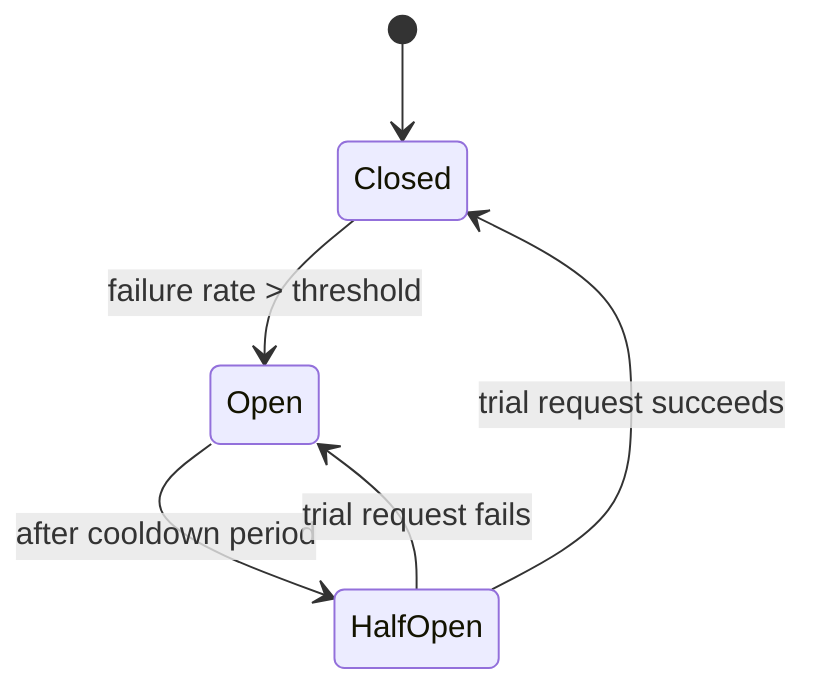
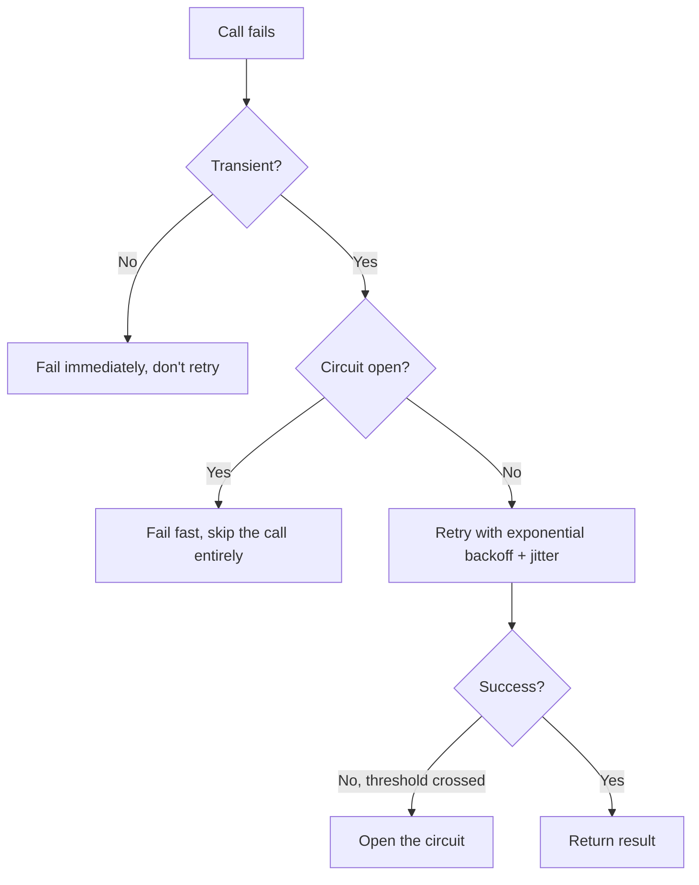

A single slow or failing downstream service can take down an entire system that depends on it — not because the failure itself is catastrophic, but because every caller keeps retrying, piling more load onto an already-struggling service, until the failure cascades upstream. Circuit breakers, retries, and backoff are the standard toolkit for preventing that cascade. Used correctly they turn "one service is having a bad day" into a contained, recoverable event. Used incorrectly — retries without backoff being the classic mistake — they turn it into an outage.

## The Problem: Cascading Failure

Picture a checkout service calling a payment service that's started timing out under load:


Without any protection, every checkout request waits for the full timeout before failing, holding a thread (or connection, or event-loop slot) the whole time. As more requests pile up, checkout's own resources get exhausted, and checkout itself becomes slow and unresponsive to *its* callers — the failure has now propagated one hop upstream. Repeat this a few times across a service graph, and one struggling dependency takes down services that have nothing to do with the original problem.

The fix isn't a single pattern — it's three patterns working together, each solving a different part of the problem.

## Retries: Handling Transient Failures

Not every failure is worth giving up on immediately. A dropped packet, a momentary network blip, a load balancer routing to a node mid-restart — these are transient, and a retry a few hundred milliseconds later often just succeeds.

```python
def call_with_retry(fn, max_attempts=3):
    for attempt in range(1, max_attempts + 1):
        try:
            return fn()
        except TransientError:
            if attempt == max_attempts:
                raise
            time.sleep(0.1 * attempt)
```

But retries are dangerous without limits, because a naive retry loop is exactly what causes the cascading failure described above — it multiplies load on a service that's already struggling. Two rules make retries safe:

- **Only retry idempotent operations**, or operations made idempotent via a request ID (see below) — retrying a non-idempotent `POST /charge-card` can double-charge a customer.
- **Only retry errors that are actually transient.** A `429 Too Many Requests` or `503 Service Unavailable` is worth retrying; a `400 Bad Request` or `401 Unauthorized` will fail identically every time, and retrying it just wastes a round trip and adds latency to an error the caller could've surfaced immediately.

```python
RETRYABLE_STATUS_CODES = {429, 502, 503, 504}

def is_retryable(response):
    return response.status_code in RETRYABLE_STATUS_CODES
```

## Exponential Backoff: Spacing Retries Out

Retrying immediately after a failure, especially across many concurrent callers, recreates the exact load spike that likely caused the failure in the first place. **Exponential backoff** spaces retries out with exponentially increasing delays, giving the downstream service room to recover:

```python
import random
import time

def retry_with_backoff(fn, max_attempts=5, base_delay=0.5, max_delay=30):
    for attempt in range(max_attempts):
        try:
            return fn()
        except TransientError:
            if attempt == max_attempts - 1:
                raise
            delay = min(base_delay * (2 ** attempt), max_delay)
            jitter = random.uniform(0, delay * 0.5)
            time.sleep(delay + jitter)
```

```bash
$ python retry_demo.py
Attempt 1 failed, retrying in 0.61s
Attempt 2 failed, retrying in 1.34s
Attempt 3 failed, retrying in 2.78s
Attempt 4 failed, retrying in 5.92s
Attempt 5 succeeded
```

The **jitter** (the random component added to each delay) matters more than it looks. Without it, if 10,000 clients all fail at the same instant (a common scenario — they were all calling the same now-overloaded service), they all retry at the same instant too, in synchronized waves, which is called the **thundering herd** problem. Adding randomness spreads those retries across a window instead of a single spike, which is what actually gives the downstream service a chance to recover rather than getting hit by the same overload pattern every 2^n seconds.

## Circuit Breakers: Stopping Retries That Won't Help

Backoff spaces retries out, but it still assumes the operation is eventually going to succeed. If a downstream service is fully down — not slow, actually down — every retry (however well-spaced) is still wasted work: it holds a connection, burns a timeout window, and adds latency for the end user, for a call that has no chance of succeeding.

A **circuit breaker** tracks the failure rate of calls to a dependency and, once it crosses a threshold, stops making calls entirely for a cooldown period — failing fast instead of failing slow.



Three states:

- **Closed** — normal operation. Calls pass through; failures are counted.
- **Open** — the failure threshold was crossed. Calls fail immediately without even attempting the network call, for the duration of a cooldown window.
- **Half-Open** — after the cooldown, a small number of trial requests are allowed through. If they succeed, the breaker closes and normal traffic resumes; if they fail, it reopens and the cooldown restarts.

```python
class CircuitBreaker:
    def __init__(self, failure_threshold=5, cooldown_seconds=30):
        self.failure_threshold = failure_threshold
        self.cooldown_seconds = cooldown_seconds
        self.failure_count = 0
        self.state = "closed"
        self.opened_at = None

    def call(self, fn):
        if self.state == "open":
            if time.time() - self.opened_at > self.cooldown_seconds:
                self.state = "half_open"
            else:
                raise CircuitOpenError("failing fast, dependency is down")

        try:
            result = fn()
            self.failure_count = 0
            self.state = "closed"
            return result
        except TransientError:
            self.failure_count += 1
            if self.failure_count >= self.failure_threshold:
                self.state = "open"
                self.opened_at = time.time()
            raise
```

The key benefit is protecting the *caller*, not just the callee: while the breaker is open, the checkout service in the earlier example fails instantly instead of holding threads open waiting for timeouts — which is exactly what stops the cascade from propagating one more hop upstream.

## How They Compose

These three patterns aren't alternatives — they stack, each handling a different failure duration:



Retries handle single-request blips lasting milliseconds. Backoff prevents those retries from synchronizing into a load spike. The circuit breaker handles sustained outages lasting seconds to minutes, by giving up on retrying altogether until there's actual evidence (a successful half-open trial) that the dependency has recovered.

## Timeouts: The Pattern Underneath All of This

None of the above works without a sane **timeout** on the underlying call in the first place — a circuit breaker can't count failures fast enough to protect anything if each failed call still takes 60 seconds to time out. Set request timeouts aggressively relative to the dependency's actual p99 latency (not a generous guess), because an overly long timeout is what causes threads/connections to pile up during an incident in the first place, defeating the entire purpose of the breaker sitting on top of it.

## Conclusion

Retries, backoff, and circuit breakers each solve a different slice of the same problem: keeping a struggling dependency's failure from propagating upstream and taking down services that depend on it. Retries recover from transient blips; exponential backoff with jitter keeps those retries from synchronizing into a self-inflicted load spike; circuit breakers stop retrying altogether once a dependency is genuinely down, failing fast instead of piling up blocked threads. None of them are optional extras for "resilience" — in a system with real downstream dependencies, skipping any one of them is how a single slow service becomes a full outage.
