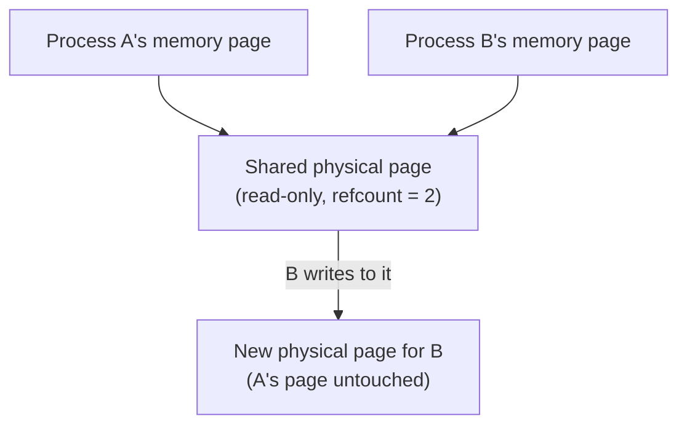
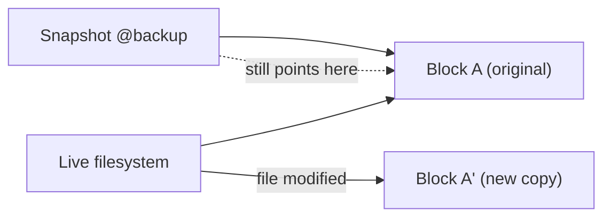

Copy-on-write shows up in places that seem unrelated at first glance — why `fork()` in Linux doesn't actually duplicate a process's entire memory space, why Postgres never overwrites a row in place, why ZFS snapshots are nearly instantaneous. All of these are the same underlying trick: defer the expensive copy until, and unless, someone actually writes to the data, and share the original for as long as everyone's only reading. Once you see the pattern once, you start recognizing it everywhere.

## The Core Idea

Copying data is expensive; sharing a reference to data is nearly free. Copy-on-write (COW) systems exploit the fact that most data, most of the time, is read far more often than it's written — so instead of copying eagerly "just in case," the system shares the original and only performs the actual copy at the exact moment a write would otherwise corrupt something another reader still depends on.



## `fork()`: Why Duplicating a Process Is (Almost) Free

When a Linux process calls `fork()`, the new child process gets its own complete copy of the parent's memory — or so it appears from userspace. Actually duplicating gigabytes of memory on every `fork()` call would make process creation prohibitively slow, so the kernel doesn't do that. Instead, it marks the parent's memory pages as **read-only** and gives the child pointers to the exact same physical pages.

```c
pid_t pid = fork();
if (pid == 0) {
    // Child process: appears to have its own full copy of memory,
    // but physically still shares every page with the parent so far.
}
```

Both processes read from the identical physical memory, completely unaware anything is shared, right up until either one tries to *write*. At that instant, the kernel's page fault handler intercepts the write, allocates a fresh physical page, copies the original page's contents into it, and remaps just that one page for the writing process — the other process's page is untouched.

```bash
$ python3 -c "
import os
pid = os.fork()
if pid == 0:
    print('child')
else:
    print('parent')
"
```

```
parent
child
```

This is exactly why `fork()` followed immediately by `exec()` (the standard pattern for launching a new program) is efficient — the child's memory is about to be entirely replaced anyway, so the copy-on-write pages it briefly "owned" are never actually duplicated at all. Without COW, every shell command you run would pay the cost of physically duplicating the shell's entire memory image first.

## `vfork()` and the Danger of Skipping the Abstraction

Understanding COW also explains why `vfork()` (an older, more dangerous alternative to `fork()`) exists and why it's risky: `vfork()` doesn't even set up copy-on-write pages — the child directly shares the parent's memory with no protection at all, on the assumption the child will call `exec()` immediately and touch nothing in between. Any write in the child before `exec()` corrupts the parent's actual memory, which is precisely the failure mode COW's read-only-then-copy mechanism exists to prevent.

## Copy-on-Write in Databases: Never Overwrite in Place

Postgres's MVCC (covered in more detail in a companion post on database internals) applies the identical idea to rows instead of memory pages: an `UPDATE` never overwrites a row's bytes in place. It writes a brand-new version of the row and leaves the old version untouched until no active transaction could possibly still need it.

```sql
BEGIN;
UPDATE accounts SET balance = 50 WHERE id = 1;
-- The old row version (balance = 100) still physically exists on disk,
-- visible to any transaction that started before this one commits.
COMMIT;
```

The parallel to `fork()` is direct: instead of copying the entire row proactively on every read, the database lets every transaction "read" the same underlying row versions, and only the write path pays the cost of creating a new version — exactly the deferred-copy trade-off COW is built around.

## Copy-on-Write Filesystems: Snapshots Without Copying Data

Filesystems like **ZFS** and **Btrfs** extend the same idea to entire file trees. Taking a snapshot doesn't copy any file data — it just marks the current tree of blocks as "shared, read-only, referenced by two snapshots now" and continues writing new blocks only where new data actually gets written.

```bash
$ zfs snapshot tank/data@backup-2026-09-02
$ zfs list -t snapshot
NAME                          USED  AVAIL  REFER  MOUNTPOINT
tank/data@backup-2026-09-02     0B      -   1.2G  -
```

The `USED 0B` for a freshly created snapshot is the tell: no data was actually copied, because the snapshot and the live filesystem still point at identical physical blocks. As files in the live filesystem get modified, the *new* data occupies new blocks — the snapshot keeps pointing at the original, unmodified blocks — which is why `USED` for a snapshot grows over time only in proportion to how much data has since changed, not the total size of the filesystem at snapshot time.



This is also why deleting a snapshot on a COW filesystem doesn't free space proportional to the *entire* snapshot size — only the blocks not shared with the live filesystem (or another snapshot) actually get reclaimed, since the rest are still referenced elsewhere.

## The Common Thread

Every one of these examples — process memory, database rows, filesystem blocks — follows the identical three-step pattern: share the original data by reference as long as everyone's only reading, detect the moment a write would mutate shared data out from under another reader, and pay the copy cost only then, only for the piece actually being written. The savings come specifically from the fact that in real workloads, most data goes unmodified for most of its lifetime — COW is a bet that reads will vastly outnumber writes, and in `fork()`, MVCC, and filesystem snapshots alike, that bet consistently pays off.

## Conclusion

Copy-on-write is the same optimization applied at three different layers of a system: the kernel defers page duplication until a `fork()`ed process actually writes, a COW database defers row duplication by keeping old versions alongside new ones instead of overwriting, and a COW filesystem defers block duplication so a snapshot costs nothing to create and only grows as the live data diverges from it. Recognizing this one pattern makes several otherwise-separate pieces of systems knowledge — why `fork()` is cheap, why MVCC keeps old row versions around, why ZFS snapshots are instant — collapse into a single, reusable mental model instead of three things to memorize independently.
