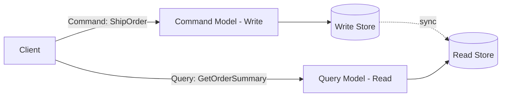
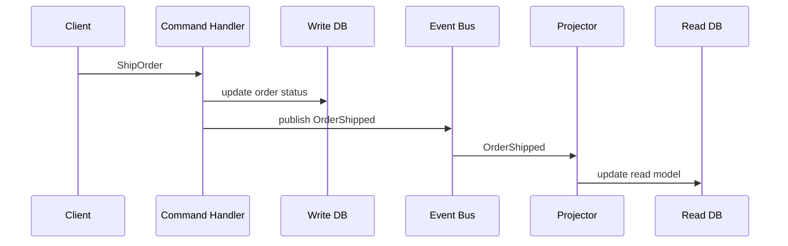

Most applications use the same model for reading and writing data — the same tables, the same ORM entities, the same shape for `INSERT` and `SELECT`. That's fine until reads and writes start pulling in genuinely different directions: writes need strict validation and consistency, while reads need to be fast, denormalized, and shaped exactly like the UI that's going to render them. CQRS — Command Query Responsibility Segregation — is the pattern of splitting these into two separate models entirely, and it's one of the more misapplied patterns in backend architecture, so understanding exactly what problem it solves (and when it doesn't apply) matters more than the pattern itself.

## The Core Idea

In a traditional CRUD design, one model serves both purposes:

```python
class Order:
    def __init__(self, id, customer_id, items, status, total):
        ...

order = db.query(Order).filter_by(id=order_id).first()
order.status = "shipped"
db.commit()
```

CQRS splits this into two distinct paths:



**Commands** represent intent to change state — `ShipOrder`, `CancelSubscription` — and are handled by a model optimized for validation, business rules, and consistency. **Queries** represent a request to read state — `GetOrderSummary`, `ListOverdueInvoices` — and are handled by an entirely separate model optimized for the shape the caller actually needs, often pre-joined and denormalized specifically for one read pattern.

The key shift: instead of one `Order` model that has to serve both "validate this state transition" and "render this exact dashboard view" reasonably well, you get two purpose-built models, each good at exactly one job.

## Why Split Them at All

**Different scaling needs.** Reads and writes in most systems are not symmetric — a typical application does far more reads than writes (browsing, dashboards, reports) and the two workloads scale independently. Splitting them lets you scale read replicas or read-optimized stores separately from the write path, without over-provisioning write capacity just to keep up with read traffic.

**Different consistency requirements.** Writes usually need strong consistency and validation (you cannot ship an order that was already cancelled). Reads can often tolerate slightly stale data (a dashboard showing an order status from two seconds ago is rarely a real problem) — which opens the door to read replicas, caching layers, or precomputed views that would be unsafe to use for the write path's validation logic.

**Different data shapes.** A write model wants a normalized shape that avoids duplication and keeps invariants easy to enforce. A read model often wants the *opposite* — pre-joined, denormalized, shaped exactly like a specific screen or report, so a query is a single fast lookup instead of a five-table join computed on every request.

```sql
-- Write model: normalized, invariant-friendly
orders(id, customer_id, status, created_at)
order_items(id, order_id, product_id, quantity, price)

-- Read model: denormalized, shaped for one specific view
order_summary_view(order_id, customer_name, item_count, total_price, status_label)
```

## Command and Query Handlers

The command side typically routes each command type to a dedicated handler that owns the validation and state transition logic for that one operation:

```python
class ShipOrderHandler:
    def handle(self, command: ShipOrderCommand):
        order = order_repository.get(command.order_id)
        if order.status != "paid":
            raise InvalidStateTransition("cannot ship unpaid order")
        order.status = "shipped"
        order.shipped_at = now()
        order_repository.save(order)
        event_bus.publish(OrderShipped(order_id=order.id))
```

The query side skips domain logic almost entirely and just reads from whatever store is shaped for the question being asked:

```python
class GetOrderSummaryHandler:
    def handle(self, query: GetOrderSummaryQuery):
        return read_db.execute(
            "SELECT * FROM order_summary_view WHERE order_id = %s",
            [query.order_id],
        )
```

Notice the query handler has no business logic — no validation, no state transitions — because it isn't supposed to. Its entire job is "return data shaped for this question," which is exactly why the read store can be denormalized without any risk of corrupting the rules the write side enforces.

## Keeping the Two Models in Sync

Splitting the models raises the obvious question: how does the read model learn about changes made through the write model? The command handler publishes an event when a state change happens (`OrderShipped` in the example above), and a separate process — a **projector** — subscribes to that event and updates the read model accordingly.

```python
class OrderSummaryProjector:
    def on(self, event: OrderShipped):
        read_db.execute(
            "UPDATE order_summary_view SET status_label = %s WHERE order_id = %s",
            ["Shipped", event.order_id],
        )
```



This sync is almost always **eventually consistent** — there's a real, if small, window between the write committing and the read model reflecting it. This is the trade-off CQRS asks you to accept explicitly: a client that writes and then immediately reads might see stale data for a brief moment, unless you add extra mechanisms (reading from the write model right after a write by the same client, or a "read your own writes" session-consistency layer) to paper over it for the cases where that specific staleness matters.

## CQRS and Event Sourcing

CQRS and [[event sourcing]] are frequently mentioned together, but they're independent patterns — you can use either without the other. They do, however, pair unusually well: event sourcing already produces a durable stream of every state-changing event as its natural output, which is exactly the input a CQRS projector needs to build and rebuild read models. If you're event-sourcing your write model anyway, CQRS read models become "just another consumer" of the event stream — the same one your audit log and analytics pipeline might already be subscribed to — rather than a bespoke sync mechanism you have to build from scratch.

## When CQRS Is the Wrong Call

This pattern gets reached for far more often than its actual benefit justifies, and it's worth being blunt about when it's overkill:

- **A simple CRUD application with no unusual read/write asymmetry.** If your reads and writes are both simple, low-volume, and shaped similarly, CQRS adds a second model, an event bus, a projector, and an eventual-consistency window — real complexity — for no corresponding benefit. A single well-indexed table with a normal ORM handles this case better.
- **When the team can't reason about eventual consistency.** If "the read model might be a few hundred milliseconds stale" causes real business problems (financial balances, inventory counts that must never be wrong even briefly), CQRS's core trade-off is actively working against the requirement, not for it.
- **As a default architecture "for scale later."** CQRS is a targeted fix for a specific, observed pain point — read/write asymmetry that's actually causing a scaling or modeling problem today — not a pattern to apply preemptively because a system might need it eventually. Applied too early, it's pure overhead: two models to keep in sync, for a read pattern that a normal query would've handled fine.

## Conclusion

CQRS earns its complexity when read and write workloads genuinely pull in different directions — different scale, different consistency needs, different shapes — and a single shared model is forcing an uncomfortable compromise between them. Splitting them lets each side be optimized independently: a strict, validation-heavy write model and a fast, denormalized, purpose-built read model, kept in sync via events and a projector. The trade is real (eventual consistency, an extra model, an extra sync mechanism), which is exactly why CQRS is a targeted response to an observed problem — not a default architecture to reach for on a simple CRUD app that doesn't have one yet.
