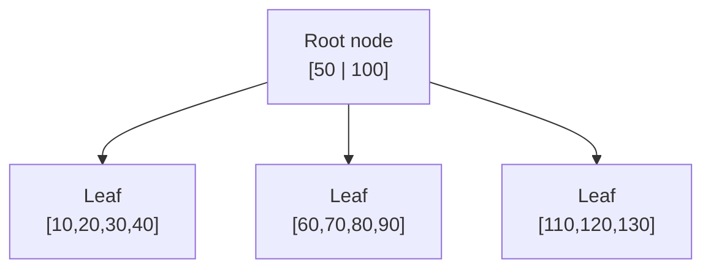
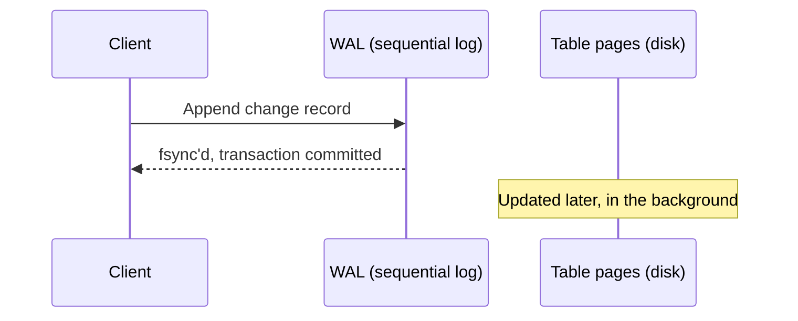

`SELECT * FROM users WHERE id = 42` looks like a single, simple operation, but underneath it, a database engine is coordinating disk-resident tree structures, a durability log, and a concurrency scheme that lets other transactions read and write at the same time without seeing each other's half-finished work. Understanding these three pieces — B-trees, write-ahead logging, and MVCC — is what turns "the database is slow" or "why did I get a stale read" from a mystery into something you can actually reason about.

## B-Trees: How Data Is Actually Found on Disk

A table with a million rows can't be scanned linearly for every lookup, so relational databases index data using a **B-tree** (or more precisely, a B+tree in most real implementations) — a balanced tree structure designed around the cost of a disk read, not just algorithmic complexity.



The key design choice is the **branching factor** — each node holds many keys (often hundreds), not just two like a binary tree, so the tree stays extremely shallow even over millions of rows. A B-tree over a million rows is typically only 3-4 levels deep, which means finding any row takes 3-4 disk reads (or fewer, since the top levels are almost always cached in memory) — that shallowness, tuned specifically to minimize disk I/O, is the entire reason B-trees became the standard index structure instead of a plain binary search tree.

```sql
CREATE INDEX idx_users_email ON users (email);
```

```sql
EXPLAIN SELECT * FROM users WHERE email = 'alice@example.com';
```

```
Index Scan using idx_users_email on users
  Index Cond: (email = 'alice@example.com'::text)
```

Without this index, that same query would be a **sequential scan** — reading every row in the table to check each one — which is exactly what `EXPLAIN` reports when no usable index exists. The B-tree is what turns an O(n) table scan into an O(log n) lookup.

## Write-Ahead Logging: Durability Without Losing Speed

If every write had to be flushed straight to the table's on-disk pages before the database could confirm it, every transaction would pay the cost of random disk I/O. **Write-ahead logging (WAL)** solves this by appending the change to a sequential log file first, then confirming the transaction — the actual table pages get updated later, in the background, at the database's convenience.



The critical rule is the name itself: the log entry must be written and flushed to disk *before* the transaction is acknowledged as committed. If the database crashes right after, the in-memory table pages might be stale or missing the change entirely — but on restart, the database replays the WAL from the last checkpoint, reapplying every committed change that hadn't made it to the table pages yet.

```bash
$ ls $PGDATA/pg_wal/
000000010000000000000001
000000010000000000000002
```

```sql
-- Forcing a checkpoint: flush WAL-recorded changes to actual table pages
CHECKPOINT;
```

This is also why sequential appends to a log file are fast even on spinning disks — sequential I/O is dramatically cheaper than the random I/O that directly updating scattered table pages on every write would require. WAL turns "durable and fast" from a contradiction into something achievable, by decoupling "durably recorded" from "reflected in the final data structure."

## MVCC: Concurrency Without Locking Every Reader

If a read transaction had to wait for every in-progress write transaction to finish before it could read a row, a busy database would serialize almost everything. **Multi-Version Concurrency Control (MVCC)** avoids this by never overwriting a row in place — instead, an update creates a new version of the row, tagged with the transaction ID that created it, and readers see whichever version was committed at the time their own transaction started.

```sql
-- Transaction A starts
BEGIN;
SELECT balance FROM accounts WHERE id = 1;  -- sees balance = 100

-- Meanwhile, Transaction B (concurrently) does:
-- BEGIN; UPDATE accounts SET balance = 50 WHERE id = 1; COMMIT;

-- Transaction A, still in the same transaction:
SELECT balance FROM accounts WHERE id = 1;  -- still sees 100
COMMIT;
```

Under MVCC, that second `SELECT` inside transaction A still sees `100`, even though transaction B already committed a change to `50` — this is what `REPEATABLE READ` isolation guarantees, and it's only possible because the row's old version (`balance = 100`) still physically exists, tagged as visible to transactions that started before B committed. PostgreSQL calls these old versions **dead tuples**, and `VACUUM` is the background process that eventually reclaims their disk space once no active transaction can possibly need them anymore.

```sql
SELECT relname, n_dead_tup FROM pg_stat_user_tables WHERE relname = 'accounts';
```

```
 relname  | n_dead_tup
----------+------------
 accounts |       1204
```

A table with heavy update traffic and infrequent vacuuming accumulates dead tuples the same index and query still have to skip past, which is the direct mechanical link between "high write volume without enough vacuuming" and "queries get slower over time" — the B-tree entries still point at those dead rows until vacuum removes them.

## How the Three Pieces Fit Together

A single `UPDATE` statement touches all three mechanisms in sequence: the change is appended to the WAL first (durability, guaranteed before commit); a new row version is created rather than overwriting the old one (MVCC, so concurrent readers aren't blocked or shown a half-written row); and the table's B-tree indexes are updated to point at the new version once it's visible (fast lookups continue to work against the new data).


This is also why a crash mid-transaction is recoverable without corruption: the WAL has either the complete committed record or it doesn't, the old row version is still intact until vacuum removes it, and the B-tree either points at the committed version or gets corrected on WAL replay — there's no window where the database is left with a half-applied change and no record of what state it should be in.

## Conclusion

B-trees, write-ahead logging, and MVCC solve three separate problems that every relational database has to answer: how to find a row without scanning the whole table, how to guarantee a committed write survives a crash without paying for random disk I/O on every transaction, and how to let readers and writers proceed concurrently without blocking each other or seeing torn data. None of these are implementation details you need to manage directly day to day, but knowing they exist explains a surprising amount of real-world behavior — why an unindexed query does a full scan, why `VACUUM` matters, and why a transaction under `REPEATABLE READ` can see data that's technically already been overwritten by someone else.
