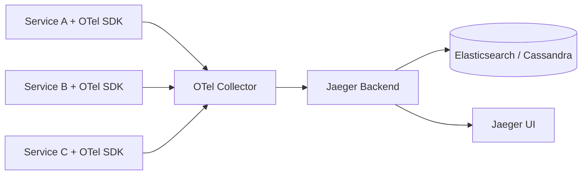

In a monolith, "why is this request slow" is a stack trace and a profiler away. In a microservices system, a single user request might touch a dozen services, and the slowness could be in any one of them — or in the network between two of them. Logs from each service tell you what happened *inside* that service, but not how the pieces connect. Distributed tracing exists to answer exactly that: it follows one request across every service it touches and reconstructs the full timeline, so "why is this slow" becomes a single query instead of a manual correlation exercise across a dozen log files.

## The Core Concepts: Traces and Spans

A **trace** represents one end-to-end request. It's composed of **spans** — each span is one unit of work (an HTTP call, a database query, a function execution) with a start time, duration, and metadata.

```mermaid
gantt
    dateFormat X
    axisFormat %L ms
    section API Gateway
    gateway span (45ms)      :0, 45
    section Orders Service
    orders span (38ms)       :5, 38
    section Payment Service
    payment span (20ms)      :12, 20
    section Database
    db query span (8ms)      :15, 8
```



Spans nest inside each other via a **parent-child relationship** — the gateway span is the parent of the orders service span, which is the parent of the database query span. This nested structure is what a trace visualization (a "flame graph" or "waterfall view") actually shows: not just how long each piece took, but which piece was waiting on which other piece.

Each span carries structured metadata (called **attributes** or **tags**): the HTTP status code, the SQL query text, the user ID, the service version. This is what makes a trace queryable — "show me every trace where `http.status_code = 500` and `service.name = payment-service`" — rather than just a visual timeline.

## Trace Context Propagation

The mechanism that ties spans across different services into one trace is **context propagation**: a `trace_id` (identifying the overall request) and a `span_id` (identifying the current operation) get passed along with the request itself, usually as HTTP headers.

```
traceparent: 00-4bf92f3577b34da6a3ce929d0e0e4736-00f067aa0ba902b7-01
             ^^ version
                ^^^^^^^^^^^^^^^^^^^^^^^^^^^^^^^^ trace-id
                                                 ^^^^^^^^^^^^^^^^ parent-span-id
                                                                  ^^ trace-flags
```

That header format (`traceparent`) is the **W3C Trace Context** standard — before it existed, every tracing vendor used its own incompatible header format, which made it painful to trace a request through services instrumented with different tools. Standardizing this is what let OpenTelemetry become the common instrumentation layer across the ecosystem.

```python
import requests
from opentelemetry import trace
from opentelemetry.propagate import inject

tracer = trace.get_tracer(__name__)

def call_payment_service(order_id):
    with tracer.start_as_current_span("call-payment-service") as span:
        span.set_attribute("order.id", order_id)
        headers = {}
        inject(headers)  # writes traceparent header from the current span context
        response = requests.post(
            "http://payment-service/charge",
            json={"order_id": order_id},
            headers=headers,
        )
        span.set_attribute("http.status_code", response.status_code)
        return response
```

On the receiving side, the payment service reads the incoming `traceparent` header and starts its own span as a **child** of the span that made the call — this is the entire mechanism that stitches independently-instrumented services into one coherent trace, with no shared database or central coordination required at request time.

## OpenTelemetry: The Instrumentation Layer

**OpenTelemetry (OTel)** is a vendor-neutral standard (and set of SDKs) for generating traces, metrics, and logs. It deliberately separates two concerns that used to be bundled together: *instrumenting* your code (creating spans, propagating context) and *where the trace data ends up* (Jaeger, Honeycomb, Datadog, or any other backend).

```python
from opentelemetry import trace
from opentelemetry.sdk.trace import TracerProvider
from opentelemetry.sdk.trace.export import BatchSpanProcessor
from opentelemetry.exporter.otlp.proto.grpc.trace_exporter import OTLPSpanExporter

provider = TracerProvider()
provider.add_span_processor(
    BatchSpanProcessor(OTLPSpanExporter(endpoint="http://otel-collector:4317"))
)
trace.set_tracer_provider(provider)
```

The practical benefit of this separation: instrument your code once against the OpenTelemetry API, and you can switch tracing backends — Jaeger today, a commercial vendor tomorrow — by changing the exporter configuration, not by re-instrumenting every service. Many popular frameworks (Flask, Express, Spring) also have **auto-instrumentation** libraries that generate spans for incoming/outgoing HTTP calls and database queries without any manual `start_span` calls at all, which is usually the fastest way to get baseline tracing coverage before adding custom spans for business-specific operations.

## Jaeger: Storing and Visualizing Traces

Jaeger is a tracing backend — it receives spans (commonly via an OpenTelemetry Collector sitting in front of it), stores them, and provides a UI and query API for exploring traces.



The **OpenTelemetry Collector** sitting between services and Jaeger is worth calling out specifically — it's a standalone process that receives spans, can batch/filter/sample them, and forwards them to one or more backends. Running it means services never talk directly to the tracing backend, which matters operationally: swapping Jaeger for a different backend, or adding a second backend for a migration period, is a Collector config change, not a redeploy of every instrumented service.

```bash
$ curl -s "http://jaeger:16686/api/traces?service=orders-service&limit=1" | jq '.data[0].spans[0]'
{
  "traceID": "4bf92f3577b34da6a3ce929d0e0e4736",
  "spanID": "00f067aa0ba902b7",
  "operationName": "POST /orders",
  "duration": 45230,
  "tags": [
    {"key": "http.status_code", "value": "200"},
    {"key": "order.id", "value": "ord_9f8e7d"}
  ]
}
```

## Sampling: You Can't Trace Everything

Recording a full trace for every single request is expensive at scale — both in the volume of data generated and in the overhead added to every request. Sampling decides which traces are actually kept.

- **Head-based sampling** — the decision (keep or discard) is made at the start of the trace, usually a fixed percentage (e.g., 1%). Simple and cheap, but you might discard the exact slow or erroring request you actually wanted to investigate, purely by chance.
- **Tail-based sampling** — the decision is made *after* the full trace completes, based on its actual characteristics (errored, was unusually slow, hit a specific service). This requires buffering all spans of a trace until it finishes before deciding, which is more resource-intensive, but it means you can guarantee "always keep traces that errored or exceeded 1 second" instead of hoping a random sample happened to catch them.

```yaml
processors:
  tail_sampling:
    policies:
      - name: errors-policy
        type: status_code
        status_code: { status_codes: [ERROR] }
      - name: slow-traces-policy
        type: latency
        latency: { threshold_ms: 1000 }
      - name: baseline-sample
        type: probabilistic
        probabilistic: { sampling_percentage: 5 }
```

Most production setups combine both: a low head-based baseline rate to control overall volume, plus tail-based rules that always keep the traces that matter most for debugging — errors and outliers — regardless of the random sample.

## Conclusion

Distributed tracing solves a problem logs alone can't: reconstructing the causal chain of one request as it crosses service boundaries, so a slow or failing request becomes a single queryable trace instead of a manual cross-referencing exercise across a dozen services' logs. OpenTelemetry standardized the instrumentation and context-propagation layer, decoupling how you generate spans from where they end up, and Jaeger (or any OTel-compatible backend) handles storage and visualization. The one design decision that matters most in practice is sampling strategy — a pure random sample will, sooner or later, miss the exact slow request you needed to see, which is why tail-based rules that always capture errors and outliers are worth the extra buffering cost.
