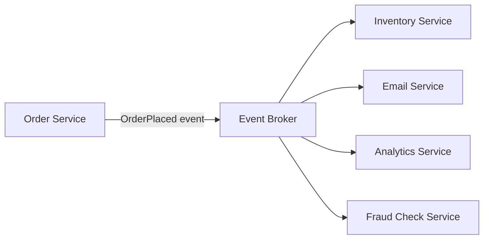
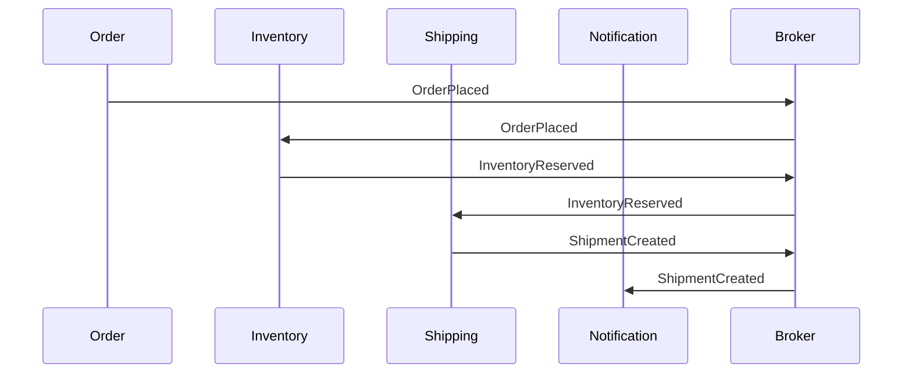

Most backend systems start as a chain of synchronous calls: service A calls service B, which calls service C, and everyone waits for everyone else to finish. That works until one link in the chain gets slow, and now every caller upstream is slow too. Event-driven architecture breaks that chain — instead of calling a downstream service directly, a service publishes a fact ("order placed") and lets interested parties react whenever they're ready. This post covers the core patterns, the trade-offs you're actually signing up for, and where event-driven design causes more problems than it solves.

## The Core Idea

In a request/response system, the caller knows exactly who it's talking to and blocks until it gets an answer. In an event-driven system, a **producer** publishes an event describing something that happened, and any number of **consumers** react to it independently, without the producer knowing or caring who's listening.



The order service doesn't know inventory, email, fraud checks, or analytics exist. Add a new consumer — say, a loyalty-points service — and the order service's code doesn't change at all. That decoupling is the entire value proposition.

## Events vs Commands vs Messages

These three terms get used interchangeably but mean different things, and mixing them up leads to confused system design:

- **Command** — "do this." Sent to a specific, known recipient, expects that recipient to act. `ChargeCard`, `CreateShipment`. Coupled to the recipient by design.
- **Event** — "this happened." Broadcast to anyone who cares, with no expectation of a specific reaction. `OrderPlaced`, `PaymentFailed`. Decoupled from consumers by design — the producer doesn't know who's listening or what they'll do.
- **Message** — the general term for either, at the transport level. Kafka, RabbitMQ, and SQS all move "messages"; whether a given message is semantically a command or an event depends on how it's used.

A common architectural smell: an "event" named `SendEmailToCustomer`. That's a command wearing an event's name — it names an action for a specific recipient to take, not a fact about something that happened. Renaming it `OrderPlaced` and letting the email service decide to react to it (by sending an email) is what makes the system genuinely event-driven instead of just asynchronous RPC.

## Choreography vs Orchestration

Once you have multiple services reacting to events, you need a strategy for coordinating multi-step workflows. Two opposing approaches:

**Choreography** — no central coordinator. Each service reacts to events and emits its own events in turn, and the overall workflow emerges from the chain of reactions.



No service owns the whole workflow — each just knows "when X happens, I do Y and emit Z." This scales well for simple chains but gets hard to reason about once a workflow has more than 4-5 steps: there's no single place to look to understand "what happens when an order is placed," and debugging a stuck workflow means tracing events across every service's logs.

**Orchestration** — a central coordinator (an orchestrator service or workflow engine like Temporal or AWS Step Functions) explicitly calls each step and tracks the workflow's state.

```python
async def process_order(order_id: str):
    await inventory_service.reserve(order_id)
    await payment_service.charge(order_id)
    await shipping_service.create_shipment(order_id)
    await notification_service.notify(order_id)
```

This is easier to observe (one place to see workflow state) and easier to reason about failure handling (the orchestrator decides what happens if step 3 fails), at the cost of reintroducing coupling — the orchestrator has to know about every participating service.

Most real systems land on a hybrid: choreography for loosely-coupled side effects (analytics, notifications — nobody needs to track whether these "completed"), orchestration for workflows with real business consequences that need explicit compensation logic on failure (payments, order fulfillment).

## Delivery Guarantees

Event brokers offer different guarantees, and picking the wrong one for your use case is a common source of production incidents:

| Guarantee | Meaning | Risk |
|---|---|---|
| At-most-once | Event delivered 0 or 1 times | Silent data loss on failure |
| At-least-once | Event delivered 1+ times | Consumers must handle duplicates |
| Exactly-once | Event delivered exactly once | Expensive; often exactly-once *processing*, not delivery |

**At-least-once is the practical default** for most systems — it's cheap to achieve (retry until acknowledged) and the failure mode (duplicates) is much safer than the failure mode of at-most-once (silent loss). The catch is that every consumer needs to be **idempotent** — processing the same event twice must produce the same result as processing it once.

```python
def handle_order_placed(event):
    if inventory_events_seen.exists(event.id):
        return  # already processed, skip
    reserve_inventory(event.order_id, event.items)
    inventory_events_seen.add(event.id, ttl_days=7)
```

"Exactly-once" is frequently advertised but almost always means exactly-once *processing effects* achieved via idempotency (as above) or transactional writes, layered on top of at-least-once delivery — true exactly-once delivery across an unreliable network is not actually achievable in the general case.

## Event Schema and Evolution

Events outlive the code that produced them — a consumer deployed six months from now still needs to understand an event schema written today, and old events sitting in a replay log need to remain parseable. Two rules keep this from becoming a mess:

- **Only add fields, never remove or repurpose them.** A field a consumer doesn't recognize should be safely ignorable; a field it depends on should never silently change meaning.
- **Version the schema explicitly** (`OrderPlacedV2`) when a breaking change is genuinely unavoidable, and keep the old version's consumers running until every consumer has migrated — not indefinitely, but not on the producer's timeline either.

Using a schema registry (Confluent Schema Registry for Kafka, or similar) enforces this at write time — a producer literally cannot publish an event that breaks the registered schema, catching the mistake before it reaches consumers instead of after.

## When Not to Use Event-Driven Architecture

This pattern gets reached for reflexively, and it's worth naming when it's the wrong call:

- **When you need an immediate answer.** If the caller genuinely can't proceed without a response ("is this credit card valid?"), a synchronous call is simpler and more honest than faking synchronicity with a request event and a matching response event.
- **When the workflow is a simple, fixed sequence with one owner.** Wrapping three sequential function calls in an event bus adds indirection without adding decoupling value — nobody else is going to react to these events.
- **When strict ordering across multiple event types matters.** Most brokers only guarantee ordering *within a single partition/topic*, not across the whole system — a design that quietly depends on global cross-topic ordering will eventually break in production in a way that's hard to reproduce.
- **Early in a system's life, before you know the real consumer boundaries.** Event-driven design pays off when there are genuinely multiple independent consumers reacting to the same facts. Introducing it speculatively, before that's true, adds debugging complexity (tracing a request across a broker instead of a call stack) for no real decoupling benefit yet.

## Conclusion

Event-driven architecture trades the simplicity of a traceable call stack for the ability to add new consumers without touching the producer, and to absorb slow or failing consumers without blocking the whole system. That trade is worth making when you have genuinely independent consumers reacting to the same underlying facts — it's not worth making for a fixed three-step sequence with a single owner. Whichever pattern you pick, the details that actually determine whether it works in production are the ones that are easy to skip in a design doc: idempotent consumers, additive-only schema evolution, and a clear-eyed choice between choreography and orchestration based on whether the workflow needs a place to reason about failure.
