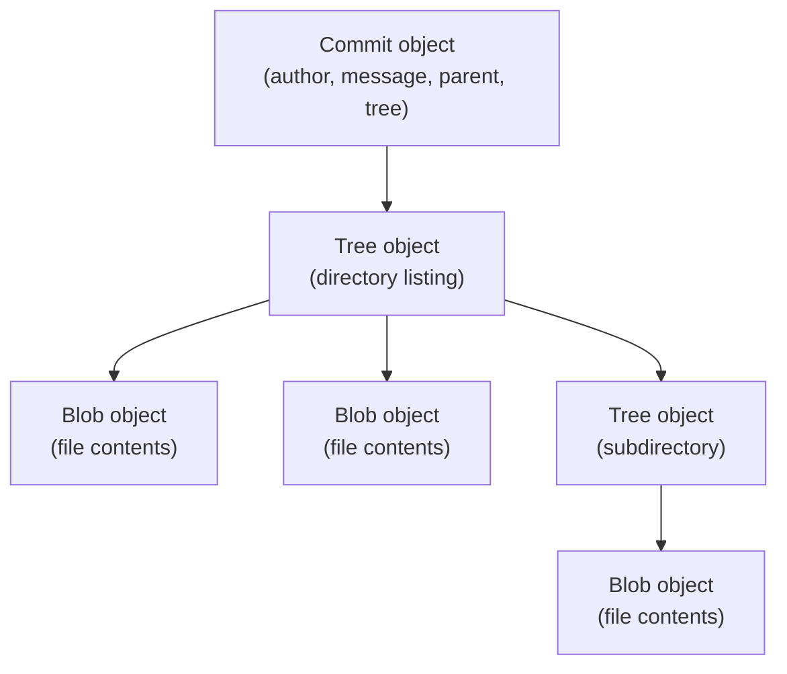

Most developers use Git for years through a handful of memorized commands — `add`, `commit`, `push`, `merge` — without ever seeing what actually happens underneath. That's fine for daily use, but it means confusing situations (a "detached HEAD", a mysterious merge conflict, a commit that "disappeared") stay confusing forever, because the mental model stops at the porcelain commands. Underneath all of it, Git is a surprisingly simple content-addressed object store with exactly four object types. Once you see those four types and how they reference each other, almost everything Git does stops being magic.

## Everything Is an Object, Addressed by Its Content Hash

Git's entire data model boils down to one idea: every piece of content — a file's contents, a directory listing, a commit — is stored as an object, and every object is named by the SHA-1 hash of its own content. Store the exact same content twice, anywhere in the repository's history, and Git stores it once.



These objects live in `.git/objects`, and you can inspect them directly with Git's low-level "plumbing" commands.

```bash
$ mkdir demo && cd demo && git init -q
$ echo "hello world" > file.txt
$ git hash-object file.txt
3b18e512dba79e4c8300dd08aeb37f8e728b8dad
```

`git hash-object` computed a SHA-1 hash from the file's content — no commit, no staging, nothing written to `.git/objects` yet. That hash is deterministic: run it again on identical content, anywhere, and you get the identical hash.

## The Four Object Types

### Blob: Raw File Contents

A **blob** stores a file's contents and nothing else — no filename, no permissions, no path. That's a deliberate design choice: if two files anywhere in history have identical contents, they're the exact same blob.

```bash
$ git hash-object -w file.txt
3b18e512dba79e4c8300dd08aeb37f8e728b8dad
$ git cat-file -p 3b18e512
hello world
```

`-w` actually writes the object into `.git/objects`, and `cat-file -p` pretty-prints it back. Note that the blob's content is just the bytes of `file.txt` — the filename `file.txt` isn't stored anywhere inside the blob itself.

### Tree: A Directory Snapshot

A **tree** object is what actually gives a blob a name — it's a list of entries, each mapping a filename and file mode to a blob (or another tree, for subdirectories).

```bash
$ git update-index --add --cacheinfo 100644 3b18e512dba79e4c8300dd08aeb37f8e728b8dad file.txt
$ git write-tree
68aba62e560c0ebc3396e8ae9335232cd93a3f60
$ git cat-file -p 68aba62e
100644 blob 3b18e512dba79e4c8300dd08aeb37f8e728b8dad	file.txt
```

`write-tree` builds a tree object from whatever's currently staged (the "index"). The output line shows the file mode (`100644`, a regular non-executable file), the object type, the blob's hash, and the filename — this is the mapping that gives a hash-addressed blob a human-readable name.

### Commit: A Tree Plus Metadata

A **commit** object points at exactly one tree (the complete snapshot of the repository at that point), plus zero or more parent commits, plus author/committer info and a message.

```bash
$ git commit-tree 68aba62e -m "Initial commit"
d670460b4b4aece5915caf5c68d12f560a9fe3e
$ git cat-file -p d670460b
tree 68aba62e560c0ebc3396e8ae9335232cd93a3f60
author Mukul <mukul@example.com> 1735689600 +0530
committer Mukul <mukul@example.com> 1735689600 +0530

Initial commit
```

This is the exact same object `git commit` creates for you — the porcelain command just automates staging, tree-writing, and commit-creation into one step. A second commit adds a `parent <hash>` line pointing back to this one, which is precisely what makes commit history a chain rather than a pile of unrelated snapshots.

### Ref: A Named Pointer to a Commit

A **ref** isn't a Git object at all — it's just a file containing a commit hash. `refs/heads/main` is a plain text file with 40 (or 64, for SHA-256 repos) hex characters in it, and `HEAD` is usually a file containing `ref: refs/heads/main`, one level of indirection pointing at the current branch's ref.

```bash
$ mkdir -p .git/refs/heads
$ echo d670460b4b4aece5915caf5c68d12f560a9fe3e > .git/refs/heads/main
$ cat .git/HEAD
ref: refs/heads/main
$ git log --oneline
d670460 Initial commit
```

This is the entire mechanism behind branching: creating a branch is writing one new file containing a commit hash, and switching branches is rewriting what `HEAD` points to. There's no branch object, no special branch data structure — it's a pointer, all the way down.

## Detached HEAD, Explained

"Detached HEAD" state — the thing that alarms people who check out a commit hash directly instead of a branch name — is just `HEAD` pointing straight at a commit hash instead of pointing at a ref that points at a commit hash.

```bash
$ git checkout d670460
Note: switching to 'd670460'.
$ cat .git/HEAD
d670460b4b4aece5915caf5c68d12f560a9fe3e
```

Compare that to `.git/HEAD` containing `ref: refs/heads/main` a moment ago — now it holds the commit hash directly. Any new commits you make here still get created normally, they're just not reachable from any branch ref, which is exactly why they're vulnerable to garbage collection once nothing else points at them (and exactly why Git's warning tells you to create a branch if you want to keep them).

## Why Content-Addressing Makes Git Fast and Correct

Because objects are named by their content hash, Git gets deduplication for free — a file that's identical across 500 commits is stored once, not 500 times. It also gets integrity checking for free: if any byte of any object changes, its hash changes, which cascades up through every tree and commit that references it. This is why Git can detect corruption (or tampering) trivially — a commit's hash is a checksum over its entire history, not just its own content.

```bash
$ git cat-file -t 3b18e512
blob
$ git cat-file -t 68aba62e
tree
$ git cat-file -t d670460b
commit
```

`cat-file -t` reports each object's type, confirming the same three-object chain — blob, tree, commit — regardless of how deep the actual repository history goes. A repository with 50,000 commits is still, underneath, just this same pattern repeated and chained together.

## Pack Files: How Git Compresses History

Individual loose objects (one file per object in `.git/objects`) are fine for small repositories, but Git periodically compresses many objects into a single **pack file** using delta compression — storing most blobs as a diff against a similar blob rather than as full content.

```bash
$ git gc
Enumerating objects: 3, done.
Counting objects: 100% (3/3), done.
Writing objects: 100% (3/3), done.
$ ls .git/objects/pack/
pack-a1b2c3d4e5f6....idx
pack-a1b2c3d4e5f6....pack
```

This is why a shallow understanding of "Git stores snapshots, not diffs" is slightly misleading in practice — logically, every commit is a full snapshot (via its tree), but physically, pack files store most of that data as deltas against similar objects, getting both the conceptual simplicity of snapshots and the storage efficiency of diffs.

## Conclusion

Git's entire object model reduces to four pieces: blobs hold file content, trees map names to blobs (and other trees), commits point at a tree plus parent commits and metadata, and refs are plain files pointing at commit hashes. Every porcelain command you already know — `commit`, `branch`, `checkout`, `merge` — is built entirely out of manipulating these four things, which is why the plumbing commands (`hash-object`, `write-tree`, `commit-tree`, `cat-file`) can recreate any porcelain operation by hand. Once this model clicks, situations that used to feel like Git magic — detached HEAD, why identical files don't duplicate storage, why a single changed byte invalidates an entire history's hashes — become direct, predictable consequences of a genuinely simple design.
