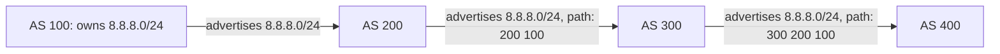
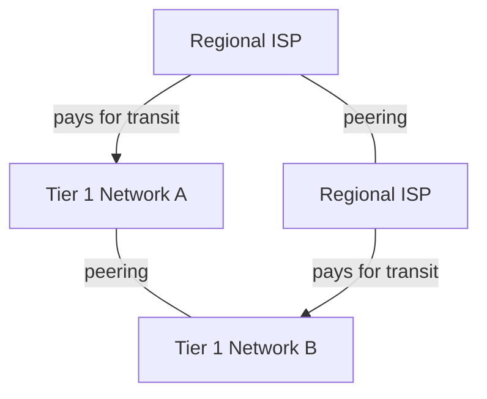

The internet isn't one network — it's tens of thousands of independently operated networks, each making its own decisions about who to connect to and what traffic to accept, with no central authority telling any of them how to route packets to the rest. BGP (Border Gateway Protocol) is the protocol that makes this work anyway: it's how one network tells its neighbors "I can reach this range of addresses," and how those neighbors decide which of several possible paths to actually use. Every time you've heard about a major internet outage caused by a "route leak" or "BGP hijack," this is the protocol in question — worth understanding both how it works and exactly why it's so easy to get wrong.

## Autonomous Systems: The Actual Unit of the Internet

The internet is composed of **Autonomous Systems (AS)** — networks under one organization's administrative control, each identified by a globally unique **AS number**. Your ISP is an AS. A large cloud provider is an AS. A university network is an AS.

```bash
$ whois -h whois.radb.net AS15169
aut-num:    AS15169
as-name:    GOOGLE
descr:      Google LLC
```

BGP's entire job is routing traffic **between** these autonomous systems — not within one. Inside a single AS, routing typically uses an interior protocol (OSPF, IS-IS) to figure out the best path between its own routers. BGP only cares about the AS-to-AS level: "to reach this block of IP addresses, go through this sequence of autonomous systems."

## Route Advertisement: How Reachability Gets Announced

Each AS owns blocks of IP addresses (expressed in CIDR notation, like `8.8.8.0/24`) and announces — "advertises" — which of these blocks it can route to, to its directly connected BGP neighbors.



Each hop doesn't just forward the announcement unchanged — it prepends its own AS number to the **AS path**, so every AS further out sees the full sequence of networks a packet would traverse to reach that destination. This is the core mechanism that lets BGP avoid routing loops: if an AS ever sees its own AS number already present in an incoming route's AS path, it rejects that route outright — a packet routed through that path would eventually loop back to where it started.

```bash
$ show ip bgp 8.8.8.0/24
Network: 8.8.8.0/24
Path: 400 300 200 100
Origin: IGP
Next hop: 203.0.113.5
```

That AS path also doubles as BGP's default measure of route quality — all else equal, a shorter AS path is preferred, on the (imperfect but usually reasonable) assumption that fewer hops means a better route.

## Path Selection: Choosing Among Multiple Routes

A router often learns multiple candidate paths to the same destination block from different neighbors, and BGP applies a deterministic sequence of tie-breaking rules to pick exactly one:

1. **Highest local preference** — an operator-configured value expressing "prefer routes learned this way," typically used to prefer routes through a paid transit provider or a preferred peering partner over a backup path.
2. **Shortest AS path** — fewer AS hops preferred, as a proxy for a shorter/better route.
3. **Lowest origin type** — routes originated by an interior protocol are preferred over routes learned via less-trusted origination methods.
4. **Lowest MED (Multi-Exit Discriminator)** — a hint from a neighboring AS about which of its own multiple entry points it prefers you use.
5. **eBGP over iBGP** — routes learned from an external neighbor (a different AS) preferred over one learned from an internal neighbor (same AS), all else equal.
6. **Lowest router ID** — a final, arbitrary tiebreaker ensuring the algorithm always converges on exactly one choice, even when every prior rule ties.

```bash
$ show ip bgp 8.8.8.0/24
   Network       Next Hop      Metric  LocPrf  Path
*  8.8.8.0/24    203.0.113.5   0       100     400 300 200 100 i
*> 8.8.8.0/24    198.51.100.9  0       150     400 200 100 i
```

The `>` marks the selected best path — here, the route via `198.51.100.9` wins on local preference (150 vs 100) despite having the same AS path length in this simplified example, illustrating that "shortest path" is only the *second* criterion, not the first — an operator's explicit preference (usually reflecting cost or contractual relationships) overrides raw path length.

Critically, **BGP does not know or care about actual network conditions** — latency, congestion, packet loss. It selects paths based on this fixed rule hierarchy over AS-path and policy attributes, not real-time performance measurement. Two paths with identical AS-path length are indistinguishable to BGP even if one runs over a congested link and the other doesn't — a well-known limitation that's part of why large networks layer additional traffic-engineering tools on top of raw BGP decisions.

## Peering vs Transit

The business relationship between two connected autonomous systems shapes what routes they exchange:

**Transit** — an AS pays a larger provider (a "transit provider") to carry its traffic to the rest of the internet. The transit provider advertises essentially the full internet routing table to its transit customer, and the customer advertises only its own address space upward.

**Peering** — two networks of comparable size connect directly and agree to exchange traffic between their own customers' address spaces, typically without payment (settlement-free peering), because it's mutually beneficial — cheaper and lower-latency than routing that traffic through a paid transit path.



This is why two regional ISPs might peer directly with each other even while both also buying transit from larger providers — for traffic between their own customers, a direct peering link is both cheaper and shorter than routing up through a transit provider and back down.

## Route Hijacks and Leaks

BGP's biggest structural weakness: **there is no built-in cryptographic verification that an AS advertising a route actually owns that address space.** Any AS can, in principle, announce "I can reach `8.8.8.0/24`" even if it has no legitimate claim to it, and neighboring routers will, by default, accept and propagate that announcement.

```
Legitimate: AS 15169 (Google) announces 8.8.8.0/24
Hijack:     AS 99999 (unrelated network) also announces 8.8.8.0/24
```

If the malicious announcement has a shorter AS path or higher local preference from some vantage points, some fraction of the internet's traffic destined for that address block gets routed to the hijacking AS instead — which can be used to intercept traffic, or simply black-hole it, causing an outage for the legitimate owner. Real-world incidents (misconfigurations far more often than deliberate attacks) have taken down major services this way — an operator fat-fingering a route filter and accidentally announcing address space they don't own, which propagates outward before anyone notices.

The mitigation gaining real deployment is **RPKI (Resource Public Key Infrastructure)**: address-space owners cryptographically sign a statement of which AS is authorized to originate routes for their prefixes, and routers configured to validate RPKI can reject an announcement that doesn't match — turning "any AS can claim any prefix" into "an AS claiming a prefix needs a matching cryptographic authorization," at least among networks that have adopted validation.

```bash
$ rpki-client -v
Prefix: 8.8.8.0/24
Max length: 24
Origin AS: 15169
Validation: valid
```

RPKI adoption is real but not universal — a hijack is still possible through networks that don't validate, which is why route hijacks remain an ongoing operational risk rather than a solved problem.

## Conclusion

BGP is what lets tens of thousands of independently operated networks form one coherent internet without any central routing authority — each AS announces what it can reach, propagates that announcement onward with its own AS prepended, and every downstream router applies the same deterministic tie-breaking rules to pick one best path among the alternatives it's heard. That decentralization is also its biggest weakness: BGP was designed around trust between operators, not cryptographic proof of address ownership, which is exactly why route hijacks and leaks — usually accidental misconfigurations, occasionally deliberate — remain a real operational risk that RPKI adoption is gradually, but not yet completely, closing.
