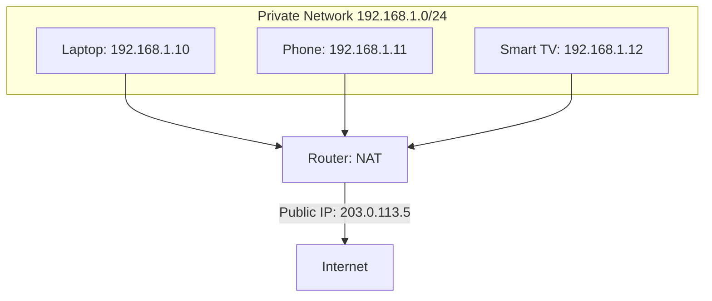
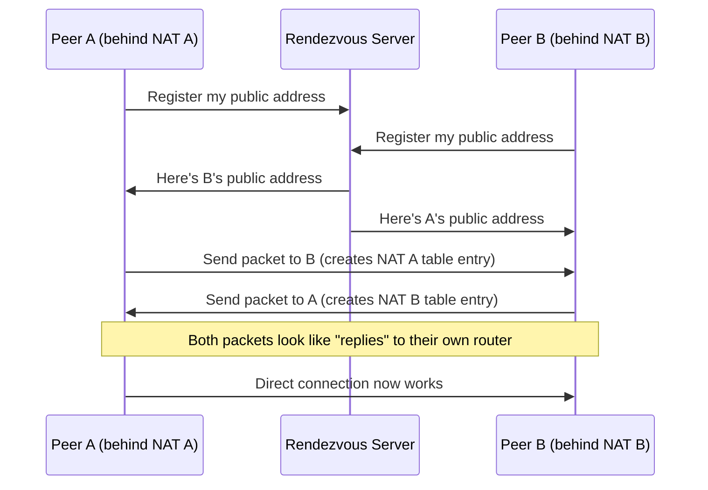

Every device on your home network — laptop, phone, smart speaker, three streaming boxes — shares exactly one public IP address when talking to the internet, and somehow the router still knows which response belongs to which device. That's Network Address Translation, and it's arguably the single technology most responsible for IPv4 surviving as long as it has, letting billions of devices share a pool of roughly 4 billion addresses that would've run out decades ago without it. This post covers how NAT actually tracks and rewrites connections, and why it's the reason peer-to-peer connections need extra tricks to work at all.

## The Problem NAT Solves

IPv4 has roughly 4.3 billion possible addresses. That sounds like a lot until you account for every phone, laptop, server, IoT device, and router on Earth needing one — the actual public IPv4 address space was exhausted (allocations from the central pool ran out) years ago. NAT is the mechanism that let the internet keep growing anyway: instead of every device needing its own public address, an entire private network shares one public address, and a router in the middle translates between the two address spaces transparently.



Private address ranges (`10.0.0.0/8`, `172.16.0.0/12`, `192.168.0.0/16`) are reserved specifically for this purpose — they're never routable on the public internet, which is precisely what makes them safe to reuse identically across millions of unrelated private networks without any conflict.

## How Translation Actually Works: The NAT Table

The core trick isn't just rewriting the source IP — it's rewriting the source **port** too, and remembering the mapping, which is what lets multiple internal devices share one public IP without their traffic getting mixed up.

```
Internal device sends:
  192.168.1.10:51200 -> 93.184.216.34:443

Router rewrites and tracks:
  203.0.113.5:40001 -> 93.184.216.34:443
  (NAT table entry: 192.168.1.10:51200 <-> 203.0.113.5:40001)

Response arrives from the internet:
  93.184.216.34:443 -> 203.0.113.5:40001

Router looks up NAT table, rewrites back, forwards internally:
  93.184.216.34:443 -> 192.168.1.10:51200
```

```bash
$ conntrack -L | grep 192.168.1.10
tcp 6 431995 ESTABLISHED src=192.168.1.10 dst=93.184.216.34 sport=51200 dport=443 \
  src=93.184.216.34 dst=203.0.113.5 sport=443 dport=40001 [ASSURED]
```

This specific variant — rewriting both address and port, and using the port to disambiguate which internal device a given response belongs to — is called **PAT (Port Address Translation)**, though it's commonly just called NAT since it's by far the most common form in practice. The NAT table entry is what makes this stateful: the router needs to remember every active translation to route return traffic correctly, which is also exactly why NAT devices need to track connection state the same way a stateful firewall does — they're solving closely related problems using the same underlying mechanism.

## Why NAT Only Works Cleanly for Outbound-Initiated Connections

The translation table entry only gets created when an **internal** device initiates a connection outward. This has a direct, important consequence: an external host on the internet **cannot** initiate a new connection to a device behind NAT, because there's no existing table entry to route the incoming packet through — the router has no idea which internal device an unsolicited inbound packet is meant for.

```
Works:     Internal device initiates -> table entry created -> response routes back fine
Fails:     External host initiates -> no table entry exists -> router has nowhere to route it
```

This is, incidentally, a meaningful (if accidental) security property — a device behind NAT is implicitly unreachable from the internet unless it first reaches out, which is part of why home networks behind a NAT router are reasonably protected from unsolicited inbound connection attempts even with zero explicit firewall configuration.

## Port Forwarding: Deliberately Punching a Hole

When you *do* want an external connection to reach a specific internal device — running a game server, a home web server, a security camera's remote view — you need **port forwarding**: a static, manually configured NAT table entry that exists permanently, rather than being created dynamically by an outbound connection.

```bash
$ iptables -t nat -A PREROUTING -p tcp --dport 8080 -j DNAT --to-destination 192.168.1.20:80
```

This tells the router: any inbound connection to the public IP on port 8080 should always be routed to `192.168.1.20:80`, regardless of whether an internal device has "asked" for it via an outbound connection first. This is the exact mechanism referenced any time a router's admin page says "port forwarding" — a permanent, manually created exception to NAT's normal "only route what an internal device initiated" behavior.

## NAT and Peer-to-Peer: The Real Complication

NAT's outbound-only default is a real problem for peer-to-peer applications — video calls, torrenting, multiplayer games — where two devices, each behind their own separate NAT (and neither able to receive unsolicited inbound connections), need to establish a direct connection to each other.

The standard workaround is **NAT hole punching**: both peers simultaneously send outbound packets toward each other (via addresses learned from a third-party rendezvous server), and because each outbound packet creates a NAT table entry on its own router, the *response* from the other peer arrives looking like a legitimate reply to an outbound request — even though it's actually a new connection from the other peer's perspective.



This works reliably for the most common type of NAT (**cone NAT**, where a given internal address:port always maps to the same external address:port regardless of destination) but fails for the stricter **symmetric NAT** (where the external mapping changes per destination), which is exactly why some peer-to-peer connections fall back to relaying traffic through a third-party server (**TURN**, in the WebRTC world) when direct hole punching doesn't succeed — a strictly worse outcome for latency and server cost, but the only option left once direct connection establishment fails.

## Carrier-Grade NAT (CGNAT): NAT of NAT

Some ISPs, especially mobile carriers, apply **another layer of NAT** on top of the customer's own router-level NAT — the ISP itself doesn't have enough public IPv4 addresses for every customer, so it shares one public IP across many customers, each of whom is already running their own NAT internally.

```
Device (192.168.1.10) -> Home Router NAT (public: 100.64.0.5, a shared carrier address)
  -> ISP CGNAT -> True Public IP (203.0.113.5, shared across thousands of customers)
```

This double translation makes port forwarding and P2P hole punching meaningfully harder or outright impossible for affected customers, since they don't control — and often can't even see — the outer layer of translation happening at the ISP. It's a genuine, if under-discussed, source of connectivity problems for anyone trying to self-host something behind a CGNAT connection, since there's no router-level configuration that can fix a translation layer you don't have access to.

## Conclusion

NAT's core mechanism — rewriting source address and port, and remembering the mapping in a table keyed by that rewrite — is what let IPv4's limited address space stretch to cover a vastly larger number of actual devices, at the cost of making unsolicited inbound connections structurally difficult by default. Port forwarding is the deliberate, manual escape hatch for services that need to be reachable from outside; NAT hole punching is the peer-to-peer workaround that exploits the same "outbound creates a table entry" mechanism from both sides at once. Understanding this table-based mechanism is what makes NAT's various quirks — why P2P connections sometimes need a relay server, why CGNAT breaks self-hosting, why port forwarding is necessary at all — make sense as consequences of one underlying design, rather than a collection of unrelated networking annoyances.
