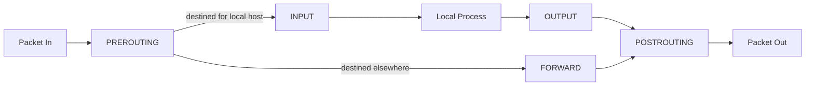

Every packet that touches a Linux machine's network stack passes through a series of decision points where the kernel asks "accept, drop, or modify this?" — and `iptables` (and its modern successor, `nftables`) is how you configure the answer to that question. Whether you're writing a firewall rule to block a port, setting up NAT for a home router, or debugging why Docker's networking behaves the way it does, you're working with this same underlying framework. This post covers how packet filtering actually works on Linux, the iptables mental model, and why the ecosystem is migrating to nftables.

## The Netfilter Framework

`iptables` isn't the packet filter itself — it's a userspace tool for configuring **Netfilter**, the actual packet-filtering framework built into the Linux kernel. Netfilter defines a series of **hooks** — points in the kernel's network stack where packets can be intercepted and a decision made about what happens to them.



Each of these hook points corresponds to a **chain** in iptables terminology: `PREROUTING` (before routing decisions), `INPUT` (packets destined for this host), `FORWARD` (packets being routed through this host to somewhere else), `OUTPUT` (packets originating from this host), `POSTROUTING` (after routing, right before leaving the interface).

## Tables: Organizing Rules by Purpose

iptables groups rules into **tables**, each meant for a specific kind of packet manipulation:

- **filter** — the default table, for accept/drop/reject decisions. This is what most people mean by "firewall rules."
- **nat** — for rewriting source or destination addresses (port forwarding, masquerading for outbound internet access).
- **mangle** — for altering packet headers (TTL, TOS/DSCP marking for QoS).
- **raw** — for exempting packets from connection tracking, used in advanced/high-performance setups.

```bash
$ iptables -t filter -L INPUT -n --line-numbers
Chain INPUT (policy DROP)
num  target     prot opt source               destination
1    ACCEPT     tcp  --  0.0.0.0/0            0.0.0.0/0            tcp dpt:22
2    ACCEPT     tcp  --  0.0.0.0/0            0.0.0.0/0            tcp dpt:443
3    ACCEPT     all  --  0.0.0.0/0            0.0.0.0/0            state RELATED,ESTABLISHED
```

## Writing Basic Filter Rules

The typical shape of a rule: match criteria (protocol, port, source address, connection state), plus a target (what to do if the packet matches).

```bash
$ iptables -A INPUT -p tcp --dport 22 -j ACCEPT
$ iptables -A INPUT -p tcp --dport 443 -j ACCEPT
$ iptables -A INPUT -m state --state RELATED,ESTABLISHED -j ACCEPT
$ iptables -P INPUT DROP
```

Rules are evaluated **in order**, top to bottom, and the first match wins — a packet stops traversing the chain the moment a rule matches, which makes rule ordering a real correctness concern, not just a style preference. The last line, setting the default **policy** to `DROP`, is what makes this a genuinely restrictive firewall — without it, unmatched packets fall through and are implicitly accepted, which is a common and dangerous misconfiguration for anyone assuming "I only wrote ACCEPT rules for what I need" is itself sufficient.

The `state RELATED,ESTABLISHED` rule deserves particular attention — it's what allows **return traffic** for connections your own host initiated (a response to an outbound request) without needing a separate explicit rule for every possible response port. Without it, outbound connections would work (their SYN can leave) but responses would be dropped on arrival, since nothing explicitly allows them back in.

## NAT: Port Forwarding and Masquerading

**DNAT (Destination NAT)** rewrites a packet's destination — the mechanism behind port forwarding, letting external traffic to a public IP:port reach an internal machine that doesn't have a public address of its own:

```bash
$ iptables -t nat -A PREROUTING -p tcp --dport 8080 -j DNAT --to-destination 10.0.1.50:80
```

**SNAT/MASQUERADE (Source NAT)** rewrites a packet's source address — the mechanism that lets an entire private network share one public IP for outbound traffic, which is exactly what a home router does for every device behind it:

```bash
$ iptables -t nat -A POSTROUTING -o eth0 -j MASQUERADE
```

`MASQUERADE` is a variant of SNAT specifically for cases where the outbound interface's IP address isn't static (common for dynamic-IP internet connections) — it automatically uses whatever address the outbound interface currently has, rather than requiring a hardcoded IP in the rule.

## Connection Tracking

Netfilter's `conntrack` subsystem tracks the state of every connection passing through the system — which is what makes `state RELATED,ESTABLISHED` matching possible in the first place, and what lets NAT correctly rewrite return traffic back to match the original outbound connection.

```bash
$ conntrack -L | head -3
tcp      6 431999 ESTABLISHED src=10.0.1.50 dst=93.184.216.34 sport=51200 dport=443 \
  src=93.184.216.34 dst=203.0.113.5 sport=443 dport=51200 [ASSURED]
```

Each tracked connection remembers both directions of translated addresses, which is exactly what lets a NAT'd response find its way back to the internal machine that initiated the connection — the router knows, from this table, that a packet arriving at `203.0.113.5:51200` actually belongs to `10.0.1.50`'s connection and rewrites it accordingly on the way back in.

## Why nftables Replaced iptables

`iptables` accumulated real, structural pain points over time: separate binaries for IPv4 (`iptables`) and IPv6 (`ip6tables`) with duplicated rule sets to maintain, a rule-matching engine that becomes measurably slow with large rule sets (linear scan through rules, not an indexed lookup), and a syntax that's grown organically rather than being designed coherently from the start.

`nftables` is the kernel's modern replacement, designed to fix these structurally rather than patch around them:

```bash
$ nft add table inet filter
$ nft add chain inet filter input { type filter hook input priority 0 \; policy drop \; }
$ nft add rule inet filter input tcp dport 22 accept
$ nft add rule inet filter input tcp dport 443 accept
$ nft add rule inet filter input ct state established,related accept
```

Key differences worth knowing:

- **Unified IPv4/IPv6 handling** — the `inet` table family (as used above) matches both protocol versions with one rule set, instead of maintaining parallel `iptables`/`ip6tables` configurations.
- **A real, indexed rule-matching structure** — nftables can use sets and maps for efficient lookups (e.g., matching against a list of a thousand IPs) instead of a linear scan through a thousand separate rules, which matters a lot for large ACLs.
- **A more expressive, composable syntax** — sets, maps, and concatenated matches let you express what would be many separate iptables rules as one nftables rule.

```bash
$ nft add set inet filter blocklist { type ipv4_addr \; }
$ nft add element inet filter blocklist { 203.0.113.9, 198.51.100.23 }
$ nft add rule inet filter input ip saddr @blocklist drop
```

This set-based approach means adding the 500th blocked IP to `blocklist` doesn't add the 500th linear rule to scan — it's one lookup against an indexed set, regardless of how large the set grows.

## Practical Reality: Both Are Still Around

Most current Linux distributions ship `nft` as the actual backend even when you invoke the `iptables` command — a compatibility shim (`iptables-nft`) translates familiar `iptables` syntax into nftables rules under the hood, which is why existing iptables-based tooling (Docker, Kubernetes network plugins, countless deployment scripts) mostly continues to work unmodified even as the underlying implementation has shifted.

```bash
$ iptables --version
iptables v1.8.9 (nf_tables)
```

That `(nf_tables)` in the version output is the tell — this is the compatibility layer, not the legacy `iptables-legacy` backend. Writing new firewall configuration directly in native `nft` syntax is the forward-looking choice, but understanding `iptables` syntax remains genuinely necessary, since an enormous amount of existing production tooling and documentation is still written against it.

## Conclusion

Both `iptables` and `nftables` are userspace configuration tools for the same underlying Netfilter framework in the kernel — chains corresponding to points in the packet's journey through the network stack, tables organizing rules by purpose (filtering, NAT, packet mangling), and connection tracking underpinning both stateful filtering and NAT's return-traffic handling. `nftables` fixes real structural limitations in the older tool — duplicated IPv4/IPv6 rule sets, linear-scan rule matching, an organically-grown syntax — but the migration is gradual enough that most systems today run `nftables` under the hood while still accepting familiar `iptables` commands, which is exactly why both are worth understanding rather than treating one as fully obsolete.
