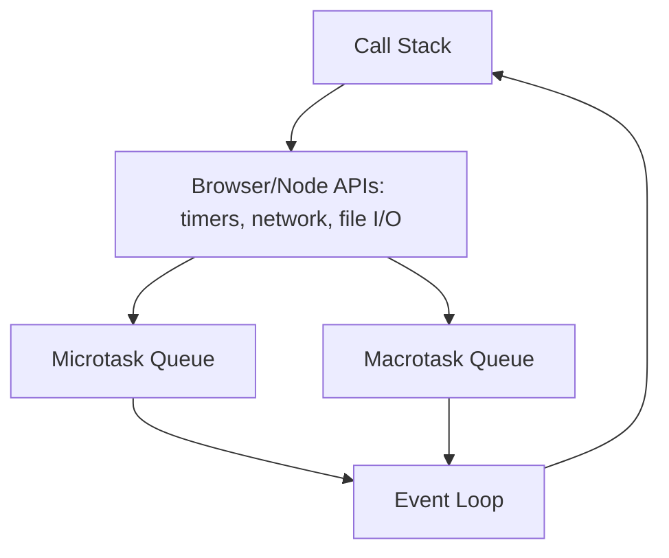
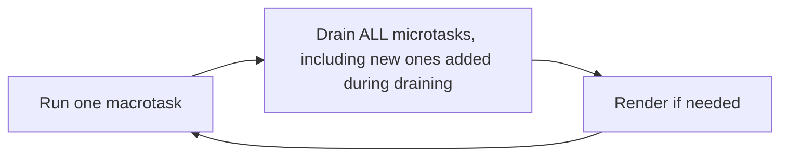

`console.log` order in JavaScript async code trips up even experienced developers, because the actual rule — microtasks always run before the next macrotask — isn't something you can guess from reading code top to bottom the way synchronous execution lets you. Understanding the event loop precisely, not just "async stuff happens later," is what makes `Promise.then()` and `setTimeout()` ordering predictable instead of something you have to test empirically every time. This post covers the actual mechanism: the call stack, the task queues, and the specific rule that determines execution order.

## JavaScript Is Single-Threaded — But Not Blocking

JavaScript executes on a single thread — only one piece of code runs at any given instant, full stop. This raises an obvious question: how does a `fetch()` call or a `setTimeout()` not freeze the entire program while waiting? The answer is that the waiting doesn't happen in JavaScript's thread at all — it happens in the runtime environment (the browser, or Node.js's libuv), which hands control back to JavaScript's single thread only once the asynchronous work actually completes.



The **call stack** is where synchronous JavaScript actually executes, one frame at a time. When code calls something async (`setTimeout`, a `fetch`, a Promise), the actual waiting is delegated to the runtime environment, and the call stack is immediately freed to keep executing the rest of the synchronous code — the async callback doesn't run inline, it gets scheduled to run later, once the stack is empty.

## The Call Stack: Synchronous Execution

```javascript
function first() {
  second();
  console.log("first done");
}
function second() {
  console.log("second running");
}
first();
```

```
second running
first done
```

Nothing unusual here — this is just ordinary synchronous execution, frames pushed and popped from the call stack in the expected order. The event loop doesn't get involved at all until something asynchronous is scheduled.

## Two Separate Queues: Macrotasks and Microtasks

This is the part that actually causes confusion, because there isn't one queue of "stuff to run later" — there are two, with different priority, and the rule for which runs when is precise and easy to state but easy to forget:

**Macrotasks** — `setTimeout`, `setInterval`, I/O callbacks, UI rendering. Each macrotask runs to completion, one at a time, one per event loop iteration.

**Microtasks** — Promise `.then()`/`.catch()`/`.finally()` callbacks, `queueMicrotask()`, `async`/`await` continuations. Critically: **the entire microtask queue is drained completely — including any new microtasks added while draining — before the event loop proceeds to the next macrotask.**



This asymmetry — one macrotask per iteration, but the *entire* microtask queue per iteration, however deep it grows — is the single rule that explains almost every "surprising" ordering question about JavaScript async code.

## The Classic Example

```javascript
console.log("1: sync start");

setTimeout(() => console.log("2: setTimeout"), 0);

Promise.resolve().then(() => console.log("3: promise"));

console.log("4: sync end");
```

```
1: sync start
4: sync end
3: promise
2: setTimeout
```

Even with `setTimeout(..., 0)` — a zero-millisecond delay — the promise callback still runs first. The reason: all synchronous code (`1` and `4`) runs first, since the call stack always executes to completion before the event loop looks at either queue. Once the stack is empty, the event loop checks the **microtask queue first**, always — draining it entirely — before it's even allowed to look at the macrotask queue where the `setTimeout` callback is waiting. The `0` in `setTimeout(..., 0)` doesn't mean "immediately" — it means "as soon as possible, but only after the current macrotask finishes and the microtask queue is fully drained."

## Microtasks Scheduling More Microtasks

The "entire queue, including new entries" part of the rule has a real consequence worth seeing directly:

```javascript
console.log("1: sync start");

setTimeout(() => console.log("2: timeout"), 0);

Promise.resolve()
  .then(() => {
    console.log("3: first microtask");
    return Promise.resolve();
  })
  .then(() => console.log("4: chained microtask"));

console.log("5: sync end");
```

```
1: sync start
5: sync end
3: first microtask
4: chained microtask
2: timeout
```

`4` runs before `2`, even though `4` was scheduled *from inside* another microtask, which itself only became runnable after the initial synchronous code finished. This is exactly the "drain the whole queue, including new arrivals" rule in action — a chain of microtasks, however long, will always fully resolve before the event loop moves on to even a single pending macrotask, no matter how that chain was constructed.

This has a real practical danger: **a microtask that keeps scheduling more microtasks can starve macrotasks (and rendering) indefinitely**, since the event loop never gets to move past the microtask queue as long as it keeps growing. This is a genuine, if uncommon, source of a frozen-feeling UI — not a blocked call stack in the traditional sense, but an event loop that's stuck perpetually draining an ever-refilling microtask queue.

## async/await Is Just Promise Syntax Sugar

`async`/`await` doesn't introduce a new execution model — it's syntax sugar over the exact same Promise/microtask mechanism, which is why understanding the rules above transfers directly:

```javascript
async function example() {
  console.log("a: start");
  await Promise.resolve();
  console.log("b: after await");
}

console.log("c: before call");
example();
console.log("d: after call");
```

```
c: before call
a: start
d: after call
b: after await
```

The code after `await` is, mechanically, a microtask callback — everything from `a: start` up to the `await` runs synchronously (as part of calling `example()`), and everything after the `await` is scheduled as a microtask continuation, which is exactly why `d: after call` (the remaining synchronous code in the caller) runs before `b: after await` — the microtask containing `b` can't run until the current synchronous execution (including `d`) finishes and the call stack empties.

## Where This Matters in Practice

**Debugging "why did this run in the wrong order."** Almost every confusing async ordering bug resolves once you correctly categorize each operation as synchronous, microtask, or macrotask, and apply the rule: sync first, then drain all microtasks completely, then one macrotask, repeat.

**Avoiding accidental UI jank.** A long chain of microtasks (common in poorly-structured Promise chains processing large datasets) can delay rendering and user input handling, because the browser can't get back to rendering until the microtask queue is fully drained — breaking heavy synchronous-feeling Promise chains into actual macrotask boundaries (`setTimeout(..., 0)`, or `requestIdleCallback`) gives the browser a chance to render in between.

**Node.js has its own additional queue nuances** (`process.nextTick` runs even before other microtasks, and Node's event loop has distinct phases for timers, I/O callbacks, and `setImmediate`) — the core sync-then-microtasks-then-macrotask rule still applies, but Node-specific code benefits from knowing these are layered on top, not a completely different model.

## Conclusion

The event loop's behavior is fully explained by one asymmetric rule: after the call stack empties, drain the microtask queue completely — including any new microtasks scheduled while draining — before running even a single macrotask, then repeat. Promises and `async`/`await` continuations are microtasks; `setTimeout`, I/O, and UI events are macrotasks — which is the entire reason a zero-delay `setTimeout` still runs after a resolved promise's `.then()`, no matter how that feels at first glance. Once this rule is internalized precisely, rather than approximated as "synchronous code runs first, then async stuff happens," ordering questions in async JavaScript stop being something you have to test empirically and become something you can predict directly from the code.
