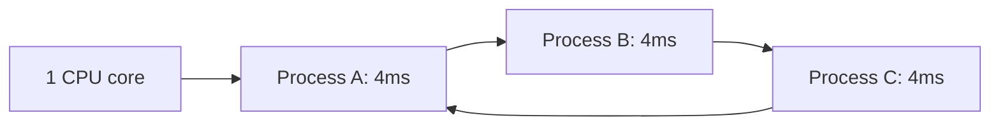
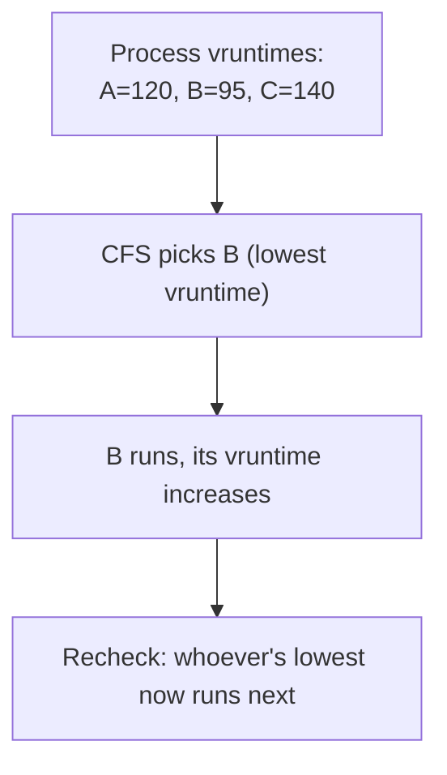
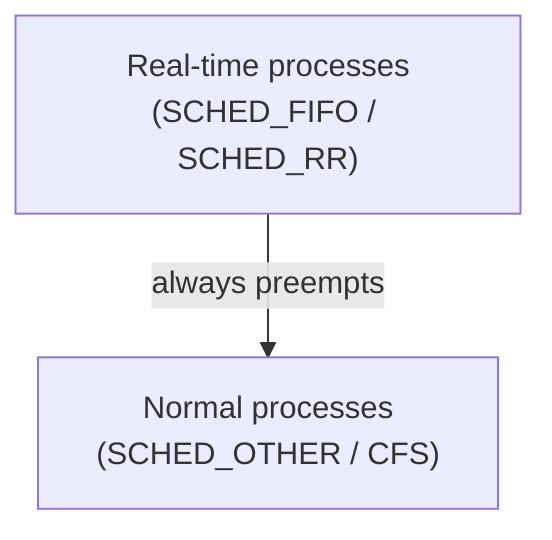

A typical laptop runs hundreds of processes but usually has somewhere between 4 and 16 CPU cores, which means at any given instant, the overwhelming majority of runnable processes are *not* running — they're waiting for the kernel to decide it's their turn. That decision, made and remade thousands of times per second, is the job of the **scheduler**. Understanding how Linux's scheduler actually works explains why `nice` affects performance the way it does, what a `renice`'d process is really getting, and why a "real-time" process behaves so differently from an ordinary one.

## The Problem: More Processes Than Cores

With more runnable processes than CPU cores, the kernel has to time-slice — give each process a small window to run, then switch to another, fast enough that it *feels* like everything is running simultaneously even though only a handful of things are literally executing at any given nanosecond.



The scheduler's job is deciding, at every context switch, which of the runnable processes gets the CPU next, and for how long. Get this wrong and you get either poor interactivity (a process waits too long for its turn) or poor throughput (constant switching wastes time on overhead instead of actual work).

## CFS: The Completely Fair Scheduler

Since Linux 2.6.23, the default scheduler for ordinary processes is the **Completely Fair Scheduler (CFS)**. Its central idea, despite the intimidating name, is simple: track how much CPU time each runnable process has actually received, and always hand the CPU to whichever process has received the *least* time so far relative to its fair share.

```bash
$ ps -eo pid,comm,pri,ni | head -5
    PID COMMAND          PRI  NI
      1 systemd           19   0
    412 sshd              19   0
   9981 python3           19   0
  10022 chrome            19   0
```

CFS tracks this using a value called **vruntime** (virtual runtime) per process — every process accumulates vruntime while it runs, and CFS always picks the process with the lowest vruntime to run next. A process that's been sleeping (blocked on I/O, waiting on a lock) accumulates no vruntime at all during that time, which is exactly why a process that just woke up after a long block tends to get scheduled promptly — its vruntime is far behind everyone else's, so CFS picks it first to keep things "fair."



Internally, CFS keeps runnable processes in a **red-black tree** keyed by vruntime, so "find the process with the lowest vruntime" is an O(log n) operation rather than a linear scan — this is what lets the scheduler make its decision in constant, predictable time even with thousands of runnable tasks.

## `nice` Values: Weighting, Not Priority Levels

The `nice` value (ranging from -20 to 19) doesn't grant a process a fixed slice of CPU time or a strict priority tier — it changes the *weight* used when calculating how fast that process's vruntime accumulates relative to others.

```bash
$ nice -n 10 ./cpu_heavy_task &
$ renice -n -5 -p 9981
9981 (process ID) old priority 0, new priority -5
```

A lower nice value (down to -20) means a *higher* weight, so that process's vruntime increases more slowly relative to real time — it effectively gets a bigger share of the CPU whenever it's competing with normal-weight processes. A higher nice value (up to 19) means the opposite: its vruntime increases faster, so CFS deprioritizes it sooner. Critically, `nice` only matters when there's contention — a `nice 19` process running completely alone on an otherwise idle machine still gets 100% of a CPU core, because there's no one else to be "fair" relative to.

```bash
$ chrt -p $$
pid 12345's current scheduling policy: SCHED_OTHER
pid 12345's current scheduling priority: 0
```

`SCHED_OTHER` is CFS's default policy name — this confirms an ordinary shell process is scheduled by CFS, not one of the real-time classes below.

## Real-Time Scheduling Classes: Escaping CFS Entirely

For workloads where "fair" isn't good enough — audio processing, industrial control loops, anything where a missed deadline is a real failure, not just a slowdown — Linux offers real-time scheduling policies that sit *above* CFS in priority entirely: `SCHED_FIFO` and `SCHED_RR`.

```bash
$ chrt -f -p 50 12345   # SCHED_FIFO, priority 50
$ chrt -r -p 30 12346   # SCHED_RR, priority 30
```

A `SCHED_FIFO` process, once runnable, preempts every ordinary CFS process unconditionally and keeps the CPU until it either blocks, yields, or a higher (or equal) priority real-time process becomes runnable — there's no vruntime accounting involved at all, no notion of "fairness" applies. `SCHED_RR` is the same idea but time-sliced among real-time processes of equal priority, so one greedy real-time task doesn't starve another at the same priority level forever.



This is genuinely dangerous to misuse: a buggy `SCHED_FIFO` process that never blocks can starve every other process on the system, including the kernel's own housekeeping tasks — which is why setting real-time priority requires elevated privileges (`CAP_SYS_NICE`) rather than being available to any user process by default.

## Observing the Scheduler in Practice

`top` and `htop` show live CPU time accounting, but for actually watching scheduling decisions happen, `perf sched` gives a direct view of context switches and latency:

```bash
$ sudo perf sched record -- sleep 5
$ sudo perf sched latency
```

```
 Task                  |   Runtime ms  | Switches | Avg delay ms |
------------------------------------------------------------------
 chrome:9981            |    412.223 ms |      842 |     0.041 ms |
 python3:10022          |     88.104 ms |      156 |     0.089 ms |
```

The **average delay** column is the practical, ground-truth answer to "how long did this process wait for its turn once it became runnable" — a number that's a direct consequence of vruntime accounting, nice weighting, and contention from other runnable processes, all at once.

## Conclusion

Linux's default scheduler, CFS, doesn't hand out fixed time slices — it continuously tracks accumulated runtime (vruntime) per process and always runs whichever runnable process is furthest behind its fair share, which is what makes a `nice`d process get proportionally less CPU only under contention, never in isolation. Real-time policies (`SCHED_FIFO`, `SCHED_RR`) opt out of this fairness model entirely, trading it for strict, deadline-oriented preemption at the cost of real risk if misused. Together, `ps`, `nice`/`renice`, `chrt`, and `perf sched` give you the full toolkit for observing and adjusting exactly how the kernel is dividing CPU time among everything currently competing for it.
