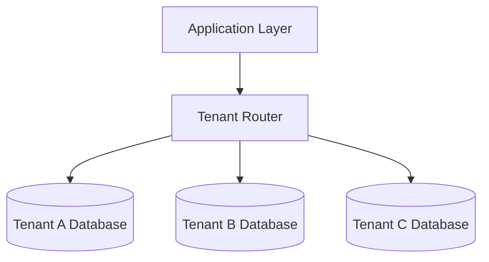

Every SaaS product eventually has to answer the same question: how do you store data for thousands of different customers in a way that's cheap to run, safe from one customer accidentally (or maliciously) seeing another's data, and doesn't require a separate deployment per customer? The answer is a multi-tenancy pattern, and the choice you make early tends to be expensive to reverse later. This post covers the three standard patterns, how tenant isolation actually gets enforced in each, and the signals that tell you which one fits your product.

## What "Tenant" Means Here

A tenant is a customer — could be an individual, could be an entire company with hundreds of internal users. Every row of data in the system belongs to exactly one tenant, and the core promise multi-tenancy has to keep is: **tenant A can never see or affect tenant B's data**, no matter what bug, bad query, or malicious input occurs.

That promise can be enforced at three different layers, which map to three different architectural patterns.

## Pattern 1: Shared Schema (Row-Level Isolation)

All tenants share the same database and the same tables; every table has a `tenant_id` column, and every query filters on it.

```sql
CREATE TABLE orders (
    id UUID PRIMARY KEY,
    tenant_id UUID NOT NULL,
    customer_name TEXT,
    total_cents INTEGER,
    created_at TIMESTAMPTZ
);

CREATE INDEX idx_orders_tenant ON orders (tenant_id);
```

```sql
SELECT * FROM orders WHERE tenant_id = $1 AND id = $2;
```

This is the cheapest pattern to run — one database, one schema, one set of migrations, and adding a new tenant is just inserting a row, not provisioning any new infrastructure. The catch is that isolation now depends entirely on **every single query remembering the `tenant_id` filter**, which is a large, easy-to-violate surface area. A single missing `WHERE tenant_id = ?` in an ORM query, an admin tool, or a background job is a cross-tenant data leak.

Postgres's **row-level security (RLS)** closes this gap by moving the filter from "every developer must remember it" to "the database enforces it, even if the application forgets":

```sql
ALTER TABLE orders ENABLE ROW LEVEL SECURITY;

CREATE POLICY tenant_isolation ON orders
    USING (tenant_id = current_setting('app.current_tenant')::UUID);
```

```sql
SET app.current_tenant = '3f29c1a0-...';
SELECT * FROM orders;  -- automatically filtered to this tenant, even without a WHERE clause
```

With RLS in place, a query that forgets the tenant filter doesn't leak data — it just returns the current tenant's rows, because the database itself won't return anything else. This meaningfully raises the bar on the shared-schema pattern's biggest weakness, though it still requires discipline: every connection needs `app.current_tenant` set correctly before any query runs, and a connection pool that reuses connections across tenants without resetting this is its own bug class to watch for.

## Pattern 2: Schema-per-Tenant

Same database server, but each tenant gets its own schema (namespace) with identical table structure.

```sql
CREATE SCHEMA tenant_acme;
CREATE SCHEMA tenant_globex;

CREATE TABLE tenant_acme.orders (id UUID PRIMARY KEY, customer_name TEXT, ...);
CREATE TABLE tenant_globex.orders (id UUID PRIMARY KEY, customer_name TEXT, ...);
```

```python
def get_connection(tenant_id):
    schema = f"tenant_{tenant_id}"
    conn = pool.get_connection()
    conn.execute(f"SET search_path TO {schema}")
    return conn
```

Isolation is now structural rather than filter-based — there's no `tenant_id` column to forget, because tenant A's connection literally cannot query tenant B's tables without explicitly changing its search path. This is a meaningfully stronger isolation guarantee than relying on a `WHERE` clause, and it also makes **per-tenant operations** easier: exporting one tenant's full data, restoring one tenant from backup, or deleting one tenant entirely are clean schema-level operations instead of filtered queries across shared tables.

The cost shows up operationally: migrations now have to run against every tenant's schema (a migration script looping over hundreds or thousands of schemas, rather than one `ALTER TABLE`), and most database engines have practical limits on how many schemas/tables a single instance handles comfortably before catalog overhead and connection pool churn become real problems — this pattern tends to top out in the hundreds to low thousands of tenants, not tens of thousands.

## Pattern 3: Database-per-Tenant

Each tenant gets an entirely separate database (potentially on a separate physical instance).



This is the strongest isolation available short of physically separate infrastructure — a bug can't cross a database connection boundary at all, and it directly satisfies compliance requirements that some enterprise customers hard-require (certain regulated industries and government contracts specifically mandate physically or logically separate data stores, not just row-level filtering). It also lets you tune resources per tenant: a large enterprise customer's database can get more CPU/memory/IOPS than a free-tier tenant's, and one tenant running an expensive query can't degrade performance for anyone else sharing the instance.

The cost is operational complexity that scales linearly with tenant count: connection pooling across potentially thousands of databases, migrations that must run tenant-by-tenant (usually with a rollout strategy — canary a few tenants, then proceed), and per-tenant backup/monitoring/alerting instead of one shared setup. This pattern is standard for enterprise B2B SaaS with a smaller number of large, high-value tenants — it's a poor fit for a product with tens of thousands of small self-serve tenants, where the per-tenant operational overhead dominates.

## Comparing the Three

| | Shared Schema | Schema-per-Tenant | Database-per-Tenant |
|---|---|---|---|
| Isolation strength | Row-level (app or RLS enforced) | Structural (namespace) | Strongest (full separation) |
| Onboarding a new tenant | Insert a row — instant | Create schema + run migrations | Provision a database |
| Migration complexity | One migration, one schema | N schemas, one per tenant | N databases, one per tenant |
| Cost at scale | Lowest — shared infra | Medium | Highest — infra scales with tenant count |
| Per-tenant resource tuning | Not possible | Limited | Full control |
| Compliance fit (data residency, hard separation) | Weak, without extra work | Moderate | Strong |
| Practical tenant count ceiling | Very high (millions) | Low thousands | Depends on ops tooling maturity |

## Hybrid Approaches

Real systems often don't pick one pattern for every tenant. A common shape:

- **Free/self-serve tenants** live in a shared schema — cheap to onboard, isolation enforced via RLS, no operational overhead per tenant.
- **Enterprise tenants** (paying for dedicated capacity, or with compliance requirements) get promoted to their own database, with a migration path to move a tenant's data from the shared schema into a dedicated one when they upgrade.

This means the tenant-routing layer needs to know, per request, which pattern applies to the requesting tenant — a small but important piece of infrastructure that most single-pattern designs don't need, and worth building deliberately rather than bolting on after the first enterprise customer demands dedicated infrastructure.

## Conclusion

The right multi-tenancy pattern depends less on technical elegance and more on tenant count and shape: a shared schema with row-level security fits a self-serve product with a very large number of small tenants; schema-per-tenant is a middle ground that gives structural isolation without full infrastructure duplication; database-per-tenant fits a smaller number of large, high-value, or compliance-constrained tenants. The pattern you pick shapes how expensive every future migration and every future compliance requirement will be — worth deciding deliberately with your actual expected tenant distribution in mind, not just whichever pattern looked simplest to build first.
