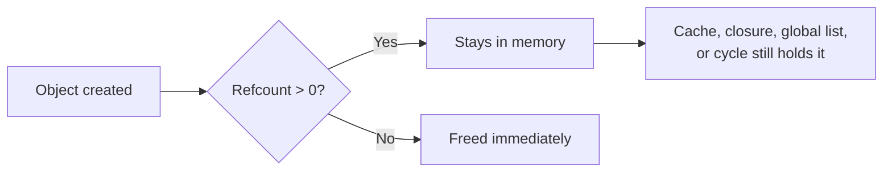

Python has a garbage collector, which leads a lot of developers to assume memory leaks simply can't happen — if nobody calls `free()`, what's there to leak? But a long-running Python service (a web server, a worker process, a daemon) can absolutely grow unbounded in memory over days or weeks, and the cause is almost never a bug in the interpreter. It's references you didn't know you were holding. This post covers why Python processes leak memory despite having a garbage collector, and the tools to actually find where.

## Why Garbage-Collected Languages Still Leak

Python's memory management is a combination of two mechanisms: **reference counting** (an object is freed the instant its reference count hits zero) and a **cycle-detecting garbage collector** (for objects that reference each other in a cycle, which reference counting alone can't clean up). A "memory leak" in Python almost always means one thing: something is holding a reference to an object longer than you intended, so its reference count never reaches zero, and it never gets freed — reference counting is working exactly as designed, on a reference you forgot you left in place.



## The Classic Leak: Growing a Module-Level Cache

The most common real-world leak in Python services is an unbounded cache — a dictionary or list at module scope that things get appended to but never removed from.

```python
# leaky_cache.py
_request_log = []

def handle_request(request):
    _request_log.append(request)  # never trimmed, never expires
    return process(request)
```

Every request handled adds one more entry to `_request_log`, and since it's a module-level global, it lives for the entire lifetime of the process. After a few million requests, this dictionary alone can account for gigabytes of resident memory — and nothing about it looks wrong in a code review, because appending to a log is an unremarkable thing to do.

The fix is almost always a size bound or a TTL, using something purpose-built for this instead of a plain list:

```python
from collections import deque

_request_log = deque(maxlen=1000)  # oldest entries drop automatically

def handle_request(request):
    _request_log.append(request)
    return process(request)
```

## Finding Growth with `tracemalloc`

Python's built-in `tracemalloc` module snapshots memory allocations by file and line number, which makes it the first tool to reach for when you suspect a leak but don't know where.

```python
import tracemalloc

tracemalloc.start()

# ... run your application for a while, or simulate load ...

snapshot1 = tracemalloc.take_snapshot()

# ... run more requests ...

snapshot2 = tracemalloc.take_snapshot()

top_stats = snapshot2.compare_to(snapshot1, "lineno")

for stat in top_stats[:5]:
    print(stat)
```

```
leaky_cache.py:5: size=812 KiB (+800 KiB), count=10000 (+9800), average=83 B
requests/models.py:120: size=45 KiB (+2 KiB), count=310 (+12), average=148 B
...
```

The comparison between two snapshots taken under load is the key technique — a single snapshot just shows what's allocated right now, which is mostly noise. The *diff* between two snapshots taken minutes apart shows what's growing, and `leaky_cache.py:5` (the `_request_log.append(request)` line) jumps out immediately as the dominant source of new allocations.

## Reference Cycles: When `gc` Has to Get Involved

Reference counting alone can't collect two objects that reference each other, because neither one's count ever drops to zero on its own.

```python
class Node:
    def __init__(self, name):
        self.name = name
        self.parent = None
        self.children = []

    def add_child(self, child):
        self.children.append(child)
        child.parent = self  # cycle: parent -> child -> parent
```

```python
root = Node("root")
child = Node("child")
root.add_child(child)

del root
del child
# Neither object's refcount reaches zero — each still holds a reference
# to the other. Only the cycle-detecting GC can eventually free these.
```

Python's cyclic garbage collector does eventually find and collect this cycle, but "eventually" is the operative word — it runs periodically based on allocation thresholds, not immediately. For most applications this is fine, but for a memory-sensitive service, you can force a collection and inspect what's actually being tracked:

```python
import gc

gc.collect()
print(f"Unreachable objects collected: {gc.collect()}")
print(f"Objects tracked by gc: {len(gc.get_objects())}")
```

```
Unreachable objects collected: 0
Objects tracked by gc: 48213
```

The bigger risk with cycles is objects that define `__del__` — historically, Python's GC couldn't safely collect cycles containing objects with a `__del__` method at all (fixed in Python 3.4+, but still worth being aware of in mixed environments), so a `__del__`-heavy codebase with reference cycles is a specific pattern worth auditing directly.

## Closures and Bound Methods Holding Onto State

A subtler leak comes from closures or bound methods registered as callbacks that outlive the object they're closing over, especially with event systems or signal handlers.

```python
class EventEmitter:
    def __init__(self):
        self._handlers = []

    def on(self, handler):
        self._handlers.append(handler)

class LargeService:
    def __init__(self, emitter):
        self.big_data = [0] * 10_000_000  # ~80MB
        emitter.on(self.handle_event)  # bound method keeps `self` alive

    def handle_event(self, event):
        pass
```

```python
emitter = EventEmitter()
service = LargeService(emitter)
del service  # LargeService is NOT freed — emitter._handlers still
             # holds a bound method, and a bound method holds `self`
```

`service.handle_event` is a bound method, which means it carries a reference to `service` itself — registering it with `emitter.on()` keeps the entire `LargeService` instance (and its 80MB list) alive for as long as `emitter._handlers` exists, even after every other reference to `service` is gone. The fix is either an explicit `unsubscribe` call, or using `weakref` so the registration doesn't keep the object alive on its own:

```python
import weakref

class EventEmitter:
    def __init__(self):
        self._handlers = []

    def on(self, handler):
        self._handlers.append(weakref.WeakMethod(handler))
```

## Confirming Growth with `objgraph`

When `tracemalloc` tells you *where* allocations happen but not *what kind* of object is accumulating, `objgraph` fills the gap by counting live instances of each type.

```bash
$ pip install objgraph
```

```python
import objgraph

objgraph.show_growth(limit=5)
# ... run more requests ...
objgraph.show_growth(limit=5)
```

```
Node                   1000     +1000
dict                  15234       +42
LargeService              1        +1
```

`show_growth()` prints only the types whose counts changed since the last call, which turns "memory is growing somewhere" into "1000 new `Node` instances appeared between these two calls" — a concrete, searchable fact instead of a vague symptom.

## Conclusion

Memory leaks in Python are reference leaks, not allocator bugs — something (a global cache, a reference cycle, a bound-method callback) is holding a reference longer than intended, and reference counting is doing exactly what it's designed to do given that reference. `tracemalloc`'s snapshot-diff approach finds *where* memory is growing by file and line; `objgraph`'s growth tracking finds *what type* of object is accumulating; and `gc.collect()` plus `gc.get_objects()` reveal whether cycles are involved. Once you've localized the leak to a specific cache, callback list, or cycle, the fix is almost always small — a size bound, an unsubscribe call, or a `weakref` — the hard part is finding it, not fixing it.
