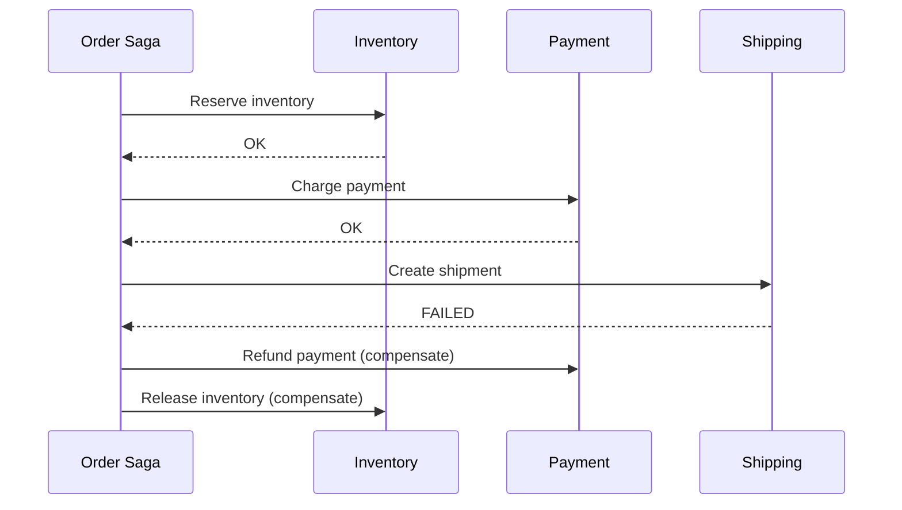

A single-database transaction gives you a clean guarantee: either everything commits, or nothing does. Split that same operation across microservices — reserve inventory in one service, charge a card in another, create a shipment in a third — and you lose that guarantee entirely, because there's no single database to wrap a `BEGIN`/`COMMIT` around anymore. The saga pattern is how distributed systems recreate "all or nothing" behavior without a distributed transaction coordinator, by making failure recovery an explicit, first-class part of the workflow instead of assuming it away.

## Why Two-Phase Commit Isn't the Answer

The textbook solution to distributed transactions is **two-phase commit (2PC)**: a coordinator asks every participant to "prepare" (lock resources, confirm they *can* commit), and only after every participant agrees does it tell them all to actually commit.

2PC works, but it has properties that make it a poor fit for microservices specifically:

- **It holds locks across the entire multi-step operation.** Every participant locks its resource from the "prepare" phase until the final "commit," which can be a long window if any one service is slow — and a lock held by one service blocks any other transaction touching the same resource.
- **The coordinator is a single point of failure.** If it crashes between phases, participants can be left holding locks indefinitely, waiting for a coordinator decision that never comes.
- **It assumes participants are always reachable and fast.** That's a reasonable assumption inside one database engine; it's a bad assumption across service boundaries with independent deploys, network partitions, and wildly different latency profiles.

Sagas take the opposite approach: no locks held across steps, no central prepare phase — instead, each step commits its own local transaction immediately, and failure is handled *after the fact* by explicitly undoing whatever already succeeded.

## The Core Idea: Compensating Transactions

A saga breaks a business transaction into a sequence of local transactions, each with a corresponding **compensating transaction** that undoes its effect if a later step fails.

```
Step 1: Reserve inventory       <-> Compensate: Release inventory
Step 2: Charge payment          <-> Compensate: Refund payment
Step 3: Create shipment         <-> Compensate: Cancel shipment
```

If step 3 fails, the saga doesn't roll back a database transaction (there isn't one spanning all three services) — it runs the compensating actions for steps 1 and 2, in reverse order, to bring the system back to a consistent state.



The important shift in mindset: a saga doesn't prevent the intermediate, partially-completed state from ever being visible — it accepts that other parts of the system might briefly observe inventory as reserved and payment as charged before the shipment step fails and everything gets compensated. This is why sagas give you **eventual consistency**, not the immediate atomicity a single-database transaction gives you.

## Choreography-Based Sagas

Each service reacts to events from the previous step and publishes its own event when done — no central coordinator.

```python
# Inventory service
def on_order_placed(event):
    reserve_inventory(event.order_id, event.items)
    publish("InventoryReserved", order_id=event.order_id)

# Payment service
def on_inventory_reserved(event):
    try:
        charge_payment(event.order_id)
        publish("PaymentCompleted", order_id=event.order_id)
    except PaymentFailed:
        publish("PaymentFailed", order_id=event.order_id)

# Inventory service, listening for its own compensating trigger
def on_payment_failed(event):
    release_inventory(event.order_id)
```

This keeps services fully decoupled — nobody needs to know about the whole workflow, just "what do I do when X happens, and what do I undo when Y happens." It works well for short sagas (2-3 steps) but gets hard to follow past that: there's no single place to see the whole workflow, and debugging "why didn't this order ship" means reconstructing the chain of events across every service's logs.

## Orchestration-Based Sagas

A dedicated orchestrator explicitly calls each step and, on failure, explicitly calls the compensating actions in reverse order.

```python
class OrderSaga:
    def __init__(self, order_id):
        self.order_id = order_id
        self.completed_steps = []

    async def run(self):
        try:
            await inventory_service.reserve(self.order_id)
            self.completed_steps.append("inventory")

            await payment_service.charge(self.order_id)
            self.completed_steps.append("payment")

            await shipping_service.create_shipment(self.order_id)
            self.completed_steps.append("shipping")

        except SagaStepFailed:
            await self.compensate()
            raise

    async def compensate(self):
        for step in reversed(self.completed_steps):
            if step == "inventory":
                await inventory_service.release(self.order_id)
            elif step == "payment":
                await payment_service.refund(self.order_id)
```

This makes the workflow explicit and observable in one place — you can look at the orchestrator's state and know exactly which steps have run and which haven't — at the cost of reintroducing coupling (the orchestrator knows about every participating service) and a coordinator that, while not a 2PC-style blocking coordinator, still needs to be durable: if it crashes mid-saga, its own state needs to survive the crash so it can resume or compensate correctly on restart.

For longer or more complex workflows, purpose-built orchestration engines (Temporal, AWS Step Functions, Camunda) handle this durability concern for you — persisting workflow state so a crashed orchestrator process can resume exactly where it left off, rather than requiring each team to build that recovery logic themselves.

## The Hard Part: Designing Compensations

The pattern is conceptually simple; the actual difficulty is that **not every action has a clean inverse**.

- **Reserving inventory** compensates cleanly — release the reservation.
- **Charging a payment** compensates via a refund, but a refund isn't instantaneous or free of side effects (the customer sees two transactions, not zero) — it's a *semantic* compensation, not a true undo.
- **Sending a confirmation email** has no meaningful compensation. You can't un-send an email. Steps like this are usually placed *last* in the saga, after every compensatable step has succeeded, specifically so they never need to be undone.

This is why saga design puts real thought into **step ordering**: put uncompensatable or hard-to-compensate actions (sending notifications, calling external non-refundable APIs) as late as possible, so a failure earlier in the chain never requires undoing them.

## Idempotency Is Not Optional

Every step and every compensating action needs to be idempotent, because sagas run in a world of retries and at-least-once delivery — a compensating action might be triggered twice (the orchestrator crashes and resumes, replaying a step it already ran) and must produce the same end state either way.

```python
def release_inventory(order_id):
    reservation = get_reservation(order_id)
    if reservation is None or reservation.status == "released":
        return  # already compensated, no-op
    reservation.status = "released"
    save(reservation)
```

Skipping this check is the most common way saga implementations break in production — not the happy path, but the retry-after-partial-failure path, where "compensate twice" needs to be exactly as safe as "compensate once."

## When to Use a Saga (and When Not To)

Sagas are the right tool when a business transaction genuinely spans multiple services that own their own data independently, and eventual consistency (a brief window where the system is in an intermediate state) is acceptable to the business. They're the wrong tool when:

- **The data actually belongs in one service.** If "reserve inventory and charge payment" always happen together and nothing else needs to touch either piece of data independently, that's an argument for owning both in one service with one real database transaction — not for building a saga to coordinate two artificially-separated services.
- **Strict, immediate consistency is a hard requirement.** Sagas explicitly trade immediate atomicity for availability and service autonomy — if the business genuinely cannot tolerate any intermediate visible state, that's a signal the operation shouldn't be distributed in the first place.

## Conclusion

The saga pattern replaces the atomicity a single-database transaction gives you for free with an explicit, engineered protocol: local transactions committed immediately, paired with compensating actions that run if a later step fails. Choreography keeps services decoupled but gets hard to follow past a few steps; orchestration makes the workflow explicit and observable at the cost of a coordinator that needs its own durability story. Either way, the real engineering work isn't the happy path — it's designing compensations for actions that don't invert cleanly, ordering steps so unrecoverable actions come last, and making every step idempotent enough to survive being retried.
