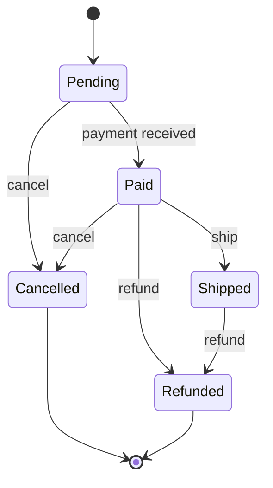

A boolean flag or two feels manageable. Then a feature request adds a third flag, and a fourth, and six months later a function has a dozen nested `if` statements checking combinations of `is_paid`, `is_shipped`, `is_cancelled`, and `is_refunded` — and nobody's fully sure which combinations are actually reachable versus which represent states the system should never be in but nothing prevents. A state machine is the fix: instead of scattering the rules for "what can happen next" across conditional logic, you make the set of valid states and valid transitions between them an explicit, checkable structure. This post covers when that trade is worth making and how to implement one cleanly.

## The Problem: Implicit State via Boolean Flags

A common way an order's status ends up modeled, organically, over time:

```python
class Order:
    def __init__(self):
        self.is_paid = False
        self.is_shipped = False
        self.is_cancelled = False
        self.is_refunded = False
```

This looks harmless with two flags. With four, it has 16 theoretically possible combinations — but only a handful of them represent states the business actually considers valid. Nothing stops `is_shipped=True, is_paid=False` (a shipped order that was never paid for) or `is_cancelled=True, is_refunded=True, is_shipped=True` (a cancelled-and-refunded order that somehow also shipped) from occurring, because each flag is set independently, and nothing enforces which combinations are legitimate.

The actual business rules — "an order can only be shipped if it's paid and not cancelled," "a refund can only happen after payment," "a cancelled order can never transition to shipped" — end up scattered across every function that touches these flags, each one re-implementing (and potentially getting slightly wrong) the same implicit rule set.

## The Fix: Explicit States and Transitions

A state machine makes the valid states, and the valid transitions between them, a first-class, single source of truth instead of an emergent property of scattered conditionals.



This diagram is a complete, unambiguous specification: from `Paid`, exactly three transitions are valid (`Shipped`, `Cancelled`, `Refunded`); from `Shipped`, only `Refunded` is valid — an order can't be "cancelled" after it's already shipped, because there's no arrow for that transition. Every question "can X happen from state Y" has one authoritative answer, visible in one place, instead of buried inside whatever function happens to check it.

## Implementing It in Python

```python
from enum import Enum, auto

class OrderState(Enum):
    PENDING = auto()
    PAID = auto()
    SHIPPED = auto()
    CANCELLED = auto()
    REFUNDED = auto()

TRANSITIONS = {
    OrderState.PENDING:   {"pay": OrderState.PAID, "cancel": OrderState.CANCELLED},
    OrderState.PAID:      {"ship": OrderState.SHIPPED, "cancel": OrderState.CANCELLED, "refund": OrderState.REFUNDED},
    OrderState.SHIPPED:   {"refund": OrderState.REFUNDED},
    OrderState.CANCELLED: {},
    OrderState.REFUNDED:  {},
}

class InvalidTransitionError(Exception):
    pass

class Order:
    def __init__(self):
        self.state = OrderState.PENDING

    def trigger(self, event):
        valid_transitions = TRANSITIONS[self.state]
        if event not in valid_transitions:
            raise InvalidTransitionError(
                f"cannot '{event}' from state {self.state.name}"
            )
        self.state = valid_transitions[event]
```

```python
order = Order()
order.trigger("pay")
order.state  # OrderState.PAID

order.trigger("ship")
order.state  # OrderState.SHIPPED

order.trigger("cancel")
# InvalidTransitionError: cannot 'cancel' from state SHIPPED
```

Notice what changed structurally: **the transition table is data, not scattered logic.** Adding a new rule means adding one entry to `TRANSITIONS`, in one place — not hunting down every function that might need to know about it. And an invalid transition raises immediately and explicitly, rather than silently producing an order in an inconsistent flag combination that some other code might mishandle later, far from where the actual mistake happened.

## Guard Conditions: When a Transition Needs Extra Logic

Real transitions often need more than "is this transition structurally valid" — they need a runtime check too. A refund, for instance, might only be valid if the order's paid amount is actually greater than zero.

```python
class Order:
    def __init__(self, amount_paid=0):
        self.state = OrderState.PENDING
        self.amount_paid = amount_paid

    def trigger(self, event, **context):
        valid_transitions = TRANSITIONS[self.state]
        if event not in valid_transitions:
            raise InvalidTransitionError(f"cannot '{event}' from {self.state.name}")

        if event == "refund" and self.amount_paid <= 0:
            raise InvalidTransitionError("cannot refund an order with no payment")

        self.state = valid_transitions[event]
```

The important distinction to preserve: **structural validity** (is this transition even defined for this state) and **guard conditions** (given the transition is structurally valid, does the current data also permit it) are two separate checks, and keeping them separate keeps the transition table itself simple and purely structural — readable at a glance — while the guard logic, which is genuinely business-specific and sometimes complex, stays isolated to the specific transitions that need it.

## Where State Machines Genuinely Pay Off

**Workflow and approval systems** — anything with a clear sequence of stages (draft → submitted → reviewed → approved/rejected) where the valid sequence matters and skipping a stage is a real bug, not a stylistic preference.

**Protocol implementations** — TCP's connection states (`LISTEN`, `SYN_SENT`, `ESTABLISHED`, `CLOSE_WAIT`, ...) are a textbook state machine, and implementing a protocol without making these states explicit is a reliable way to mishandle an edge-case sequence of events that the spec's own state diagram would have made obvious.

**UI flow with meaningfully different screens/behavior per stage** — a multi-step signup wizard, a checkout flow — where "can the user go back to step 2 from step 4" is a real, answerable question that benefits from being encoded explicitly rather than inferred from which fields happen to be filled in.

**Anywhere a bug report reads "the system got into a state that shouldn't be possible."** This specific phrase is close to a diagnostic signal that implicit state (boolean flags, ad-hoc status strings) has let an invalid combination occur — the fix is usually making the actual state space explicit and enumerable, so "shouldn't be possible" becomes "literally isn't representable," not just "isn't supposed to happen."

## Where It's Overkill

A toggle with two states and one trivial transition (`is_active: bool`) doesn't need a state machine — that's just a boolean, and wrapping it in a formal transition table adds ceremony without adding clarity. The signal that a state machine is actually earning its complexity is **more than two or three states, with transitions that aren't all mutually valid** — if literally every state can transition to every other state, the transition table degenerates into "nothing is actually restricted," and you probably don't need the structure at all, just a plain enum.

## Hierarchical and Parallel States

More complex systems sometimes need states that contain sub-states (a `Shipped` state that itself has sub-stages `InTransit` → `OutForDelivery` → `Delivered`) or multiple independent state machines running in parallel (an order's fulfillment status and its payment dispute status, evolving independently but both attached to the same order). Libraries like `python-statemachine`, XState (JavaScript), or Spring State Machine (Java) provide this as a first-order feature rather than something you'd want to hand-roll — worth reaching for once a hand-rolled transition table starts needing nested states or nested machines to stay accurate, rather than continuing to flatten an inherently hierarchical problem into one flat table.

## Conclusion

A state machine's real value isn't the diagram or the library — it's converting "which combinations of implicit flags are actually valid" from a fact that lives nowhere explicit (and gets re-derived, sometimes incorrectly, in every function that touches the data) into a single, explicit, checkable structure that raises immediately on an invalid transition instead of silently producing bad state. It's worth reaching for once a system has more than a couple of meaningfully distinct states with real restrictions on what can follow what — and worth skipping for anything simpler, where a plain boolean or enum says everything that needs saying without the extra structure.
