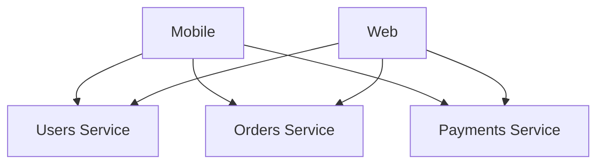
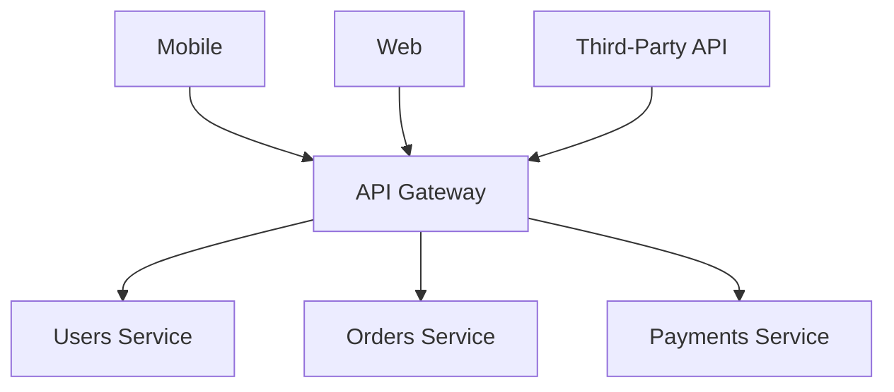
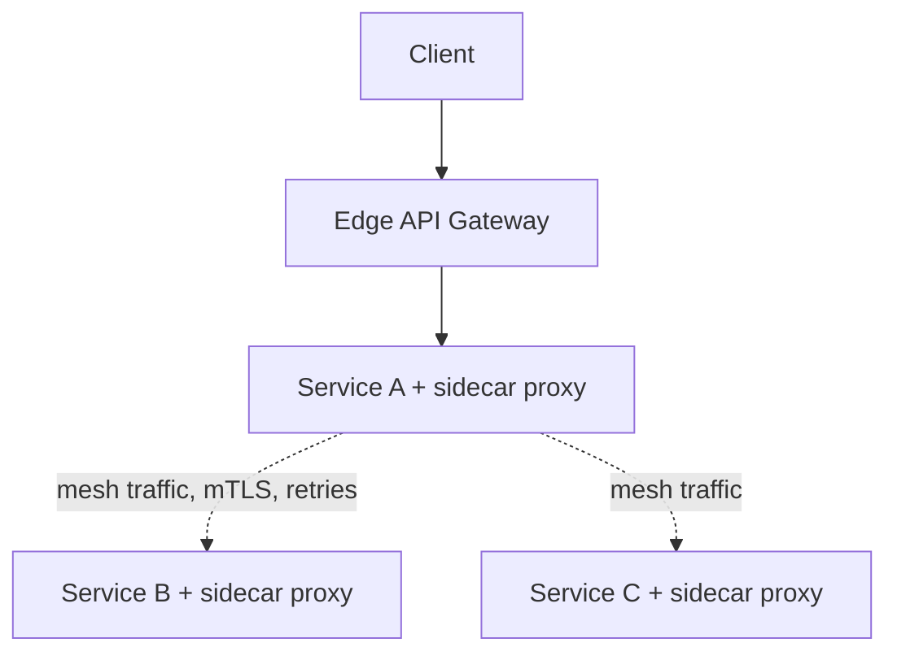

Once a system grows past a handful of services, every client (mobile app, web frontend, third-party integrator) faces the same problem: which of these twenty services do I call, how do I authenticate, and what happens when one of them is down? An API gateway exists to answer that once, in one place, instead of every client and every service reimplementing auth, rate limiting, and routing independently. This post covers what a gateway actually does, how to design one, and where centralizing this logic starts to hurt.

## What Problem the Gateway Actually Solves

Without a gateway, clients call services directly:



Every client now needs to know every service's address, implement auth against every service independently, and handle every service's individual failure modes. Add a new service, and every client needs to be updated to know about it.

With a gateway, clients see one endpoint:



The gateway becomes the single place that knows how to route, authenticate, rate-limit, and shield clients from individual service failures — cross-cutting concerns move out of every service and every client, into one layer.

## Core Responsibilities

### Routing

The most basic job: map an incoming request path to a backend service.

```yaml
routes:
  - path: /api/users/*
    service: users-service
    upstream: http://users-svc.internal:8080

  - path: /api/orders/*
    service: orders-service
    upstream: http://orders-svc.internal:8080

  - path: /api/payments/*
    service: payments-service
    upstream: http://payments-svc.internal:8080
```

This looks trivial until you need **path rewriting** (external `/api/v1/users/42` mapping to internal `/users/42`), **service discovery** (the upstream address isn't static — it changes as instances scale up and down, so the gateway needs to query a service registry like Consul or Kubernetes DNS rather than hardcoding IPs), and **versioning** (routing `/api/v2/orders` to a different backend deployment than `/api/v1/orders` during a migration).

### Authentication and Authorization

Rather than every backend service independently validating a JWT or session token, the gateway does it once, and forwards a verified identity downstream:

```javascript
async function authenticate(req) {
  const token = req.headers.authorization?.replace("Bearer ", "");
  if (!token) throw new UnauthorizedError();

  const claims = await verifyJWT(token, publicKey);
  req.headers["x-user-id"] = claims.sub;
  req.headers["x-user-roles"] = claims.roles.join(",");
  // strip the original Authorization header before forwarding —
  // downstream services trust x-user-id from the gateway, not raw tokens
  delete req.headers.authorization;
}
```

This centralizes a security-critical piece of logic in one well-tested place instead of N slightly-different reimplementations, but it also means the gateway becomes the system's single most security-critical component — a bug here is a bug everywhere behind it. It's also why the header swap matters: downstream services should trust `x-user-id` because it came from the gateway on a private network, never because a client claimed it directly.

### Rate Limiting

Protecting backend services from being overwhelmed — by a buggy client, a misbehaving integration, or an actual abuse attempt — belongs at the edge, before wasted work reaches any backend service.

```bash
$ curl -i https://api.example.com/orders
HTTP/1.1 429 Too Many Requests
Retry-After: 12
X-RateLimit-Limit: 100
X-RateLimit-Remaining: 0
X-RateLimit-Reset: 1735689600
```

A common implementation is the **token bucket** algorithm: each client gets a bucket that refills at a fixed rate, and each request consumes a token.

```python
class TokenBucket:
    def __init__(self, capacity, refill_rate_per_sec):
        self.capacity = capacity
        self.tokens = capacity
        self.refill_rate = refill_rate_per_sec
        self.last_refill = time.time()

    def allow_request(self):
        now = time.time()
        elapsed = now - self.last_refill
        self.tokens = min(self.capacity, self.tokens + elapsed * self.refill_rate)
        self.last_refill = now

        if self.tokens >= 1:
            self.tokens -= 1
            return True
        return False
```

Token bucket is popular because it allows short bursts (up to the bucket's capacity) while still enforcing a steady average rate — a client that's been idle can burst briefly, but can't sustain a rate above the refill rate indefinitely.

### Request/Response Transformation

Backend services often expose internal representations that shouldn't leak to external clients — the gateway is a natural place to reshape responses (renaming fields, hiding internal IDs, aggregating multiple backend calls into one client-facing response) without making every backend service aware of every client's needs.

### Circuit Breaking and Load Balancing

Since every request to a backend service flows through the gateway, it's also the natural place to implement per-service circuit breakers (failing fast when a backend is unhealthy, instead of every client independently discovering the outage) and load balancing across multiple instances of a service.

## Where to Put the Gateway: Edge vs Per-Service

Not every cross-cutting concern belongs at a single edge gateway. Some architectures split responsibilities between an **edge gateway** (client-facing, handles auth/rate limiting/routing) and a **service mesh** (sidecar proxies like Envoy, handling service-to-service traffic — retries, mTLS, internal load balancing) for internal calls between backend services.



The edge gateway handles client-facing concerns (auth, external rate limits, public API versioning); the mesh handles internal concerns (service-to-service retries, internal load balancing, mTLS between services). Conflating the two — routing every internal service-to-service call back through the edge gateway — adds unnecessary latency and turns the gateway into a bottleneck for traffic that never needed to leave the internal network in the first place.

## The Cost of Centralizing

A gateway is a genuine trade-off, not a free win:

- **Single point of failure.** If the gateway goes down, every client-facing request fails, even if every backend service is perfectly healthy. This makes gateway availability (redundant instances, no single-instance deploys) disproportionately important relative to any individual backend service.
- **Added latency.** Every request now makes an extra hop. This is usually small (single-digit milliseconds) but is not zero, and compounds if the gateway itself calls multiple backend services to assemble a response.
- **A deployment bottleneck.** If every route change requires a gateway config change and redeploy, and every team depends on the same gateway, it can become a shared resource that slows down independent teams — worth solving with self-service route configuration (each service owns its own route definition, applied via CI) rather than a single team gatekeeping every change.
- **Temptation to put business logic in it.** A gateway should stay a routing and cross-cutting-concerns layer. Once response-shaping logic starts encoding actual business rules (not just field renaming), it's become an undeclared service of its own — with none of the ownership clarity, testing, or independent deployability a real service would have.

## Conclusion

An API gateway earns its place by moving auth, rate limiting, and routing out of every client and every backend service into one well-tested layer — but that centralization is a real trade, not a free abstraction. It makes gateway availability and security disproportionately critical, adds a hop of latency to every request, and can become an organizational bottleneck if route ownership isn't kept decentralized. The design mistake to avoid isn't building a gateway — it's letting genuine business logic creep into it, turning what should be thin infrastructure into an unaccountable extra service sitting in front of every real one.
