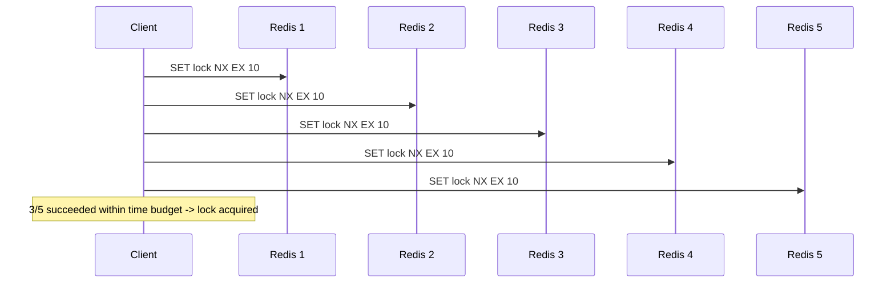
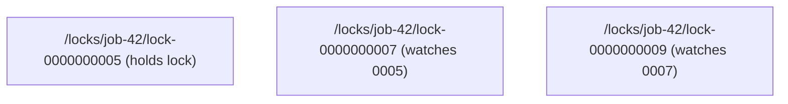

A regular mutex works because one process owns memory that every thread can see. Distributed systems don't have that luxury — two processes on two machines need to agree on who's allowed to touch a shared resource, and they can only talk to each other over an unreliable network. Distributed locking is how you get mutual exclusion anyway, and the mechanisms for doing it correctly are more subtle than they first appear. This post covers why naive approaches fail, how Redlock and ZooKeeper solve the problem differently, and when a distributed lock is (and isn't) the right tool.

## Why You'd Want One

Common cases where multiple processes need to coordinate around a shared resource:

- **Preventing duplicate work.** Two instances of a cron-triggered job shouldn't both process the same batch of records.
- **Protecting a critical section on shared state.** Multiple workers updating the same row, file, or external API resource need to serialize access.
- **Leader election.** Only one node in a cluster should perform a particular role (e.g., triggering a scheduled task) at a time.

The naive fix — "just use a database row as a lock" — sort of works, but doing it correctly (with expiry, ownership checks, and safe release) is exactly what distributed lock libraries formalize.

## The Naive Approach and Why It Breaks

A first attempt usually looks like this in Redis:

```bash
$ redis-cli SET lock:job-42 "worker-a" NX EX 30
OK
```

`NX` means "only set if not already set," and `EX 30` gives the lock a 30-second expiry so a crashed holder doesn't lock the resource forever. This is a real building block — but a few things can still go wrong:

- **The process pauses past the TTL.** A GC pause, a slow disk write, or a network partition can stall the lock holder longer than the lock's expiry. The lock is released automatically while the holder still thinks it's holding it, and a second process acquires it — now two processes believe they own the critical section.
- **Releasing someone else's lock.** If worker A's lock expires and worker B acquires it, a naive `DEL lock:job-42` from worker A (which thinks it still owns the lock) deletes worker B's lock, not its own.

The fix for the second problem is a lock **token** — a unique value per acquisition, checked before deletion:

```bash
$ redis-cli SET lock:job-42 "token-a1b2c3" NX EX 30
OK
```

Releasing safely requires an atomic compare-and-delete, which plain Redis commands can't express directly — you need Lua:

```lua
if redis.call("GET", KEYS[1]) == ARGV[1] then
    return redis.call("DEL", KEYS[1])
else
    return 0
end
```

This closes the "delete someone else's lock" hole, but the first problem — a process acting past its lock's expiry — is fundamental and no single-node lock can fully solve it. That's the gap Redlock and ZooKeeper address in different ways.

## Redlock: Majority Consensus Across Redis Instances

Redlock, proposed by Redis's creator, addresses single-instance-failure risk by acquiring the lock across **N independent Redis instances** (typically 5) and requiring a **majority** to succeed.



The algorithm:

1. Get the current time.
2. Try to acquire the lock on all N instances sequentially, using the same key and a unique token, with a short per-instance timeout.
3. The lock is considered acquired if a **majority** (N/2 + 1) of instances granted it, *and* the total time spent acquiring is less than the lock's validity window.
4. If acquisition fails or takes too long, release the lock on every instance (even ones where acquisition failed, in case of a partial success).

The majority requirement is what buys resilience: a single Redis instance going down doesn't invalidate the lock, since a majority of the other instances still hold it.

Redlock is not without controversy — Martin Kleppmann wrote a well-known critique arguing it doesn't actually guarantee mutual exclusion under certain failure modes (particularly around clock behavior and process pauses), and the Redis creator responded to the critique. The practical takeaway: Redlock reduces the risk of a single point of failure in the locking layer, but like the naive single-instance approach, it still can't protect against a lock holder that's simply too slow — GC pauses and network delays can still cause two clients to believe they hold the lock simultaneously. If a lock's true purpose is *correctness* (not just avoiding duplicate work as an optimization), you need a **fencing token** — a strictly increasing number issued with the lock, which downstream resources check and reject if they see a lower number than one they've already seen.

## ZooKeeper: Ephemeral Sequential Nodes

ZooKeeper takes a structurally different approach, using its hierarchical znode model instead of TTL-based expiry.

The pattern:

1. Each client creates an **ephemeral sequential** znode under a lock path: `/locks/job-42/lock-`. ZooKeeper appends a monotonically increasing suffix, e.g. `/locks/job-42/lock-0000000001`.
2. The client lists all children of `/locks/job-42/` and checks whether its own node has the lowest sequence number. If so, it holds the lock.
3. If not, the client watches the znode with the next-lowest sequence number (not all other nodes — this avoids a "thundering herd" where every waiting client wakes up on every release).
4. When a node is deleted (lock released, or client disconnects), the client watching it is notified and re-checks whether it now holds the lowest sequence number.

```bash
$ zkCli.sh create -s -e /locks/job-42/lock- ""
Created /locks/job-42/lock-0000000007
```

The `-e` (ephemeral) flag is the key mechanism: **the znode is automatically deleted when the client's session ends**, whether that's a clean disconnect or the client crashing and its session timing out. This solves the "holder crashed and never released" problem structurally, rather than via a TTL guess — ZooKeeper's own heartbeat and session mechanism handles it.



## Redlock vs ZooKeeper

| | Redlock | ZooKeeper |
|---|---|---|
| Failure detection | TTL expiry (time-based guess) | Session/heartbeat (structural) |
| Ordering / fairness | None — acquisition is a race | Fair — strict FIFO via sequence numbers |
| Operational cost | Run 5 independent Redis instances | Run a ZooKeeper ensemble (3-5 nodes) |
| Best fit | Simple mutual exclusion, best-effort duplicate-work prevention | Leader election, systems needing strong ordering guarantees |
| Consistency model | Best-effort majority; disputed guarantees under GC pauses | Strong consistency via Zab consensus protocol |

The practical rule of thumb: if a duplicate execution is merely wasteful (running the same cache-warming job twice) rather than harmful, a Redis-based lock is simpler to operate and good enough. If duplicate execution causes real damage (double-charging a payment, corrupting shared state), you want either ZooKeeper-style structural guarantees or a fencing-token scheme that makes the *protected resource itself* reject stale lock holders — because no distributed lock, on its own, can guarantee a paused process won't wake up and act after its lock has technically expired.

## Conclusion

Distributed locking looks like "just use SETNX" until you account for crashed holders, network partitions, and processes that pause longer than their lock's TTL. Redlock trades single-point-of-failure risk for majority consensus across Redis instances, while ZooKeeper trades operational simplicity for structural correctness via sessions and strict ordering. Neither fully eliminates the fundamental risk of a slow process acting after its lock expired — for anything where correctness (not just efficiency) is on the line, pair whichever lock you choose with a fencing token the protected resource actually checks.
