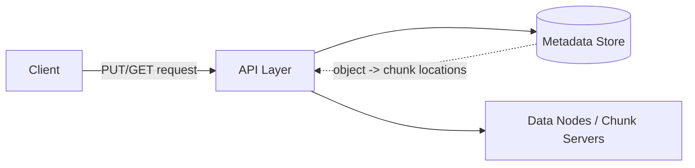

S3 looks simple from the outside — you `PUT` an object, you `GET` it back by key — but that simplicity hides a system that reliably stores exabytes of data across thousands of machines while surviving disk failures, rack failures, and entire data center outages. This post walks through how you'd design an object storage service from first principles: separating metadata from data, chunking large files, replicating for durability, and picking a consistency model that doesn't fall apart under concurrent writes.

## What Makes This Different From a Filesystem

A traditional filesystem gives you a hierarchical namespace (directories, nested paths, `mv`, `rm -r`) and expects you to mount it on one machine. Object storage deliberately gives up that model in exchange for scale:

- **Flat namespace.** A "key" like `photos/2024/vacation.jpg` looks like a path but isn't — there's no real directory structure underneath, just a string key. This makes it trivial to shard by key without worrying about directory-tree invariants.
- **Immutable objects.** You don't edit part of an object in place — you overwrite the whole thing. This sidesteps a huge class of concurrency problems that POSIX filesystems have to solve (partial writes, byte-range locking).
- **Eventual (or read-after-write) consistency**, not the strict consistency a local filesystem gives you for free.

Giving up POSIX semantics is precisely what lets object storage scale horizontally to a degree a mounted filesystem never could.

## Core Requirements

**Functional:**

- `PUT`, `GET`, `DELETE` on objects identified by a bucket + key.
- Support objects ranging from a few bytes to terabytes.
- List objects by key prefix (`photos/2024/`).

**Non-functional:**

- Extreme durability — S3's published target is 11 nines (99.999999999%) — losing customer data is essentially never acceptable.
- High availability — reads and writes should succeed even during partial infrastructure failure.
- Horizontal scalability in both storage capacity and request throughput.

## Separating Metadata from Data

The foundational design decision is splitting the system into two subsystems with very different characteristics:



**The metadata store** tracks, for every object key: which bucket it belongs to, its size, content type, checksum, and — critically — *where its data chunks physically live*. This is a small, latency-sensitive, highly-indexed dataset, well suited to a strongly consistent database (a distributed key-value store or a sharded relational database keyed by bucket+key).

**The data layer** stores the actual bytes, split into fixed-size chunks (S3 uses roughly this pattern internally, and other implementations like Ceph and HDFS make it explicit) and spread across many physical disks and machines. This layer optimizes for raw throughput and capacity, not low-latency lookups — lookups are the metadata store's job.

Separating these lets each scale independently: metadata scales by adding shards to the index; raw storage scales by adding disks, with no coordination between the two beyond the pointers the metadata store holds.

## Chunking Large Objects

A naive design stores each object as one file on one machine. That breaks down fast: a 50GB object can't fit conveniently on a single disk's available space, uploads can't be parallelized, and a single machine failure loses the whole object.

Instead, objects are split into chunks (typically tens of megabytes each) before being written:

```
object: videos/conference-2024.mp4  (2.3 GB)
  chunk-0 (64MB) -> stored on nodes [A, D, F]
  chunk-1 (64MB) -> stored on nodes [B, E, G]
  chunk-2 (64MB) -> stored on nodes [C, D, H]
  ...
```

This buys three things at once: uploads and downloads of a single large object can be parallelized across multiple chunk transfers, a single node failure only affects the chunks it held (which are replicated elsewhere, covered next), and chunk placement can be spread across failure domains — different racks, different availability zones — so a rack-level outage doesn't touch all copies of any one chunk.

## Replication and Durability

Each chunk is written to **multiple nodes**, not one, and those nodes are deliberately chosen from different failure domains.

```bash
$ storage-cli describe-chunk chunk-a1b2c3
Chunk: chunk-a1b2c3
Replicas:
  node-17   (rack-3, az-us-east-1a)
  node-92   (rack-11, az-us-east-1b)
  node-204  (rack-19, az-us-east-1c)
Status: healthy (3/3 replicas confirmed)
```

Two dominant strategies for how many copies to keep and how:

**Simple replication (3x)** — keep three full copies of every chunk. Simple to reason about and to recover from (any single surviving copy is a complete, immediately usable chunk), but costs 3x the raw storage.

**Erasure coding** — split each chunk into *k* data fragments plus *m* parity fragments (e.g., 6 data + 3 parity), such that any *k* of the *k+m* fragments can reconstruct the original. This gets similar durability to 3x replication at roughly 1.5x storage overhead instead of 3x, at the cost of more CPU work to reconstruct data when a fragment is missing. Large-scale systems (S3 among them, per public engineering write-ups) typically use erasure coding for infrequently-accessed data specifically because the storage savings compound at exabyte scale, while keeping simple replication (or a lower-latency scheme) for hot data where reconstruction CPU cost would hurt read latency.

A background process continuously scans for under-replicated chunks (a disk died, a node was decommissioned) and re-replicates them onto healthy nodes — durability isn't a one-time write-time guarantee, it's an ongoing repair process.

## Consistency Model

The question that matters most for API design: if you `PUT` an object and immediately `GET` it, do you see the new version?

Object storage systems historically differed here. S3 originally offered only **eventual consistency** for overwrite `PUT`s (a `GET` right after a `PUT` could return stale data or a 404, briefly) — a deliberate trade against strict consistency, because coordinating strict consistency across globally-distributed replicas adds latency to every single request, not just concurrent ones. S3 later moved to strong read-after-write consistency for all operations, which shows the trade-off can be narrowed with enough engineering investment, but it's not free — it requires the metadata layer to be the single source of truth that every read consults, rather than allowing reads to be served from a replica that might not have caught up yet.

The general design lesson: pick the weakest consistency model your API contract can tolerate, because every notch stronger costs coordination latency on the request path. A photo-sharing app can tolerate a few hundred milliseconds of read-after-write staleness; a system using object storage as a transaction log cannot.

## Handling the Upload Path

Large uploads need to survive a dropped connection partway through without restarting from byte zero. The standard mechanism is a **multipart upload**:

```bash
$ aws s3api create-multipart-upload --bucket my-bucket --key big-file.zip
{
    "UploadId": "2~AbCdEf123456"
}

$ aws s3api upload-part --bucket my-bucket --key big-file.zip \
    --part-number 1 --upload-id 2~AbCdEf123456 --body part1.bin

$ aws s3api upload-part --bucket my-bucket --key big-file.zip \
    --part-number 2 --upload-id 2~AbCdEf123456 --body part2.bin

$ aws s3api complete-multipart-upload --bucket my-bucket --key big-file.zip \
    --upload-id 2~AbCdEf123456 --multipart-upload file://parts.json
```

Each part is uploaded (and can be retried) independently; the object only becomes visible to readers once `complete-multipart-upload` assembles the parts and commits the object's metadata atomically. This also parallelizes upload throughput across multiple TCP connections, which matters a lot on high-latency links.

## Conclusion

Object storage earns its scale by giving up the guarantees a mounted filesystem gives you for free — hierarchical directories, in-place edits, and (originally, for S3) strict consistency — in exchange for a flat, immutable, horizontally-shardable model. The core moves are separating a small strongly-consistent metadata index from a massive throughput-oriented data layer, chunking large objects for parallelism and fault isolation, replicating (or erasure-coding) chunks across failure domains, and choosing the weakest consistency model the API contract can actually tolerate. Every one of these decisions trades some property — cost, latency, or simplicity — for durability and scale, and understanding which trade you're making is the actual system design skill here.
