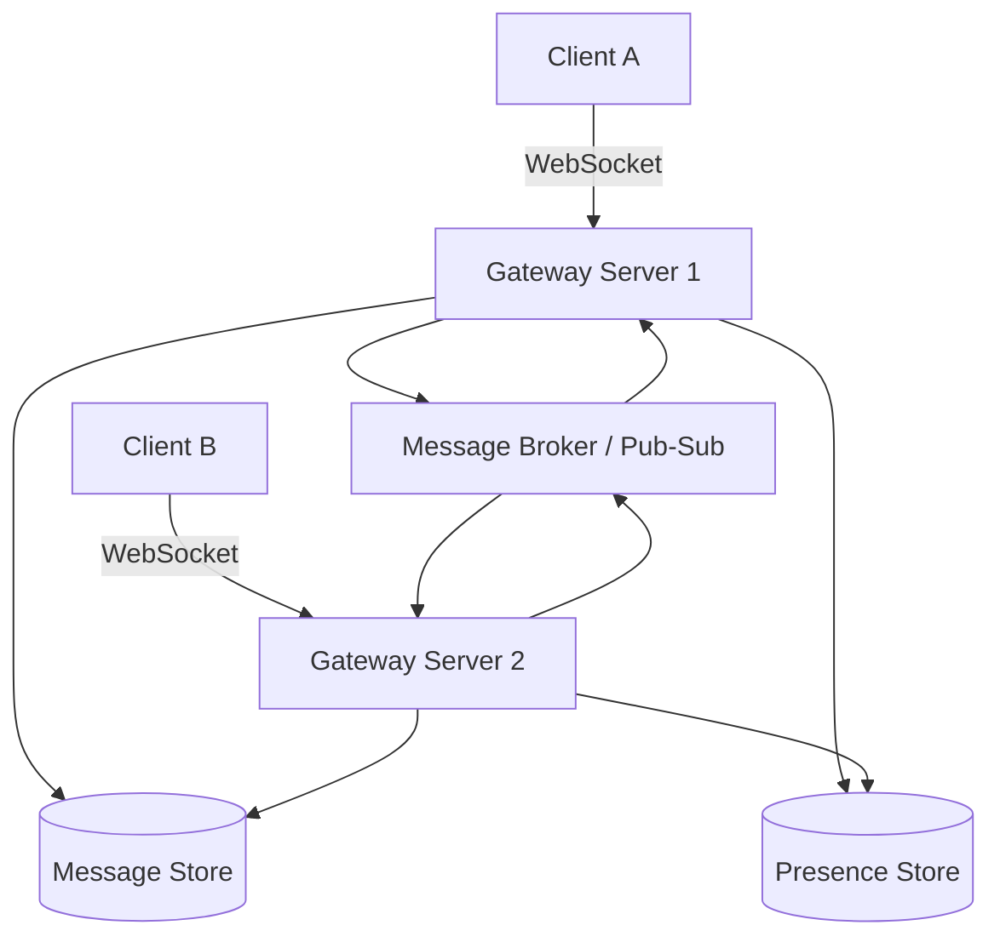
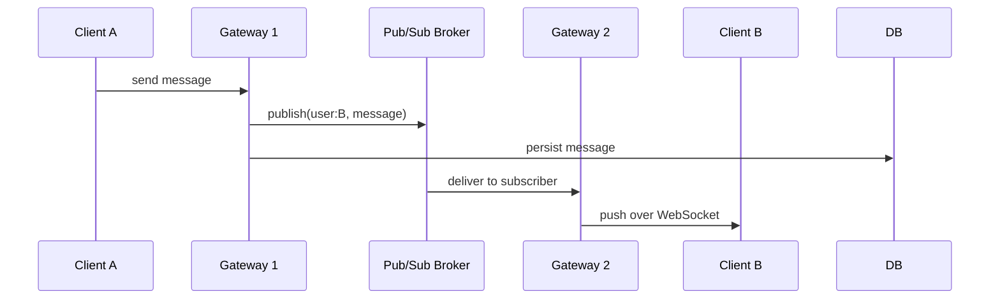

Chat applications look deceptively simple — send a message, show it to the other person — but building one that works reliably at scale touches almost every hard problem in distributed systems: persistent connections, fan-out, ordering, delivery guarantees, and presence. This post walks through designing a real-time chat system the way you'd approach it in an interview or an actual architecture doc, starting from requirements and building up to the pieces that make it scale.

## Core Requirements

Before drawing boxes, pin down what the system actually needs to do.

**Functional requirements:**

- Users can send and receive messages in one-on-one and group conversations.
- Messages are delivered in real time when the recipient is online.
- Messages are stored and retrievable as history when a user comes back online or scrolls up.
- Users can see who's online (presence) and typing indicators.
- Delivery status: sent, delivered, read.

**Non-functional requirements:**

- Low latency — sub-second delivery for online users.
- Durability — a message must never be lost once the server acknowledges it.
- Horizontal scalability — millions of concurrent connections, not just millions of users.
- At-least-once delivery, with the client able to de-duplicate.

That last point matters more than it sounds. Chat systems almost universally choose **at-least-once** over exactly-once, because exactly-once delivery across a network is expensive to guarantee and mostly unnecessary — a client-side message ID makes duplicates cheap to filter.

## High-Level Architecture



Four pieces do the actual work:

1. **Gateway servers** hold the persistent WebSocket connections. They're stateless in terms of business logic but stateful in terms of *which client is connected where* — that mapping is the crux of the scaling problem.
2. **A message broker (pub/sub layer)** — Redis Pub/Sub, Kafka, or NATS — routes a message from the gateway that received it to the gateway holding the recipient's connection, since they're very likely different servers.
3. **A message store** — a database optimized for high write throughput and range queries by conversation (Cassandra, DynamoDB, or a sharded Postgres are all common choices).
4. **A presence store** — typically Redis, tracking who's online and on which gateway, with short TTLs so a crashed gateway doesn't leave stale "online" state behind.

## Why WebSockets (and Not Just Polling)

A chat app *could* be built on HTTP polling — the client asks "any new messages?" every few seconds. It's simple and stateless, but it wastes bandwidth and adds latency proportional to the poll interval.

| Approach | Latency | Server connection cost | Complexity |
|---|---|---|---|
| Short polling | Poll interval (seconds) | Low (no persistent connections) | Low |
| Long polling | Near real-time | Medium (connection held open per request) | Medium |
| WebSockets | Real-time (ms) | High (one persistent connection per client) | Medium-high |
| Server-Sent Events | Real-time, server → client only | High | Low-medium |

WebSockets win for chat because messages are bidirectional and frequent enough that the overhead of a persistent connection pays for itself. The trade-off is operational: a gateway server holding 50,000 open WebSocket connections needs careful tuning of file descriptor limits, memory per connection, and load balancer support for long-lived TCP connections (most load balancers need explicit configuration to not treat an idle WebSocket as a dead connection).

```javascript
const server = new WebSocket.Server({ port: 8080 });

server.on("connection", (socket, req) => {
  const userId = authenticate(req);
  connections.set(userId, socket);
  presenceStore.setOnline(userId, gatewayId);

  socket.on("message", async (raw) => {
    const msg = JSON.parse(raw);
    await messageStore.append(msg.conversationId, msg);
    await broker.publish(`user:${msg.recipientId}`, msg);
  });

  socket.on("close", () => {
    connections.delete(userId);
    presenceStore.setOffline(userId, gatewayId);
  });
});
```

## The Fan-Out Problem

The hard part isn't accepting a message — it's getting it to the right recipient when that recipient's WebSocket connection lives on a *different physical server* than the one that received the message. This is where the pub/sub layer earns its place.

Two common strategies:

**Fan-out on write.** When a message is sent, the sending gateway looks up which gateway (if any) holds the recipient's connection and publishes directly to that gateway's channel. This keeps per-message work proportional to the number of *online* recipients — cheap for 1:1 chat, but expensive for a group with thousands of active members, since you're publishing to every one of them individually.

**Fan-out on read.** The message is written once to storage; each recipient's client pulls new messages when it reconnects or via a lightweight "new message" notification. This is cheaper for very large groups (think broadcast channels) at the cost of not being truly instantaneous for every member.

Most production systems use a hybrid: fan-out on write for small groups and 1:1 chats (the common case), fan-out on read for large channels or broadcast-style groups.



## Presence and Typing Indicators

Presence looks trivial — "is the user online?" — but it's a distributed state problem in disguise. A user can have multiple devices connected to different gateways simultaneously, and gateways crash without a clean disconnect.

The standard approach: each gateway periodically refreshes a TTL-based key in Redis (`presence:user123:gatewayA`, expiring in ~30 seconds) for every connection it holds. A user is "online" if *any* such key exists for them. If a gateway crashes, the keys simply expire — no explicit cleanup required, which matters because you can't rely on a crashed process to run its own disconnect handler.

```bash
$ redis-cli SET presence:user123:gw-4 "connected" EX 30
OK
$ redis-cli TTL presence:user123:gw-4
(integer) 27
```

Typing indicators use the same pub/sub channel as messages but are deliberately **not** persisted — they're ephemeral UI state, and losing one on a server restart is a non-event.

## Message Ordering and Delivery Guarantees

Two failure modes to design against explicitly:

**Out-of-order delivery.** If a client reconnects mid-conversation, or a message is retried after a timeout, messages can arrive out of send order. The fix is a **monotonically increasing sequence number per conversation** (not a wall-clock timestamp — clocks drift and aren't strictly ordered across servers), assigned at write time and used by the client to sort messages before rendering.

**Duplicate delivery.** At-least-once delivery means a network retry can cause the same message to be delivered twice. The client generates a UUID for each message *before* sending it; the server stores it as part of the message record, and both the server and client de-duplicate on that ID rather than trusting the transport layer to deliver exactly once.

```python
message = {
    "client_msg_id": str(uuid4()),  # generated once, survives retries
    "conversation_id": conv_id,
    "sender_id": user_id,
    "body": text,
    "sent_at": time.time(),
}
```

Read receipts and delivery status ("sent" → "delivered" → "read") are just additional state transitions on the same message record, published over the same channel the message itself used — no separate system needed.

## Scaling the Message Store

Chat write patterns are unusual: extremely high write volume, narrow read patterns (almost always "give me the last N messages in this conversation"), and messages are effectively immutable once written. That points toward a wide-column or log-structured store over a traditional relational one.

A common schema shape, partitioned by conversation:

```
Partition key:  conversation_id
Clustering key: sequence_number (descending)
Columns:        sender_id, body, sent_at, client_msg_id
```

This makes "fetch the last 50 messages in this conversation" a single-partition range scan — the cheapest possible query shape — instead of a table scan with a filter. It also means conversations with extremely high message volume (a busy group chat) become **hot partitions**, which is the usual scaling limit for this design and typically addressed by time-bucketing the partition key (e.g., `conversation_id + year_month`) once a single conversation's history grows large enough to matter.

## Conclusion

A real-time chat system is really three systems wearing one UI: a connection-management layer (WebSocket gateways plus a pub/sub broker for cross-server fan-out), a durability layer (an append-optimized message store partitioned by conversation), and a presence layer (short-TTL keys that decay safely on crash). None of the individual pieces are exotic — the design work is in choosing at-least-once delivery with client-side de-duplication instead of chasing exactly-once, and in picking a fan-out strategy that matches your actual group-size distribution rather than optimizing for the average case.
