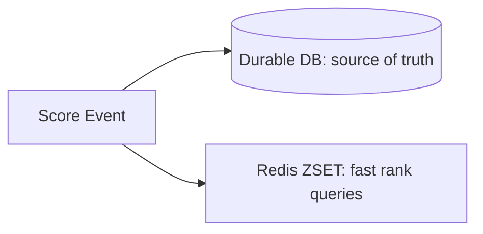

A leaderboard sounds like a simple "sort scores, show top 10" problem until you need it to update in real time for millions of players, answer "what's my rank right now" in milliseconds, and handle ties fairly. Doing this with a traditional relational database means `ORDER BY score DESC` queries that get slower as the table grows, plus a separate query just to compute one player's rank. Redis's sorted set (`ZSET`) data structure was essentially built for this exact problem, and understanding why makes the rest of the design fall into place.

## Why a Relational Database Struggles Here

The obvious first approach: a `scores` table, `SELECT * FROM scores ORDER BY score DESC LIMIT 10`.

This works fine for the top-10 view. It falls apart on the query every leaderboard actually needs constantly: **"what's this specific player's rank?"** In SQL, that's a full sort plus a count of how many rows outrank them:

```sql
SELECT COUNT(*) + 1 AS rank
FROM scores
WHERE score > (SELECT score FROM scores WHERE user_id = 'user_42');
```

This is an O(n) scan in the worst case, and it gets slower as the table grows — exactly the wrong direction for a feature that's supposed to feel instantaneous. Running this per-request, for potentially every player checking their rank simultaneously, doesn't scale.

## Redis Sorted Sets: The Right Data Structure

A Redis `ZSET` is a set of members, each associated with a floating-point **score**, kept internally in sorted order via a skip list. Every core leaderboard operation maps directly onto a native `ZSET` command, in logarithmic time:

```bash
$ redis-cli ZADD leaderboard 15400 user_42
(integer) 1
$ redis-cli ZADD leaderboard 22100 user_7
(integer) 1
$ redis-cli ZADD leaderboard 18900 user_103
(integer) 1
```

**Top N players:**

```bash
$ redis-cli ZREVRANGE leaderboard 0 9 WITHSCORES
1) "user_7"
2) "22100"
3) "user_103"
4) "18900"
5) "user_42"
6) "15400"
```

**A specific player's rank** — the operation that was expensive in SQL is O(log n) here, because the skip list already knows the sorted position of every member:

```bash
$ redis-cli ZREVRANK leaderboard user_42
(integer) 2
```

**A player's score directly:**

```bash
$ redis-cli ZSCORE leaderboard user_42
"15400"
```

**Incrementing a score** (the operation that runs on every point scored, so it needs to be cheap and atomic):

```bash
$ redis-cli ZINCRBY leaderboard 500 user_42
"15900"
```

`ZINCRBY` is atomic — no read-modify-write race condition even under heavy concurrent updates, which matters a lot for a leaderboard where thousands of players might be scoring points in the same second.

## Handling Ties

Two players with the same score need a deterministic, fair tiebreak — usually "whoever reached that score first ranks higher," which rewards being ahead of the pack rather than arbitrarily depending on insertion order or hash iteration.

The standard trick: encode the tiebreak directly into the score itself, using a composite value that sorts correctly as a single number.

```python
import time

def composite_score(raw_score: int, achieved_at: float) -> float:
    # raw_score dominates sort order; timestamp breaks ties,
    # earlier timestamp -> higher tiebreak rank
    max_timestamp = 9_999_999_999
    tiebreak = max_timestamp - int(achieved_at)
    return raw_score + (tiebreak / 10_000_000_000)
```

```bash
$ redis-cli ZADD leaderboard 15900.0000031487 user_42
```

The integer part is the real score (dominates sorting); the fractional part encodes a normalized, inverted timestamp so that among equal integer scores, the earlier achiever sorts first. This keeps the tiebreak entirely inside Redis's native score comparison — no application-level tie resolution logic needed on every read.

## Pagination Around a Player's Own Rank

A very common UI pattern — "show me the 5 players above and below me" — is a range query anchored on the player's own rank rather than absolute position 0:

```bash
$ redis-cli ZREVRANK leaderboard user_42
(integer) 847

$ redis-cli ZREVRANGE leaderboard 842 852 WITHSCORES
```

Fetch the rank first, then request a window around it — two round trips, both O(log n) or better, versus a SQL approach that would need the same expensive rank-counting subquery just to figure out where to start the page.

## Scaling Beyond a Single Redis Instance

A single `ZSET` handles millions of members comfortably in memory, but two scaling pressures show up in real systems:

**Multiple leaderboards.** Global leaderboard, weekly leaderboard, per-region leaderboard, per-friend-group leaderboard — each is just a separate `ZSET` key (`leaderboard:global`, `leaderboard:weekly:2026-W35`, `leaderboard:region:eu`), and Redis handles many independent sorted sets without any special coordination between them. Time-windowed leaderboards (weekly, monthly) get a natural reset for free — just start writing to a new key when the window rolls over, and let old keys expire.

```bash
$ redis-cli EXPIRE leaderboard:weekly:2026-W35 604800
(integer) 1
```

**Sheer member count.** When a single leaderboard genuinely needs to hold hundreds of millions of members — beyond comfortable single-instance memory — the standard approach is sharding by a stable dimension (region, game mode) into multiple `ZSET`s, with a lightweight aggregation layer for any cross-shard "global top 100" view. This trades a small amount of query complexity for horizontal scalability, and it's usually only necessary at a scale most leaderboards never reach — a single well-provisioned Redis instance holds tens of millions of scored members without issue.

## Durability: Redis Is Not Your System of Record

Redis is exceptionally good at the read/write pattern a leaderboard needs, but it's an in-memory store first — even with persistence enabled (RDB snapshots or AOF), it's not the tool of choice as the sole source of truth for data you can't afford to lose.

The standard pattern: the authoritative score lives in a durable database (Postgres, DynamoDB) written on every score-changing event, and the Redis `ZSET` is a derived, rebuildable **read-optimized cache** of that same data, updated in lockstep.



If the Redis instance is lost entirely, it's rebuildable from the durable store — a real but bounded recovery cost, versus permanent data loss if Redis were the only copy. This is the general pattern for using Redis anywhere performance matters more than durability: treat it as a fast projection of data that lives durably somewhere else, not as the only copy.

## Conclusion

A real-time leaderboard is close to a textbook case for Redis's sorted set: rank lookups, top-N queries, and score updates are all native `ZSET` operations running in logarithmic time, which is exactly what a naive SQL `ORDER BY` approach can't offer as the table grows. The details that make it production-ready are encoding tiebreaks into the score itself so ties resolve without extra application logic, splitting leaderboards by key for different time windows and scopes, and treating the `ZSET` as a fast, rebuildable derived view rather than the system's only copy of the data.
