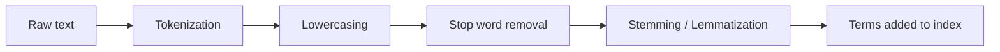
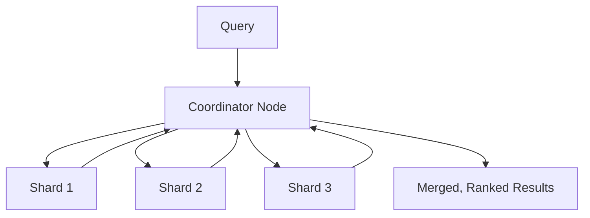

Searching a million documents for every word match by scanning each one, every time, would make search unusably slow — yet Google returns results across billions of pages in under a second. The trick isn't a faster scan, it's not scanning at all: search engines pre-build a data structure that maps every word directly to the documents containing it, so a query becomes a lookup instead of a scan. This post covers how that structure — the inverted index — works, how text gets processed before indexing, how results get ranked, and how the whole thing scales past a single machine.

## The Core Data Structure: Inverted Index

A **forward index** maps documents to the words they contain — the natural way you'd store documents. An **inverted index** flips that: it maps each word to the list of documents containing it.

```
Forward index:
  doc1 -> ["the", "quick", "brown", "fox"]
  doc2 -> ["the", "lazy", "dog", "sleeps"]

Inverted index:
  "the"   -> [doc1, doc2]
  "quick" -> [doc1]
  "brown" -> [doc1]
  "fox"   -> [doc1]
  "lazy"  -> [doc2]
  "dog"   -> [doc2]
  "sleeps"-> [doc2]
```

A search for "fox" is now a single hash-map lookup returning `[doc1]`, rather than scanning every document's word list. A search for "the fox" intersects the posting lists for "the" and "fox" — a set intersection, which is fast even when both lists are long.

```python
inverted_index = {
    "fox": {1, 47, 892},
    "quick": {1, 203},
    "brown": {1, 47},
}

def search_and(*terms):
    result_sets = [inverted_index.get(t, set()) for t in terms]
    return set.intersection(*result_sets) if result_sets else set()

search_and("fox", "quick")  # {1}
```

Each entry in a posting list usually carries more than just a document ID — typically the **term frequency** (how many times the word appears in that document) and the **positions** where it appears, which is what enables phrase queries ("brown fox" as an exact phrase, not just both words appearing anywhere) and relevance ranking.

## Building the Index: The Text Processing Pipeline

Raw text isn't indexed as-is — it goes through a pipeline that normalizes it into searchable terms:



**Tokenization** splits text into individual words/tokens — trickier than `.split(" ")` once you account for punctuation, hyphenation, and languages without whitespace between words (Chinese, Japanese) that need entirely different tokenization strategies.

**Lowercasing** so "Fox" and "fox" match the same index entry — a deliberate choice to trade case information for higher recall, since almost no search use case actually wants case-sensitive matching.

**Stop word removal** drops extremely common words ("the", "a", "is") that appear in nearly every document and therefore add index size without adding discriminating power for ranking — though this is a trade-off, since stop word removal breaks exact-phrase search for phrases like "to be or not to be" unless handled carefully.

**Stemming/lemmatization** reduces words to a common root — "running", "runs", "ran" all map to "run" — so a search for "run" also matches documents containing "running". Stemming (rule-based suffix stripping) is fast but crude; lemmatization (dictionary/grammar-aware) is more accurate but more expensive to compute at index time.

```python
def analyze(text):
    tokens = tokenize(text.lower())
    tokens = [t for t in tokens if t not in STOP_WORDS]
    tokens = [stem(t) for t in tokens]
    return tokens

analyze("The Quick Foxes Are Running")
# ["quick", "fox", "run"]
```

The same pipeline runs on the query at search time — a search for "running foxes" gets analyzed into `["run", "fox"]` too, which is what makes it match a document indexed from "The quick fox ran."

## Ranking: TF-IDF and BM25

Finding documents that contain the query terms is only half the problem — a search engine also needs to rank matching documents by relevance, since "contains the word" isn't the same as "is a good result."

**TF-IDF (Term Frequency–Inverse Document Frequency)** is the classic ranking formula. It scores a term's importance to a document as high when the term appears frequently *in that document* but rarely *across the whole corpus* — a word that appears in every document (like "the") is a poor signal even if it appears many times in one document, while a rare word appearing repeatedly in one document is a strong signal.

```
tf(t, d)  = (occurrences of t in d) / (total terms in d)
idf(t)    = log(total documents / documents containing t)
tf-idf    = tf(t, d) * idf(t)
```

**BM25** is the modern refinement most production search engines (Elasticsearch, Lucene-based systems) actually use by default. It improves on raw TF-IDF with two adjustments: term frequency's contribution to the score **saturates** (a word appearing 50 times isn't 50x more relevant than appearing once — the marginal value of each additional occurrence diminishes), and it normalizes for **document length** (a long document naturally contains more word occurrences by chance, and shouldn't be rewarded just for being long).

```
BM25(d, q) = Σ IDF(t) * (f(t,d) * (k1 + 1)) / (f(t,d) + k1 * (1 - b + b * |d|/avgdl))
```

`k1` controls how quickly term frequency saturates; `b` controls how strongly document length is normalized. You don't need to derive this from scratch to use it — Elasticsearch and Solr use BM25 as their default scoring function — but understanding what it's correcting for (raw TF-IDF's length bias and unbounded frequency weighting) explains why it consistently outperforms naive TF-IDF in practice.

## Building and Updating the Index

Indexes are typically built as **immutable segments** — a batch of documents is written into one segment file, and that segment is never modified in place. New documents go into new segments; deletions are handled with a tombstone marker rather than rewriting the segment.

```
Segment 1 (10,000 docs, immutable)
Segment 2 (5,000 docs, immutable)
Segment 3 (200 docs, immutable, most recent)
```

A background **merge process** periodically combines smaller segments into larger ones, reclaiming space from deleted/tombstoned documents and keeping the number of segments a query has to check from growing unbounded. This immutable-segment design (the same core idea behind LSM trees) is what lets search engines support high write throughput without locking readers out — queries run against a stable, unchanging set of segments while writes accumulate in new ones.

A query fans out across every segment, gets partial results from each, and merges them — which is also exactly the shape that generalizes to distributed search, covered next.

## Scaling: Sharding and Distributed Search

A single machine's index eventually outgrows available memory and disk I/O capacity. The standard fix is **sharding**: split the document set across multiple nodes, each holding a complete inverted index for its subset of documents.



A query gets sent to every shard in parallel (**scatter**), each shard returns its own top-scoring matches, and a coordinator node merges those partial result sets into one final ranked list (**gather**). This is the same scatter-gather pattern used broadly in distributed systems, and it's what lets a search engine's query latency stay roughly flat even as the total document count grows — each shard is only searching its own fraction of the corpus.

The main subtlety: relevance scores like BM25 depend on corpus-wide statistics (document frequency, average document length), which differ slightly per shard if documents aren't distributed perfectly evenly. In practice this small skew is usually an acceptable trade for the throughput gain, though it's worth knowing that "top 10 results" from a sharded index is an approximation of what a single-index search would return, not a mathematically identical result.

## Conclusion

A search engine's core trick is doing the expensive work — parsing, normalizing, and indexing text — once at write time, so that read time is a fast lookup and intersection over pre-built posting lists instead of a scan. The text processing pipeline (tokenization, stop words, stemming) determines what actually counts as a "match"; BM25 determines which matches are ranked as most relevant, correcting for term-frequency saturation and document length in ways raw TF-IDF doesn't; and immutable segments plus sharding are what let both indexing and querying scale horizontally without locking readers out of writers' way.
