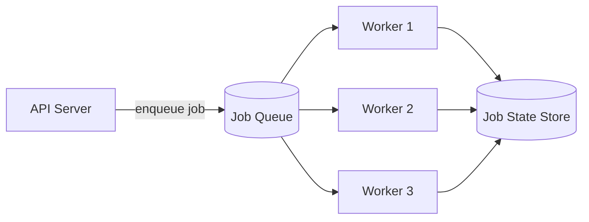

Sending a confirmation email, resizing an uploaded image, generating a PDF report — none of these need to block the HTTP request that triggered them, and forcing a user to wait on them makes the request slower for no benefit to the user. A task queue exists to move this kind of work out of the request path: the API handler enqueues a job and returns immediately, while a separate pool of workers picks jobs up and executes them asynchronously. This post covers how to design one — queueing, worker execution, retries, and scheduled jobs — and the failure modes that show up once it's handling real production load.

## The Core Shape



Three pieces: **producers** (application code that enqueues jobs), a **queue** (durable storage holding pending jobs — Redis, RabbitMQ, SQS, or a database table), and **workers** (processes that pull jobs off the queue and execute them). Producers and workers are decoupled entirely by the queue — a producer never talks to a worker directly, and doesn't need to know how many workers exist or whether they're currently busy.

```python
def handle_signup(user):
    create_user_record(user)
    queue.enqueue("send_welcome_email", user_id=user.id)
    return {"status": "created"}  # returns immediately, email sends async
```

## Job Serialization and the Data It Should (and Shouldn't) Carry

A job needs to be serialized into the queue as data — typically JSON — describing what to run and with what arguments:

```json
{
  "job_id": "job_8f3a2c",
  "task": "send_welcome_email",
  "args": {"user_id": 4821},
  "attempts": 0,
  "max_attempts": 5,
  "enqueued_at": "2026-09-02T10:15:00Z"
}
```

A common mistake is serializing large or stale objects directly into the job payload — passing a full `user` object instead of `user_id`. By the time a worker picks the job up (seconds or hours later, depending on queue depth), that embedded data may be stale, and it bloats every job's payload size. The job should carry just enough to **look up current state** at execution time, not a snapshot of state as it existed when the job was enqueued.

## Worker Pools and Concurrency

Workers pull jobs and execute them, typically with a pool size tuned to the nature of the work: I/O-bound jobs (calling external APIs, waiting on database queries) can run many concurrently per worker process since they spend most of their time waiting, not computing; CPU-bound jobs (image processing, PDF generation) benefit from a pool size closer to the number of available CPU cores, since more concurrent CPU-bound jobs than cores just adds context-switching overhead without adding throughput.

```python
class Worker:
    def __init__(self, queue, concurrency=10):
        self.queue = queue
        self.semaphore = asyncio.Semaphore(concurrency)

    async def run(self):
        while True:
            job = await self.queue.dequeue()
            asyncio.create_task(self.execute(job))

    async def execute(self, job):
        async with self.semaphore:
            try:
                await run_task(job.task, **job.args)
                self.queue.ack(job.job_id)
            except Exception:
                await self.handle_failure(job)
```

**Acknowledgment** matters here: a job should only be marked complete (`ack`) *after* it finishes successfully, not when it's picked up. If a worker crashes mid-execution, an unacknowledged job needs to become visible to another worker again — most queue implementations handle this with a **visibility timeout**: a dequeued-but-unacknowledged job becomes invisible to other workers for a bounded window, then automatically reappears in the queue if no ack arrives in time, which is what prevents a crashed worker from silently losing a job.

## Retries With Backoff

Jobs fail — a downstream API times out, a database connection blips. The queue needs a retry policy, not a single attempt.

```python
async def handle_failure(self, job):
    job.attempts += 1
    if job.attempts >= job.max_attempts:
        await self.move_to_dead_letter(job)
        return

    delay = min(2 ** job.attempts, 300)  # exponential backoff, capped at 5 min
    await self.queue.enqueue_delayed(job, delay_seconds=delay)
```

The same principles from general retry design apply here: only retry errors that are plausibly transient (a network timeout, not a malformed input that will fail identically every time), space retries out with backoff so a downstream outage doesn't get hammered by every failed job retrying simultaneously, and cap the number of attempts — a job that has failed 5 times in a row is more likely broken than unlucky.

## Dead Letter Queues

Jobs that exhaust their retry budget shouldn't just vanish — they need somewhere to land for investigation, which is the **dead letter queue (DLQ)**.

```bash
$ queue-cli dlq list
job_8f3a2c  send_welcome_email  failed 5x  last_error: "SMTP timeout"
job_9d1e4f  generate_report     failed 5x  last_error: "KeyError: 'region'"
```

Without a DLQ, a permanently-broken job either retries forever (burning worker capacity on something that will never succeed) or silently disappears after its final failed attempt — both bad outcomes. A DLQ makes failures visible and inspectable, and typically supports manually replaying a job back onto the main queue once the underlying issue (a bug, a bad input, a downstream outage) is fixed.

## Priority and Isolation

Not all jobs deserve equal treatment — a password-reset email and a nightly analytics rollup shouldn't compete for the same worker capacity, because a burst of low-priority jobs shouldn't be able to delay a time-sensitive one.

The common fix is **multiple named queues**, each with its own worker pool, rather than one shared queue with a priority field:

```python
queue.enqueue("password_reset_email", args, queue_name="critical")
queue.enqueue("nightly_analytics_rollup", args, queue_name="batch")
```

```bash
$ worker --queues critical:10,default:5,batch:2
```

Separate queues (rather than a single queue with priority scores) also give you **isolation** — a flood of batch jobs can't starve the critical queue's dedicated workers, because they're physically different worker pools pulling from different queues. A single shared queue with priority ordering is simpler to operate but doesn't protect against exactly this starvation scenario under load.

## Delayed and Scheduled Jobs

Two related but distinct needs: run this job once, at a specific future time (a delayed job — "send this reminder in 3 days"), and run this job repeatedly on a schedule (a recurring/cron-style job — "run this report every night at 2am").

**Delayed jobs** are usually implemented with a sorted structure keyed by execution time — a Redis sorted set works well here for the same reason it works for leaderboards: efficient range queries.

```bash
$ redis-cli ZADD delayed_jobs 1735826400 "job_8f3a2c"
```

A separate poller process periodically checks for jobs whose scheduled time has passed and moves them onto the immediate execution queue:

```python
async def promote_due_jobs():
    while True:
        now = time.time()
        due = await redis.zrangebyscore("delayed_jobs", 0, now)
        for job_id in due:
            await queue.enqueue_immediate(job_id)
            await redis.zrem("delayed_jobs", job_id)
        await asyncio.sleep(1)
```

**Recurring jobs** need a scheduler that tracks cron-style expressions and enqueues a fresh job instance at each trigger time — critically, with protection against **double-scheduling** if the scheduler process itself is running redundantly (for its own availability) or restarts near a trigger time. This is usually solved with a distributed lock (see [[distributed locks]]) held briefly at trigger time, ensuring only one scheduler instance actually enqueues the job even if several are running.

## Idempotency Is the Real Foundation

Because most task queues offer at-least-once delivery (a crashed worker's unacknowledged job gets redelivered), every task handler needs to be safe to run twice with the same arguments. This is the same idempotency requirement that shows up in event-driven systems and sagas — a task queue is, structurally, just another at-least-once delivery system, and the same discipline applies:

```python
async def send_welcome_email(user_id):
    if await already_sent(user_id, "welcome_email"):
        return
    await email_client.send(user_id, template="welcome")
    await mark_sent(user_id, "welcome_email")
```

Skipping this is the most common way task queues cause real production incidents — not queue downtime, but a redelivered job silently double-charging a customer or double-sending an email.

## Conclusion

A task queue's core job is decoupling "something needs to happen" from "something is happening right now" — producers enqueue and move on, workers execute independently, and a durable queue in between means neither side needs to know about the other's pace or availability. The design decisions that determine whether it holds up in production are retry policy with backoff and a dead letter queue for jobs that never succeed, separate queues for workload isolation so low-priority work can't starve critical jobs, and — the one that matters most — idempotent task handlers, since at-least-once delivery means every job will eventually run more than once, whether you planned for it or not.
