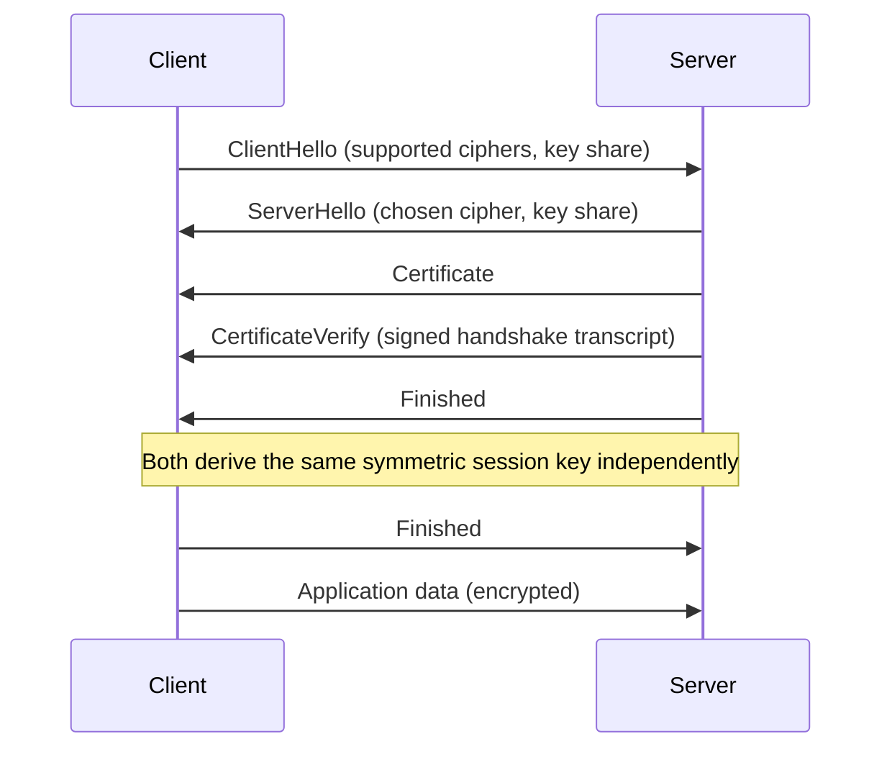

Every HTTPS connection starts with two parties who've never talked before, agreeing on a shared secret key over a network that anyone could be eavesdropping on — without ever transmitting that secret in a form an eavesdropper could use. That's the TLS handshake, and it's one of the more elegant pieces of applied cryptography in everyday use: a few round trips of public information exchange that end with both sides holding an identical symmetric key neither of them sent directly. This post walks through what actually happens, step by step, in a modern TLS 1.3 handshake.

## Why Not Just Use Asymmetric Encryption for Everything

If public-key cryptography can already establish secure communication, why not just encrypt every message with the recipient's public key directly? Because asymmetric encryption is computationally expensive relative to symmetric encryption — orders of magnitude slower for the same amount of data. TLS uses asymmetric cryptography for exactly one purpose: securely establishing a shared **symmetric** key, and then switches to fast symmetric encryption (AES, ChaCha20) for the actual bulk data transfer. The handshake's entire job is getting both sides to the same symmetric key without an eavesdropper being able to derive it too.

## The TLS 1.3 Handshake, Step by Step

TLS 1.3 (the current standard, and meaningfully faster than 1.2) reduced the handshake to roughly one round trip. Here's the sequence:



### 1. ClientHello

The client initiates by sending the list of TLS versions and cipher suites it supports, plus — critically, this is the TLS 1.3 speedup — a **key share**: half of a Diffie-Hellman key exchange, sent speculatively before the server has even responded.

```
ClientHello:
  supported_versions: [TLS 1.3]
  cipher_suites: [TLS_AES_256_GCM_SHA384, TLS_CHACHA20_POLY1305_SHA256]
  key_share: X25519 public value: 8f3a2c...
```

Sending the key share speculatively (guessing which key exchange method the server will accept, based on common defaults) is what lets TLS 1.3 complete in roughly one round trip instead of the two round trips TLS 1.2 needed — the server doesn't have to ask the client for its key share separately.

### 2. ServerHello and Key Exchange

The server picks a cipher suite from the client's offered list, sends its own key share, and — using **Diffie-Hellman key exchange** — both sides can now independently compute the same shared secret, without that secret ever having been transmitted over the wire in any form.

```
ServerHello:
  cipher_suite: TLS_AES_256_GCM_SHA384
  key_share: X25519 public value: a91d7e...
```

The mathematical property that makes this work: each side combines its own private key with the other side's *public* key share, and the result is identical on both ends — this is the core trick of Diffie-Hellman, and it's what lets two parties agree on a shared secret while only ever exchanging public values that, on their own, don't reveal the secret to an eavesdropper watching the exchange.

### 3. Certificate and CertificateVerify

Key exchange alone proves the two parties can compute a shared secret — it doesn't prove the server is actually who it claims to be. That's a separate problem, solved by the server presenting an X.509 certificate:

```bash
$ openssl s_client -connect example.com:443 -showcerts 2>/dev/null | openssl x509 -noout -subject -issuer
subject=CN=example.com
issuer=C=US, O=Let's Encrypt, CN=R3
```

The certificate contains the server's public key and is itself signed by a **Certificate Authority (CA)** the client's trust store already trusts. The client verifies this signature chain: does this certificate's signature check out against the issuing CA's public key, and is that CA itself trusted (directly, or via its own certificate signed by a trusted root)? This is the mechanism covered in depth by public key infrastructure — TLS is the protocol that *consumes* that trust chain at connection time, not the thing that builds it.

The server then sends a **CertificateVerify** message — a signature, using the certificate's private key, over the entire handshake transcript so far. This is what actually proves the server possesses the private key matching the certificate it presented, not just that it can quote a valid-looking certificate — a certificate alone is public information anyone could present; only the real key holder can produce a valid signature over this specific handshake's transcript.

### 4. Finished Messages

Both sides send a **Finished** message — a MAC (message authentication code) computed over the entire handshake transcript, using a key derived from the now-shared secret. This serves as integrity verification: if any handshake message was tampered with in transit, the computed Finished MACs on each side won't match what the other side expects, and the connection is aborted before any application data is exchanged. This closes off a class of downgrade and tampering attacks that would otherwise be possible by manipulating the handshake messages themselves before the symmetric key is fully in use.

### 5. Application Data

From this point, all traffic is encrypted with the derived symmetric session key — the asymmetric cryptography's job is done, and every request/response from here on uses the fast symmetric cipher negotiated in step 2.

## Why the Distinction Between Key Exchange and Certificate Verification Matters

It's worth being precise about what each half of the handshake actually proves, because conflating them is a common source of confusion:

- **Diffie-Hellman key exchange** proves that both sides can compute the same shared secret — but says nothing about *who* is on the other end. An attacker could just as easily complete a DH exchange with the client.
- **Certificate verification** proves that whoever completed the key exchange also holds the private key for a certificate a trusted CA vouches for — this is the piece that actually defeats a man-in-the-middle, because an attacker without the real server's private key cannot produce a valid CertificateVerify signature, no matter how successfully they participate in the key exchange itself.

Together, these give you both **confidentiality** (the symmetric key an eavesdropper can't derive) and **authentication** (proof you're actually talking to the server you intended to, not an impostor). Either half alone is insufficient — key exchange without certificate verification is vulnerable to man-in-the-middle attacks; certificate verification without key exchange gives you identity but no efficient way to encrypt bulk traffic.

## Session Resumption: Skipping the Full Handshake

Repeating this full handshake for every new connection to a server you've already connected to recently is wasteful. TLS 1.3 supports **session resumption** via a **pre-shared key (PSK)** issued by the server after a full handshake completes — on a subsequent connection, the client presents this PSK and both sides can derive a new session key without repeating certificate verification at all.

```
NewSessionTicket (sent after first handshake):
  ticket: a1b2c3d4...
  lifetime: 7200s

Second connection:
ClientHello:
  pre_shared_key: a1b2c3d4...
  early_data: <application data, sent immediately>
```

This is what enables **0-RTT (zero round-trip time)** resumption — the client can send actual application data in its very first message, before any handshake round trip completes at all, for a resumed session. The trade-off: 0-RTT data doesn't have the same replay protection as data sent after a full handshake, since an attacker who captures that first 0-RTT payload can potentially replay it — which is why 0-RTT is typically restricted to idempotent requests (like a `GET`) rather than used indiscriminately for anything that changes server state.

## Conclusion

The TLS handshake solves two distinct problems in one coordinated exchange: establishing a shared symmetric key that an eavesdropper watching the whole conversation still can't derive (via Diffie-Hellman key exchange), and proving the identity of the party on the other end (via certificate verification against a trusted CA chain). TLS 1.3's main improvement over 1.2 is collapsing this into roughly one round trip by having the client speculatively send its key share upfront, and session resumption via PSK takes it further still — letting a returning client skip the full handshake and, in the 0-RTT case, send data before the connection is even fully established. Understanding these as two separate guarantees — confidentiality from key exchange, authentication from certificate verification — is what makes the rest of TLS's design (and its failure modes, like accepting a self-signed certificate) make sense.
