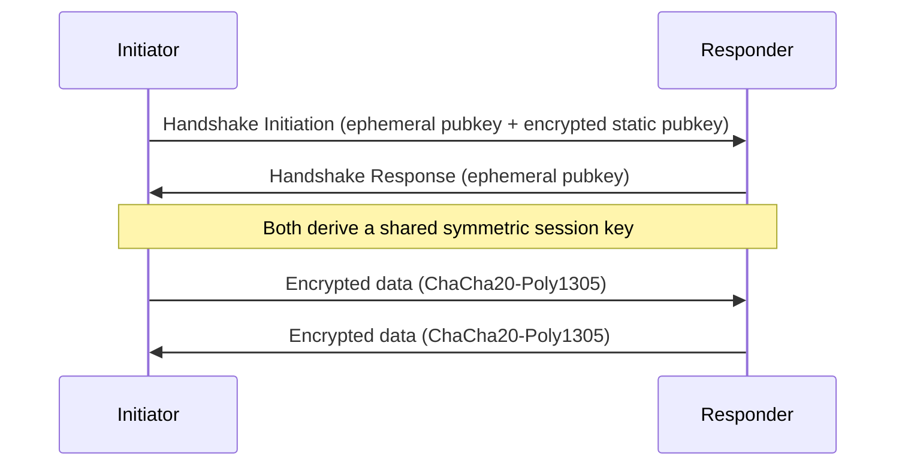

Older VPN protocols like IPsec and OpenVPN carry decades of accumulated complexity — negotiable cipher suites, configurable key exchange modes, certificate authorities, and enough optional knobs that a misconfiguration is easy to introduce and hard to notice. WireGuard took the opposite approach: pick one modern cryptographic suite, remove nearly every configuration option, and implement the whole thing in a fraction of the code. The result is a VPN protocol that's dramatically simpler to reason about and faster in practice — worth understanding both for what it does differently and why that simplicity is itself a security property.

## What a VPN Tunnel Actually Is

At its core, a VPN creates a **virtual network interface** on your machine that behaves like any other network interface — but traffic sent through it gets encrypted and wrapped inside another packet before leaving over the real network, then unwrapped and decrypted at the other end.


From the application's point of view, nothing is unusual — it's just sending packets to an interface, exactly like any other network traffic. The encryption and encapsulation happen transparently at the interface level, which is what lets a VPN reroute *all* of a machine's traffic (or a specific subset, via routing rules) without any individual application needing to be VPN-aware.

## WireGuard's Design Philosophy: Cryptographic Minimalism

Where IPsec offers a menu of negotiable algorithms (multiple choices for encryption cipher, key exchange method, authentication scheme — each combination a potential source of misconfiguration or a downgrade attack surface), WireGuard makes exactly one choice for each cryptographic primitive and doesn't offer alternatives:

- **Curve25519** for key exchange (ECDH)
- **ChaCha20** for symmetric encryption
- **Poly1305** for message authentication
- **BLAKE2s** for hashing

This isn't a limitation — it's a deliberate security decision. Every negotiable option in a protocol is a potential downgrade attack surface (trick both sides into agreeing on a weaker option) and a source of implementation complexity that historically correlates strongly with vulnerabilities. WireGuard's entire codebase is famously small — roughly 4,000 lines, compared to hundreds of thousands for a full IPsec or OpenVPN implementation — which makes it small enough to actually be audited thoroughly by a human, a property most large cryptographic codebases don't have.

## Peer Identity: Public Keys, Not Certificates

WireGuard doesn't use X.509 certificates or a certificate authority at all. Instead, each peer has a **Curve25519 key pair**, and a peer's identity *is* its public key — full stop, no chain of trust to validate.

```bash
$ wg genkey | tee privatekey | wg pubkey > publickey
$ cat publickey
xTIBA5rboUvnH4htodjb6e697QjLERt1NAB4mZqp8Dg=
```

Configuring a connection means each side lists the other's public key directly, alongside the address it's reachable at:

```ini
# /etc/wireguard/wg0.conf on the client
[Interface]
PrivateKey = <client-private-key>
Address = 10.0.0.2/24

[Peer]
PublicKey = xTIBA5rboUvnH4htodjb6e697QjLERt1NAB4mZqp8Dg=
Endpoint = vpn.example.com:51820
AllowedIPs = 0.0.0.0/0
```

This is a genuinely different trust model than certificate-based systems: there's no CA to compromise, no certificate to expire or revoke, no chain of trust to validate — a peer is authenticated purely because it can prove possession of the private key matching a public key you've explicitly configured to trust. The trade-off is that key distribution becomes a manual, out-of-band problem — there's no equivalent of a CA vouching for a new peer, so adding a peer means physically getting its public key to every other peer that needs to trust it, which doesn't scale to large, dynamic peer sets the way a CA-based system does, but is exactly right for the "fixed set of known peers" case WireGuard targets.

## The Handshake: Noise Protocol Framework

WireGuard's handshake is built on the **Noise Protocol Framework**, specifically its `IK` pattern (Initiator knows the responder's static public key in advance). This is a much simpler exchange than TLS's certificate-based handshake, precisely because peer identity is already known ahead of time via the configured public key — there's no certificate chain to transmit or validate during the handshake itself.



The handshake completes in a single round trip, and every session key derived from it is **ephemeral** — a fresh key pair is generated for each handshake, which gives WireGuard **perfect forward secrecy**: even if a peer's long-term private key is compromised at some point in the future, past session traffic captured earlier can't be decrypted retroactively, because the session keys that actually encrypted that traffic were never derived from the long-term key alone and are gone once the session ends.

By default, WireGuard re-runs this handshake and rotates the session key roughly every two minutes, which further bounds how much traffic any single compromised session key could expose even in the worst case.

## Cryptokey Routing: The `AllowedIPs` Mechanism

WireGuard's routing model is unusual and worth understanding on its own: `AllowedIPs` isn't just a routing table entry — it's simultaneously a firewall rule and a routing rule, described by WireGuard's authors as **cryptokey routing**.

```ini
[Peer]
PublicKey = xTIBA5rboUvnH4htodjb6e697QjLERt1NAB4mZqp8Dg=
AllowedIPs = 10.0.0.0/24, 192.168.5.0/24
```

This single line means two things simultaneously: **outbound**, traffic destined for `10.0.0.0/24` or `192.168.5.0/24` gets routed to and encrypted for this specific peer. **Inbound**, a decrypted packet arriving from this peer is only accepted if its source address falls within these same ranges — a packet claiming to be from an address outside the configured `AllowedIPs` is dropped, even if it decrypts successfully with this peer's key.

This means `AllowedIPs` does double duty as an implicit access control list, with no separate firewall configuration needed to enforce "this peer may only claim to be these specific addresses" — a property that's easy to overlook but meaningfully simplifies the mental model of what a WireGuard peer can and can't do, compared to a system where routing and access control are configured as entirely separate, independently-fallible layers.

## Why It's Faster Than IPsec/OpenVPN in Practice

A few compounding factors, beyond raw cipher speed:

- **Kernel-space implementation** (on Linux, WireGuard is a kernel module) avoids the userspace/kernel context-switching overhead that OpenVPN's typical userspace TUN implementation incurs on every packet.
- **UDP-based, connectionless transport** with no TCP-in-TCP overhead — a real problem for VPN protocols that tunnel TCP application traffic inside a TCP-based tunnel, since packet loss handling at both layers can interact badly and degrade throughput (a phenomenon commonly called "TCP meltdown").
- **A drastically smaller codebase** means fewer branches, fewer abstraction layers, and a cryptographic operation path that's short and predictable rather than routed through a large configurable negotiation state machine on every packet.

None of these are exotic optimizations — they're mostly the natural consequence of WireGuard's minimalist design philosophy showing up in real-world throughput and latency numbers, not a separate performance-engineering effort layered on top.

## Conclusion

WireGuard's core insight is that most of the complexity in older VPN protocols — negotiable ciphers, certificate chains, configurable handshake modes — was optional complexity that mostly added attack surface and implementation risk without adding real security value for the common case. By picking one modern cryptographic suite, replacing certificates with directly-configured public keys, and building the handshake on the Noise Protocol Framework's simpler `IK` pattern, it ends up both easier to audit and measurably faster than what came before. The `AllowedIPs`-based cryptokey routing is the one genuinely novel piece worth internalizing — it's not just a routing table, it's baked-in access control, which is a meaningfully different (and simpler) way to reason about what a peer can and can't do compared to systems that keep those two concerns separate.
