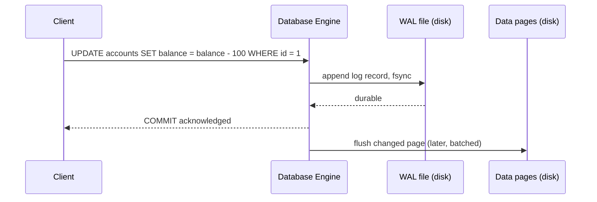

A database has to survive its own crash — power loss, an OOM kill, a hardware fault — without losing or corrupting data that it already told a client was committed. Doing that by writing every change directly to its final on-disk location, safely, on every transaction, would make every write painfully slow. Write-ahead logging (WAL) is the technique nearly every serious database uses to get both durability and speed: instead of guaranteeing the actual data files are safely updated before confirming a commit, it guarantees a much cheaper sequential log entry is safely written first — and reconstructs everything else from that log if a crash happens before the real update lands.

## The Problem WAL Solves

A transaction commit needs to satisfy the "D" in ACID: once the database says "committed," that data must survive a crash immediately after, no exceptions. The naive way to guarantee that is to write the actual changed pages to disk, synced, before acknowledging the commit.

The problem is that databases store data in **pages** — fixed-size blocks, often scattered across a file in no particular order relative to a single transaction's changes — and a transaction can touch multiple pages in multiple different locations. Flushing every touched page to disk, synced, on every commit means random-access disk I/O (or at minimum non-sequential writes) on the hot path of every single transaction, which is slow even on modern SSDs relative to sequential writes.

## The Core Idea

WAL flips the order: **before** any change is made to the actual data pages, a record describing that change is appended to a log file — sequentially, which is fast — and that log record is what gets synced to disk before the transaction is allowed to report success. The actual data pages get updated later, in memory first, and flushed to their real on-disk locations on a more relaxed schedule.



The rule that makes this safe — "**write-ahead**" is literally the name of the invariant — is: **a log record describing a change must be durably written before the corresponding data page change is durably written.** If a crash happens after the log record is durable but before the data page is updated on disk, the database can replay the log record on restart and reconstruct the change. If a crash happens before the log record itself is durable, the transaction never counted as committed in the first place — so there's nothing to recover, which is exactly the correct outcome.

## What a Log Record Looks Like

Each WAL record describes a single, specific change — not the whole SQL statement, but the low-level effect it had:

```
LSN: 4821093
Transaction: 771
Type: UPDATE
Relation: accounts, page 42
Before: balance = 500
After:  balance = 400
```

The **LSN (Log Sequence Number)** is a monotonically increasing identifier for each record — it's what lets the database know exactly how far recovery has progressed, and it's stamped onto data pages themselves once they're flushed, so the engine can tell whether a given page already reflects a given log record or still needs it replayed.

```bash
$ pg_waldump 000000010000000000000001 | head -5
rmgr: Heap        len (rec/tot):     54/    54, tx:        771, lsn: 0/04821093, \
  desc: UPDATE off 12 xmax 771, blkref #0: rel 1663/16384/16401 blk 42
```

## Recovery: Replaying the Log

When a database restarts after an unclean shutdown, it runs a **recovery** process before accepting new connections: scan the WAL from the last known-safe point, and replay every record whose data page changes weren't yet confirmed on disk.

This process, formalized in the classic **ARIES** recovery algorithm (used, in spirit, by most production databases), has three conceptual phases:

1. **Analysis** — scan the log to determine which transactions were in progress at crash time, and which data pages might be missing changes.
2. **Redo** — replay every logged change since the last checkpoint, even for transactions that will ultimately be rolled back — this brings the data pages up to exactly the state they were in at the moment of the crash, no more, no less.
3. **Undo** — roll back the effects of transactions that were still in progress (uncommitted) at crash time, using the log records to reverse their partial changes.

```bash
$ postgres --single -D /var/lib/postgresql/data
LOG:  database system was not properly shut down; automatic recovery in progress
LOG:  redo starts at 0/4820000
LOG:  redo done at 0/4821200
LOG:  database system is ready to accept connections
```

Redoing *everything* since the last checkpoint, even work that gets undone in the next phase, sounds wasteful but is what makes the algorithm simple and correct — it avoids having to reason about which specific pages need which specific subset of changes, by just replaying the log deterministically up to the exact crash point, then cleaning up incomplete transactions afterward.

## Checkpoints: Bounding Recovery Time

If the WAL grew forever and recovery always replayed from the very beginning of time, a crash after months of uptime would mean an impractically long recovery. **Checkpoints** solve this: periodically, the database flushes all currently-dirty (changed but not yet persisted) data pages to disk and records a checkpoint marker in the log.

```bash
$ psql -c "CHECKPOINT;"
CHECKPOINT
```

Recovery only ever needs to replay the log starting from the most recent checkpoint — everything before it is guaranteed to already be reflected in the on-disk data pages, so there's nothing left to redo from that far back. This is the direct trade-off checkpoint frequency controls: more frequent checkpoints mean faster crash recovery (less log to replay) but more I/O overhead during normal operation (more frequent full flushes of dirty pages); less frequent checkpoints mean the opposite.

```
WAL timeline:  [checkpoint A] ---- ---- [checkpoint B] ---- ---- [CRASH]
                                                          ^
                                          recovery only replays from here
```

## WAL as the Foundation for Replication

Once every change to the database is captured as a sequential, ordered log, that log becomes useful for more than crash recovery — it's also the natural mechanism for **streaming replication**. A replica can continuously receive and replay the primary's WAL stream, staying in near-real-time sync without the primary needing any awareness of replication-specific logic beyond shipping its log.

```bash
$ psql -c "SELECT client_addr, state, sent_lsn, replay_lsn FROM pg_stat_replication;"
 client_addr  |   state   | sent_lsn  | replay_lsn
--------------+-----------+-----------+------------
 10.0.1.42    | streaming | 0/4821200 | 0/4821200
```

This is why WAL-based replication and crash recovery share the same underlying mechanism — a replica replaying WAL is doing essentially the same redo operation a crashed primary does on restart, just continuously and from a remote source instead of once from local disk. It's also the basis of **point-in-time recovery (PITR)**: archived WAL segments plus a base backup let you restore a database to its exact state at any past moment, by replaying the log up to (but not past) a chosen point in time.

## The Durability/Performance Knob: fsync and Group Commit

The expensive part of this whole scheme is the `fsync` call that forces the WAL record to physical disk before acknowledging commit — without it, the "durable before acknowledging" guarantee is fiction, since data could still be sitting in an OS page cache that a power loss would wipe out.

**Group commit** amortizes this cost: instead of one `fsync` per transaction, the database batches log records from multiple concurrently-committing transactions and issues one `fsync` covering all of them, since the WAL is append-only and sequential anyway.

```
Transaction A commits -> log record queued
Transaction B commits -> log record queued  } single fsync covers all three
Transaction C commits -> log record queued
```

This is a genuine free lunch under concurrent load — batching doesn't weaken the durability guarantee for any individual transaction (each still waits for its own record to be part of a synced batch before acknowledging), it just spreads the fixed cost of a disk sync across more transactions when there are enough happening concurrently to batch.

## Conclusion

Write-ahead logging is the mechanism that lets a database be both fast and durable at the same time, by separating "provably safe from a crash" (a small, sequential log write) from "reflected in the actual data files" (a larger, scattered write that can happen later, on its own schedule). Recovery is just deterministic log replay from the last checkpoint; replication is the same replay mechanism running continuously against a remote copy; and group commit amortizes the one genuinely expensive operation — the fsync — across concurrent transactions instead of paying it once per transaction. Nearly every serious database (Postgres, MySQL's InnoDB, SQLite in WAL mode) is built on some variation of this same idea, because it's the cleanest known way to reconcile durability with acceptable write throughput.
