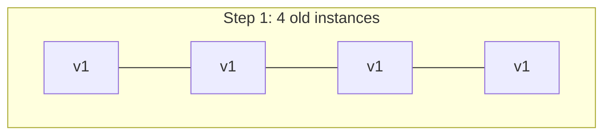
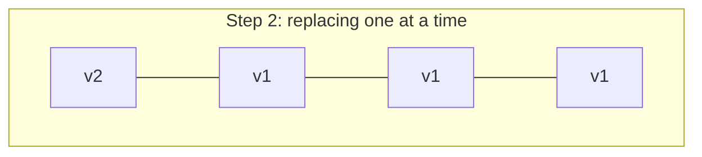
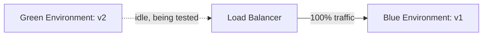
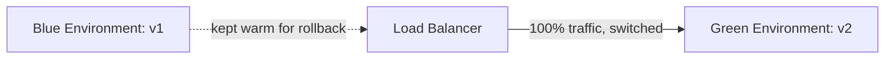
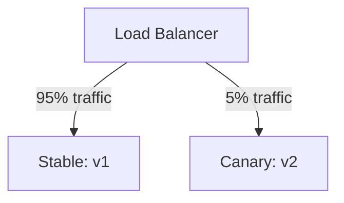

Deploying used to mean an explicit maintenance window — take the service down, replace the code, bring it back up, and hope users didn't notice. Modern deployment strategies exist specifically to remove that trade-off: ship new code continuously, all day, without any request ever hitting a broken or unavailable server. The three dominant strategies — rolling, blue-green, and canary — all achieve zero downtime, but they differ sharply in rollback speed, infrastructure cost, and how much of your user base is exposed to a bad deploy before you notice.

## The Baseline Problem: Why Naive Deploys Cause Downtime

The naive deploy — stop the old process, start the new one — has an obvious gap: between "stopped" and "started," there's no server to handle requests. Even a fast restart (a few seconds) causes dropped connections and failed requests during that window, and if the new version fails to start at all (a bad config, a missing dependency), the service stays down until someone notices and rolls back manually.

Every zero-downtime strategy solves this the same fundamental way: **never take capacity offline before new capacity is confirmed healthy.** The strategies differ in how much new capacity is stood up, how traffic shifts to it, and how quickly you can undo a bad deploy.

## Rolling Deployment

Replace instances of the old version with the new version incrementally — a few at a time — rather than all at once.





```bash
$ kubectl set image deployment/api api=myapp:v2
deployment.apps/api image updated

$ kubectl rollout status deployment/api
Waiting for deployment "api" rollout to finish: 1 out of 4 new replicas have been updated...
Waiting for deployment "api" rollout to finish: 2 out of 4 new replicas have been updated...
deployment "api" successfully rolled out
```

Kubernetes's default `Deployment` controller does this natively: it spins up a new-version pod, waits for it to pass its readiness probe, adds it to the load balancer's rotation, then removes and terminates one old-version pod — repeating until every instance is on the new version. No extra infrastructure is needed beyond what's already running, since old and new versions coexist only briefly, one instance at a time.

The trade-off: **rollback is not instant.** If a bug surfaces after most instances have already rolled forward, rolling back means running the same incremental process in reverse — which takes real time, during which the bad version is still serving some fraction of traffic. Rolling deployments also require **both versions to be compatible simultaneously** — old and new code are serving traffic side by side for the whole rollout duration, which matters a lot for database schema changes (covered below).

## Blue-Green Deployment

Run two complete, identical production environments — "blue" (currently live) and "green" (the new version) — and switch traffic between them atomically.





The new version is deployed entirely into the idle environment and tested against production-like traffic (or a copy of it) before receiving any real users at all. The cutover itself — repointing the load balancer or updating DNS — is close to instant, and so is rollback: repoint traffic back to blue, which was never torn down.

```bash
$ deploy-tool switch --from blue --to green
Switching load balancer target: blue -> green
Health check on green: 20/20 targets healthy
Traffic cutover complete (14ms)
```

This gives the fastest possible rollback of the three strategies — a config change, not a redeployment — which is exactly why it's attractive for high-stakes releases. The cost is real: **you need double the infrastructure** for the duration both environments exist, since green is a full, complete copy of production capacity sitting mostly idle until cutover. For a service with meaningfully expensive infrastructure, running two full production-sized environments even briefly is a real budget line item, not a rounding error.

## Canary Deployment

Route a small percentage of real traffic to the new version, watch its actual error rates and latency under real conditions, and progressively increase that percentage as confidence grows.



```yaml
apiVersion: split.smi-spec.io/v1alpha2
kind: TrafficSplit
metadata:
  name: api-canary
spec:
  service: api
  backends:
    - service: api-v1
      weight: 95
    - service: api-v2
      weight: 5
```

The distinguishing feature versus blue-green: canary exposes the new version to **real production traffic** at small scale before committing fully, rather than testing it in isolation and cutting over all at once. This catches classes of bugs that only appear under genuine production load and data variety — a bad interaction with a specific customer's data shape, a race condition that only shows up under real concurrency — that pre-cutover testing in an idle environment might miss entirely.

```bash
$ canary-tool status
Canary: api-v2 (5% traffic, running 12m)
  Error rate:  0.02% (baseline: 0.03%)
  p99 latency: 145ms (baseline: 142ms)
  Verdict: healthy, safe to proceed

$ canary-tool promote --step 25
Increasing canary traffic: 5% -> 25%
```

The trade-off is exposure and time: even at 5% traffic, *some* real users hit a genuinely broken new version before it's caught, and reaching full rollout takes longer than blue-green's instant cutover, since each traffic-weight increase should be held long enough to gather meaningful error-rate and latency signal before proceeding. Rollback is fast (shift weight back to 0%) but not instant in the blue-green sense, and it requires either a metrics pipeline with defined health thresholds or a human actively watching dashboards during the rollout window.

## Comparing the Three

| | Rolling | Blue-Green | Canary |
|---|---|---|---|
| Extra infrastructure | None | Full duplicate environment | Small (partial new-version capacity) |
| Rollback speed | Slow — reverse the rollout | Instant — repoint traffic | Fast — shift weight to 0% |
| Real-traffic validation before full rollout | No | No (tested in isolation) | Yes |
| User exposure to a bad deploy | Fraction of instances, whole rollout duration | None until cutover, then 100% at once | Small % initially, growing gradually |
| Operational complexity | Low (built into most orchestrators) | Medium (environment duplication + cutover tooling) | High (traffic splitting + automated health analysis) |

## The Part These Strategies Don't Solve: Database Migrations

Every one of these strategies assumes the application layer can be swapped independently — but the database schema is shared by old and new code simultaneously during the transition window, for all three strategies except a blue-green setup with fully separate databases (rare, since keeping two databases in sync defeats much of the point). This means schema changes need to be **backward compatible** with the previous version of the code for the duration of the rollout.

The standard technique is the **expand-contract pattern**: add a new column alongside the old one (expand), deploy code that writes to both and reads from whichever is populated, let the rollout complete fully, backfill data, then remove the old column in a later, separate deploy (contract). Trying to rename a column atomically alongside a rolling deploy is a reliable way to break whichever instances are still running the old code during the rollout window — because for that window, both versions are genuinely live at once, and the database can't be two schemas simultaneously.

## Conclusion

Rolling, blue-green, and canary deployments all solve the same core problem — never take capacity offline before its replacement is confirmed healthy — but optimize for different things. Rolling costs nothing extra but rolls back slowly; blue-green rolls back instantly but doubles infrastructure cost during the transition; canary catches real-traffic problems earliest but takes the longest to reach full rollout and needs real monitoring to do safely. None of them, on their own, solve backward-compatible schema evolution — that's a separate discipline (expand-contract) that every one of these strategies depends on to actually be safe.
